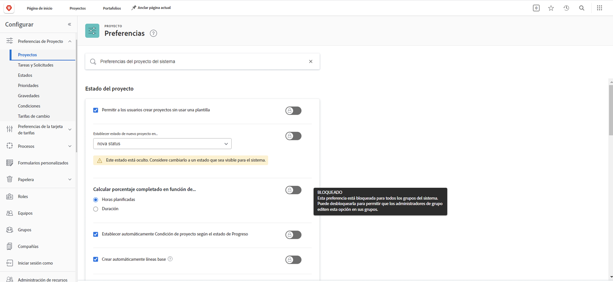
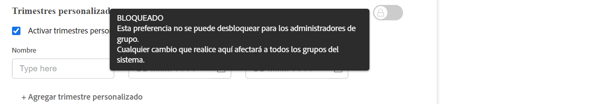

# Configuración de los ajustes predeterminados globales del proyecto

<!---
21.4 updates have been made
--->

Este vídeo contiene información sobre:

* Cambio de un estado personalizado
* Definición de las preferencias globales del proyecto
* Creación y utilización de programaciones

>[!VIDEO](https://video.tv.adobe.com/v/335065/?quality=12&learn=on)

## Configuración de proyectos, tareas y problemas globales y de grupo

Al abrir los ajustes de los [!UICONTROL Proyectos] de [!DNL Workfront], observará que aparece “[!UICONTROL Preferencias del proyecto del sistema]” en la barra de búsqueda de la parte superior de la ventana. Esto le permite saber que esta configuración afecta a todo el sistema de [!DNL Workfront], ya que es una configuración global.

![[!UICONTROL Preferencias del proyecto] en [!UICONTROL Configuración]](assets/admin-fund-system-project-preferences-1.png)

Verá algo similar cuando abra la configuración de [!UICONTROL Tareas y problemas].

![[!UICONTROL Preferencias de tareas y problemas] en [!UICONTROL Configuración]](assets/admin-fund-task-issue-preferences-2.png)

Sin embargo, es posible que no todos los grupos de [!DNL Workfront] necesiten las mismas preferencias de proyecto, tarea y problema. Por ejemplo, el grupo de marketing quiere que el nuevo estado del proyecto sea Planificando, mientras que el grupo del administrador del proyecto prefiere el estado Solicitud.

[!DNL Workfront] permite a los administradores del grupo ajustar determinadas preferencias de proyecto, tarea y problema de sus grupos. Las preferencias que se pueden ajustar están determinadas por la variable del administrador del sistema de [!DNL Workfront] mediante las conmutaciones de bloqueo/desbloqueo.

Para empezar, vaya al área [!UICONTROL Configuración]:

1. Seleccione **[!UICONTROL Configuración]** en el **[!UICONTROL Menú principal]**.
1. Expanda las **[!UICONTROL Preferencias de proyecto]** en el menú de la izquierda.
1. Seleccione **[!UICONTROL Proyectos]** o **[!UICONTROL Tareas y problemas]**, según la configuración que desee modificar.

Bloquee una preferencia para evitar que los administradores del grupo ajusten esa configuración para su grupo.

Desbloquee la preferencia para que esté disponible para que los administradores del grupo la personalicen.

Algunos ajustes no se pueden desbloquear y siguen siendo ajustes globales del sistema.

### Definición de las preferencias de grupo y subgrupo

Para cualquier configuración desbloqueada por el administrador del sistema, los administradores del grupo pueden realizar ajustes para los grupos que administran y para cualquier subgrupo anidado en esos grupos. Además, los administradores del grupo pueden controlar qué configuración pueden modificar los administradores del subgrupo.

1. Seleccione **[!UICONTROL Configuración]** en el **[!UICONTROL Menú principal]**.
1. Haga clic en **[!DNL Groups]** en el menú de la izquierda.
1. Haga clic en el nombre del grupo o subgrupo para abrirlo.
1. Seleccione **[!UICONTROL Preferencias de proyecto]** o **[!UICONTROL Preferencias de tareas y problemas]** en el menú de la izquierda.
1. Realice los cambios necesarios para cada una de las preferencias que se han desbloqueado.
1. Seleccione **[!UICONTROL Guardar]**.

Sección ![[!UICONTROL Estado del proyecto] en la página [!UICONTROL Grupo]](assets/admin-fund-group-preferences.png)

Si su organización no utiliza administradores de grupos, el administrador del sistema puede gestionar la configuración de preferencias de los distintos grupos.

<!---
learn more URLs and guides
Create or edit a group status 
Group administrators 
Configure system-wide project preferences 
Configure project preferences for a group 
Configure task and issue preferences for a group 
Create and modify a group’s schedule 
--->
