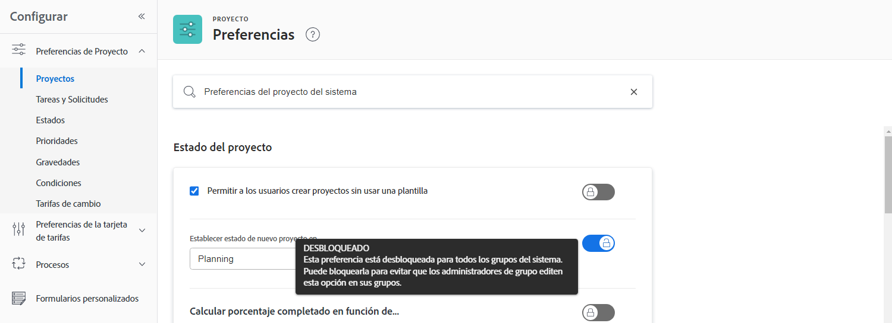

# Configurar las opciones predeterminadas globales del proyecto

<!---
21.4 updates have been made
--->

En este vídeo, aprenderá a hacer lo siguiente:

* Cambiar un estado personalizado
* Establecer preferencias globales de proyecto
* Creación y uso de programaciones

>[!VIDEO](https://video.tv.adobe.com/v/335065/?quality=12&learn=on)

## Configuración global y de grupo de proyectos, tareas y problemas

Al abrir el [!UICONTROL Proyectos] configuración en [!DNL Workfront], verá que dice &quot;[!UICONTROL Preferencias del proyecto del sistema]&quot; en la barra de búsqueda de la parte superior de la ventana. Esto le permite saber que esta configuración afecta a todos los miembros de su [!DNL Workfront] sistema — es una configuración global.

![[!UICONTROL Preferencias de proyecto] página en [!UICONTROL Configurar]](assets/admin-fund-system-project-preferences-1.png)

Verá algo similar cuando abra el archivo. [!UICONTROL Tareas y problemas] configuración.

![[!UICONTROL Preferencias de tarea y problema] in [!UICONTROL Configurar]](assets/admin-fund-task-issue-preferences-2.png)

Sin embargo, es posible que no todos los grupos de [!DNL Workfront] necesita las mismas preferencias de proyecto, tarea y problema. Por ejemplo, el grupo de marketing desea que el estado de un nuevo proyecto sea Planificación, mientras que el grupo del administrador de proyectos prefiere el estado de Solicitud.

[!DNL Workfront] permite a los administradores de grupos ajustar ciertas preferencias de proyectos, tareas y problemas para sus grupos. Las preferencias que se pueden ajustar vienen determinadas por la variable [!DNL Workfront] administrador del sistema con las opciones de bloqueo/desbloqueo.

Para empezar, vaya a [!UICONTROL Configurar] área:

1. Seleccionar **[!UICONTROL Configurar]** en el **[!UICONTROL Menú principal]**.
1. Expandir **[!UICONTROL Preferencias de proyecto]** en el menú izquierdo.
1. Seleccionar **[!UICONTROL Proyectos]** o **[!UICONTROL Tareas y problemas]**, dependiendo de la configuración que desee modificar.

Bloquee una preferencia para evitar que los administradores de grupo ajusten esa configuración a su grupo.

Desbloquee la preferencia para que esté disponible para que los administradores de grupo la personalicen.

Algunos ajustes no se pueden desbloquear y permanecen como ajustes globales del sistema.

### Definir preferencias de grupo y subgrupo

Para cualquier configuración desbloqueada por el administrador del sistema, los administradores del grupo pueden realizar ajustes en el grupo o los grupos que administran y en los subgrupos anidados en esos grupos. Además, los administradores de grupos pueden controlar qué configuración pueden modificar los administradores de sus subgrupos.

1. Seleccionar **[!UICONTROL Configurar]** en el **[!UICONTROL Menú principal]**.
1. Clic **[!DNL Groups]** en el menú izquierdo.
1. Haga clic en el nombre del grupo o subgrupo para abrirlo.
1. Seleccionar **[!UICONTROL Preferencias de proyecto]** o **[!UICONTROL Preferencias de tareas y problemas]** en el menú izquierdo.
1. Realice los cambios necesarios para cada una de las preferencias que se han desbloqueado.
1. Seleccionar **[!UICONTROL Guardar]**.

![[!UICONTROL Estado del proyecto] sección sobre [!UICONTROL Grupo] página](assets/admin-fund-group-preferences.png)

Si su organización no utiliza administradores de grupo, el administrador del sistema puede administrar la configuración de preferencias de los diferentes grupos.

<!---
learn more URLs and guides
Create or edit a group status 
Group administrators 
Configure system-wide project preferences 
Configure project preferences for a group 
Configure task and issue preferences for a group 
Create and modify a group’s schedule 
--->
