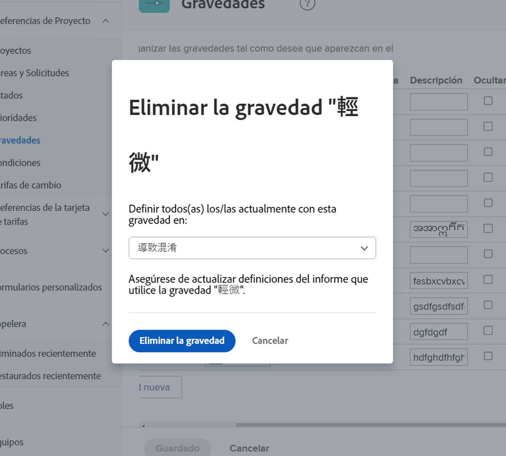

# Creación y administración de la gravedad de los problemas

## Introducción a la gravedad de los problemas

Se puede utilizar la gravedad para indicar cuán grave es un problema o cómo podría afectar al trabajo realizado.

Menú de ![[!UICONTROL Gravedad] en la ventana de [!UICONTROL Detalles del problema]](assets/admin-fund-severity-issue-details.png)

Puede acceder al campo de [!UICONTROL Gravedad] en los [!UICONTROL Detalles del problema]. También se puede incluir en las vistas de columnas de las listas y en los informes personalizados.

[!DNL Workfront] tiene cinco niveles de gravedad predeterminados:

* [!UICONTROL Cosmético]
* [!UICONTROL Causa confusión]
* [!UICONTROL Error con solución]
* [!UICONTROL Error sin solución]
* [!UICONTROL Error fatal]

Los administradores del sistema pueden cambiar el nombre de estas gravedades predeterminadas o crear otras nuevas, si es necesario.

Las gravedades solo están disponibles para los problemas de [!DNL Workfront].

## Creación y administración de la gravedad de los problemas

Como administrador del sistema, puede crear nuevas gravedades, si es necesario, para completar el flujo de trabajo del problema.

Página de ![[!UICONTROL Gravedades] en [!UICONTROL Configuración]](assets/admin-fund-severity-section.png)

1. Haga clic en **[!UICONTROL Configuración]** en el **[!UICONTROL Menú principal]**.
1. Expanda la sección de **[!UICONTROL Preferencias del proyecto]** en el panel de menú de la izquierda.
1. Seleccione **[!UICONTROL Gravedades]**.
1. Haga clic en **[!UICONTROL Agregar gravedad nueva]**.
1. Asigne un nombre a la gravedad que coincida con el uso deseado.
1. El número de **[!UICONTROL Importancia]** coincide con la gravedad del problema. El número más alto se corresponde con la gravedad más alta. El número de [!UICONTROL Importancia] debe ser único.
1. Seleccione un color para la prioridad. Este se utiliza en los informes de gráficos y en otros lugares de [!DNL Workfront].
1. Designe una de las opciones de gravedad como **[!UICONTROL Gravedad predeterminada]**. Esto se aplica automáticamente a todos los problemas nuevos en Workfront.
1. Incluya una descripción de la gravedad, por ejemplo, cómo se utilizará.
1. Haga clic fuera de los campos para guardar.

Lista de ![[!UICONTROL Gravedades]](assets/admin-fund-severity-new.png)

### Modificación de gravedades

Si una gravedad ya no es relevante para los flujos de trabajo del problema, se puede cambiar su nombre, ocultarla o eliminarla.

Si ya no se necesita una gravedad, [!DNL Workfront] recomienda ocultarla (haga clic en la casilla de [!UICONTROL Ocultar] junto a ella en el área de configuración). Esto elimina la opción de gravedad del menú desplegable del problema, pero conserva la gravedad de los datos históricos, por lo que aún está disponible para la creación de informes.

La columna ![[!UICONTROL Ocultar] aparece resaltada en la página de [!UICONTROL Gravedades] en [!UICONTROL Configuración]](assets/admin-fund-severity-hide.png)

[!DNL Workfront] recomienda que **no** elimine una gravedad que se haya utilizado en problemas anteriores. Cuando elimina una gravedad, se le pide que la sustituya por otra. Esto puede cambiar los datos históricos y afectar a los informes.

<!---
learn more URLs
Create and customize issue severities
Update issue severity
--->
