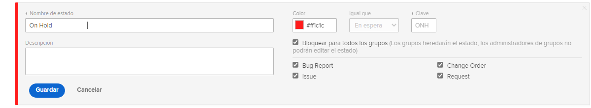

# Personalizar los estados de todo el sistema

[!DNL Workfront] proporciona una variedad de estados predeterminados para dar cabida a los flujos de trabajo de administración de problemas de su organización. Se puede cambiar el nombre de estos estados para que coincidan con la terminología de su organización. Los estados se pueden asignar a tipos de problemas específicos.

Se pueden crear estados adicionales, si es necesario. Solo los administradores del sistema pueden crear estados de todo el sistema. Además, los administradores del sistema controlan qué estados pueden editar los administradores del grupo.

![[!UICONTROL Problemas] pestaña activada [!UICONTROL Estatuas] página en [!UICONTROL Configurar]](assets/admin-fund-all-issue-statuses.png)

## Modificación de estados existentes

[!DNL Workfront] recomienda un número mínimo de estados. Esto hace que sea más fácil para los usuarios elegir el estado correcto y conlleva una lista más corta de estados que mantener.

Puede editar un estado existente para cambiar el nombre, los tipos de problemas a los que está asignado, el color relacionado, etc.

![Lista de estados de problemas con [!UICONTROL Editar] opción resaltada](assets/admin-fund-edit-issue-status.png)

1. Clic **[!UICONTROL Configurar]** en el **[!UICONTROL Menú principal]**.
1. Expanda el **[!UICONTROL Preferencias de proyecto]** en el panel de menú izquierdo.
1. Seleccionar **[!UICONTROL Estados]**.
1. Seleccione el **[!UICONTROL Problemas]** y asegúrese de que [!UICONTROL Estados del sistema] se muestra en la esquina superior derecha.
1. Seleccionar **[!UICONTROL Lista maestra]** para ver los estados de todos los tipos de problemas. Aquí es donde se crea o modifica un estado de problema.
1. Pase el ratón sobre el lado derecho del estado cuyo nombre desee cambiar y haga clic en **[!UICONTROL Editar]**.
1. Asigne un nuevo nombre al estado o cambie cualquier otra información que desee.
1. Bloquee el estado si esta configuración se debe aplicar a todos los usuarios de su [!DNL Workfront] ejemplo.
1. Desbloquee el estado para permitir que los administradores de grupo editen el estado solo para sus grupos.
1. Marque las casillas del tipo de problema al que se debe aplicar el estado.
1. Haga clic en **[!UICONTROL Guardar]**.

### Asignaciones de estado

Es posible que no todos los estados estén asignados a todos los tipos de problemas. El [!UICONTROL Estados] tiene columnas que muestran el tipo de problema para el que se puede utilizar cada estado.

Para ver únicamente los estados asignados a un tipo de problema específico, haga clic en el nombre del tipo de problema en la parte superior de la ventana.

![[!UICONTROL Problema] pestaña de [!UICONTROL Estado] página con columnas resaltadas](assets/admin-fund-statuses-issue-type.png)

Desde aquí, puede arrastrar y soltar los problemas en el orden en que desee que aparezcan en la [!UICONTROL Estado] menú desplegable.

Para editar los estados, debe volver a la sección [!UICONTROL Lista maestra].
