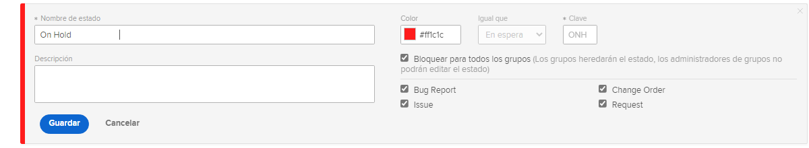
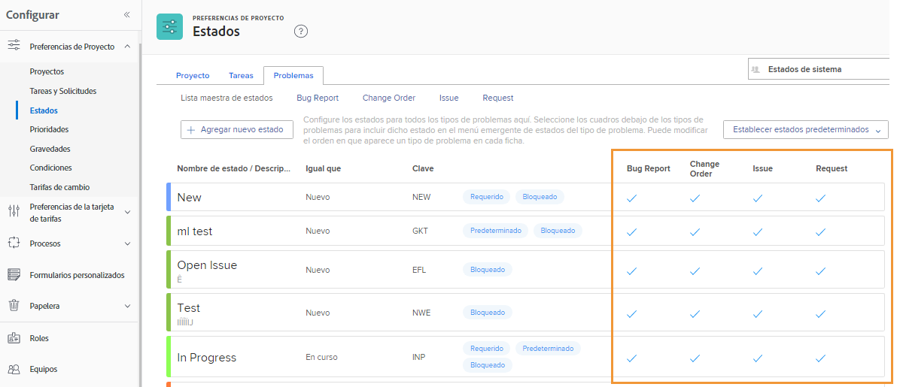

# Personalización de estados en todo el sistema

[!DNL Workfront] proporciona una variedad de estados predeterminados para dar cabida a los flujos de trabajo de administración de problemas de su organización. Se puede cambiar el nombre de estos estados para que coincidan con la terminología de la organización. Y los estados y se pueden asignar a tipos de problemas específicos.

Se pueden crear estados adicionales, si es necesario. Solo los administradores del sistema pueden crear estados para todo el sistema. Además, los administradores del sistema controlan qué estados pueden ser editados por los administradores del grupo.

Pestaña ![[!UICONTROL Problemas] en la página [!UICONTROL Estados] en [!UICONTROL Configuración]](assets/admin-fund-all-issue-statuses.png)

## Modificación de los estados existentes

[!DNL Workfront] recomienda un número mínimo de estados. Esto facilita la elección del estado correcto para los usuarios y reduce la lista de estados que deben mantenerse.

Puede editar un estado existente para cambiar el nombre, los tipos de problema a los que está asignado, el color relacionado, etc.

![Lista de estados de problemas con la opción [!UICONTROL Editar] resaltada](assets/admin-fund-edit-issue-status.png)

1. Haga clic en **[!UICONTROL Configuración]** en el **[!UICONTROL Menú principal]**.
1. Expanda la sección de **[!UICONTROL Preferencias del proyecto]** en el panel de menú de la izquierda.
1. Seleccione **[!UICONTROL Estados]**.
1. Seleccione la pestaña **[!UICONTROL Problemas]** y asegúrese de que [!UICONTROL Estados del sistema] se muestra en el ángulo superior derecho.
1. Seleccione **[!UICONTROL Lista principal]** para ver los estados de todos los tipos de problemas. Aquí es donde crea o modifica un estado de problema.
1. Pase el puntero por encima del lado derecho del estado cuyo nombre desea cambiar y haga clic en **[!UICONTROL Editar]**.
1. Asigne un nuevo nombre al estado o cambie cualquiera de la otra información, como desee.
1. Bloquee el estado si esta configuración debe aplicarse a todos los usuarios de su instancia [!DNL Workfront].
1. Desbloquee el estado para permitir que los administradores de grupos editen el estado solo para sus grupos.
1. Marque las casillas para el tipo de problema al que se debe aplicar el estado.
1. Haga clic en **[!UICONTROL Guardar]**.

### Asignaciones de estado

Es posible que no todos los estados se asignen a todos los tipos de problemas. La página [!UICONTROL Estados] tiene columnas que muestran el tipo de problema para el que se puede utilizar cada estado.

Para ver solo los estados asignados a un tipo de problema específico, haga clic en el nombre del tipo de problema en la parte superior de la ventana.

Pestaña ![[!UICONTROL Problema] de la página [!UICONTROL Estado] con columnas resaltadas](assets/admin-fund-statuses-issue-type.png)

Desde aquí, puede arrastrar y soltar los problemas en el orden en el que desee que aparezcan en el menú desplegable [!UICONTROL Estado].

Para editar los estados, debe volver a la [!UICONTROL Lista principal].
