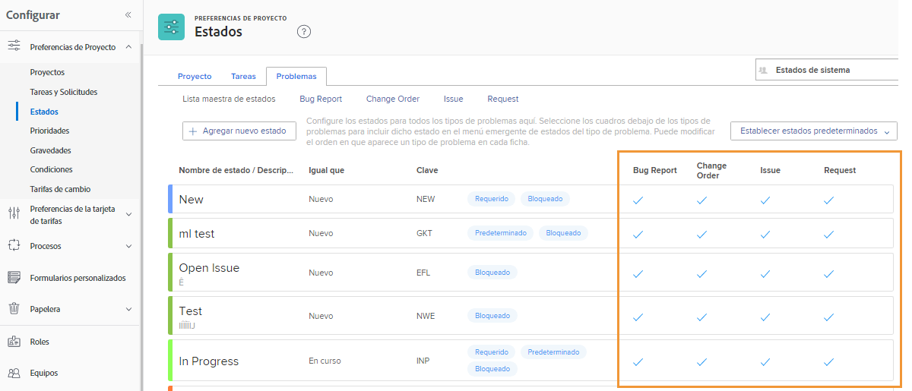

# Personalizar estados en todo el sistema

[!DNL Workfront] proporciona una variedad de estados predeterminados para dar cabida a los flujos de trabajo de gestión de problemas de su organización. Se puede cambiar el nombre de estos estados para que coincidan con la terminología de la organización. Los estados y se pueden asignar a tipos de problemas específicos.

Se pueden crear estados adicionales, si es necesario. Solo los administradores del sistema pueden crear estados para todo el sistema. Además, los administradores del sistema controlan qué estados pueden editar los administradores del grupo.

![[!UICONTROL Problemas] ficha en [!UICONTROL Estados] en [!UICONTROL Configuración]](assets/admin-fund-all-issue-statuses.png)

## Modificar estados existentes

[!DNL Workfront] recomienda un número mínimo de estados. Esto facilita la elección del estado correcto para los usuarios y reduce la lista de estados que deben mantenerse.

Puede editar un estado existente para cambiar el nombre, los tipos de problema a los que está asignado, el color relacionado, etc.

![Lista de estados de problemas con [!UICONTROL Editar] opción resaltada](assets/admin-fund-edit-issue-status.png)

1. Haga clic en **[!UICONTROL Configuración]** en el **[!UICONTROL Menú principal]**.
1. Expanda el **[!UICONTROL Preferencias de proyecto]** en el panel de menú de la izquierda.
1. Select **[!UICONTROL Estados]**.
1. Seleccione el **[!UICONTROL Problemas]** y asegúrese de [!UICONTROL Estados del sistema] en la esquina superior derecha.
1. Select **[!UICONTROL Lista maestra]** para ver los estados de todos los tipos de problemas. Aquí es donde crea o modifica un estado de problema.
1. Pase el ratón por encima del lado derecho del estado al que desea cambiar el nombre y haga clic en **[!UICONTROL Editar]**.
1. Asigne un nuevo nombre al estado o cambie cualquiera de la otra información, según lo desee.
1. Bloquee el estado si esta configuración debe aplicarse a todos los usuarios de su [!DNL Workfront] instancia.
1. Desbloquee el estado para permitir a los administradores de grupos editar el estado solo para sus grupos.
1. Marque las casillas para el tipo de problema al que se debe aplicar el estado.
1. Haga clic en **[!UICONTROL Guardar]**.

### Asignaciones de estado

Es posible que no todos los estados se asignen a todos los tipos de problemas. La variable [!UICONTROL Estados] tiene columnas que muestran el tipo de problema para el que se puede utilizar cada estado.

Para ver solo los estados asignados a un tipo de problema específico, haga clic en el nombre del tipo de problema en la parte superior de la ventana.

![[!UICONTROL Problema] pestaña [!UICONTROL Estado] página con columnas resaltadas](assets/admin-fund-statuses-issue-type.png)

Desde aquí, puede arrastrar y soltar los problemas en el orden en el que desee que aparezcan en la [!UICONTROL Estado] menú desplegable.

Para editar los estados, debe volver al [!UICONTROL Lista maestra].
