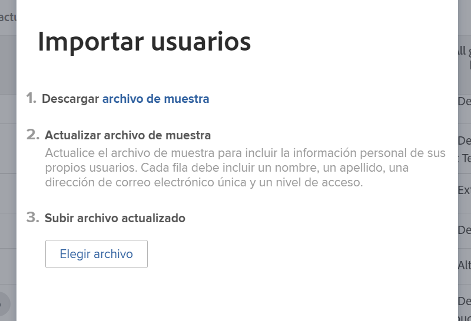
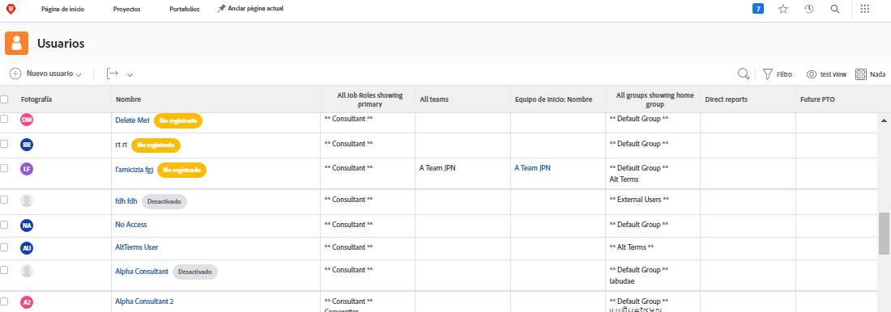

# Agregar usuarios de forma masiva

Agregar usuarios de a uno puede llevar mucho tiempo y ser abrumador. [!DNL Workfront] permite a un administrador del sistema agregar varios usuarios al mismo tiempo mediante la función de importación.

Opción de menú ![[!UICONTROL Importar personas]](assets/admin-fund-adding-users-5.png)

1. Seleccione **[!UICONTROL Usuarios]** en el [!UICONTROL Menú principal].
1. Seleccione la flecha en el botón **[!UICONTROL Nueva persona]** y seleccione **[!UICONTROL Importar personas]**.
1. La ventana que se abre lo acompaña durante la creación de una hoja de cálculo de los usuarios que desea importar.
1. Descargue el archivo de muestra, que es una hoja de cálculo de [!DNL Excel].
1. Actualice la hoja de cálculo con la información del usuario (nombre, apellidos, dirección de correo electrónico y nivel de acceso) siguiendo las instrucciones del propio archivo.
1. Seleccione el botón **[!UICONTROL Elegir archivo]** una vez guardada la lista de usuarios.
1. Vaya al archivo de hoja de cálculo del usuario y selecciónelo.

Los usuarios importados aparecen en la lista de [!UICONTROL Usuarios]. Edite la información sobre usuarios individuales o múltiples, si es necesario.

## Importar usuarios: Uso de los primeros pasos

[!DNL Workfront] proporciona una plantilla inicial para importar datos en el sistema. También se puede utilizar para importar usuarios. Antes de usar el inicio inicial, [!DNL Workfront] recomienda trabajar con su consultor de [!DNL Workfront], ya que hay consideraciones que debe tener en cuenta.

<!---
paragraph below needs URL to article
--->

Consulte Importar datos en Workfront a través de Kick-Starts para obtener información detallada.

Ventana ![[!UICONTROL Importar datos] ([!UICONTROL Kick-Starts]) en el área [!UICONTROL Configuración] ](assets/admin-fund-adding-users-8.png)

<!--
Learn more URLs
Import users
Import data into Workfront via Kick-Starts
-->
