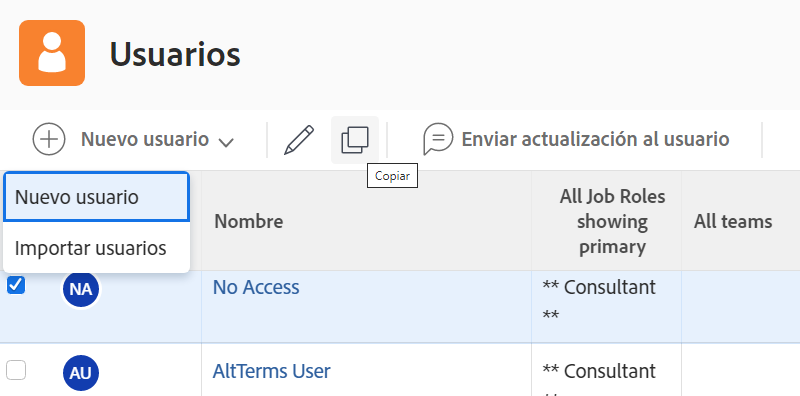

# Creación de un perfil de usuario individual

Cuando se contrata a un nuevo empleado o alguien se transfiere a un departamento mediante [!DNL Workfront], el administrador del sistema solo debe crear un usuario. Esto se puede hacer rápida y fácilmente desde el [!UICONTROL Usuarios] área en [!DNL Workfront].

1. Seleccionar **[!UICONTROL Usuarios]** desde el **[!UICONTROL Menú principal]**.
1. Haga clic en **[!UICONTROL Nueva persona]** botón.
1. Introduzca el nombre y los apellidos del usuario en la variable [!UICONTROL Nueva persona] ventana.
1. Introduzca la dirección de correo electrónico del usuario. Este es su [!DNL Workfront] inicie sesión y debe ser único dentro de su instancia de [!DNL Workfront].
1. Si desea que el usuario reciba un correo electrónico sobre su nuevo inicio de sesión, marque la casilla Enviar invitación.
1. Asigne a la persona un nivel de acceso. Concede sus permisos principales en [!DNL Workfront].
1. Asigne el usuario a un grupo de inicio para asegurarse de que tiene acceso al trabajo correcto.
1. Seleccionar **[!DNL Add this Person]** para terminar de crear el usuario.

![[!UICONTROL Nueva persona] ventana](assets/admin-fund-adding-users-1.png)

El [!UICONTROL Mostrar opciones avanzadas] Este vínculo abre la ventana de detalles completa del usuario. Esto permite al administrador del sistema definir información adicional de organización y planificación de recursos, como equipos y funciones de puesto, además de introducir información personal sobre el usuario (número de teléfono, cargo, etc.).

![[!UICONTROL Nueva persona] después de hacer clic en [!UICONTROL Mostrar opciones avanzadas]](assets/admin-fund-adding-users-2.png)

El usuario puede modificar parte de esta información, pero parte no (según los permisos de nivel de acceso del usuario).

## Copiar un usuario existente para crear uno nuevo

Utilice un usuario existente en el sistema como base para crear un nuevo inicio de sesión. Se copiará parte de la información del usuario existente, pero parte de la información debe rellenarse desde cero.

1. Seleccionar **[!UICONTROL Usuarios]** desde el **[!UICONTROL Menú principal]**.
1. Seleccione el usuario que desee copiar marcando la casilla junto a su nombre.
1. Seleccione la flecha de la **[!UICONTROL Nueva persona]** y elija **[!UICONTROL Nuevo a partir de persona seleccionada]**.
1. Rellene el **[!UICONTROL Información personal]** con la información del nuevo usuario.
1. Algunos campos se copian del usuario original. Cambie la información según sea necesario.
1. Seleccionar **[!UICONTROL Agregar esta persona]**.

![[!UICONTROL Nueva persona] ventana](assets/admin-fund-adding-users-4.png)

<!--
Learn more URLs
Add users
-->
