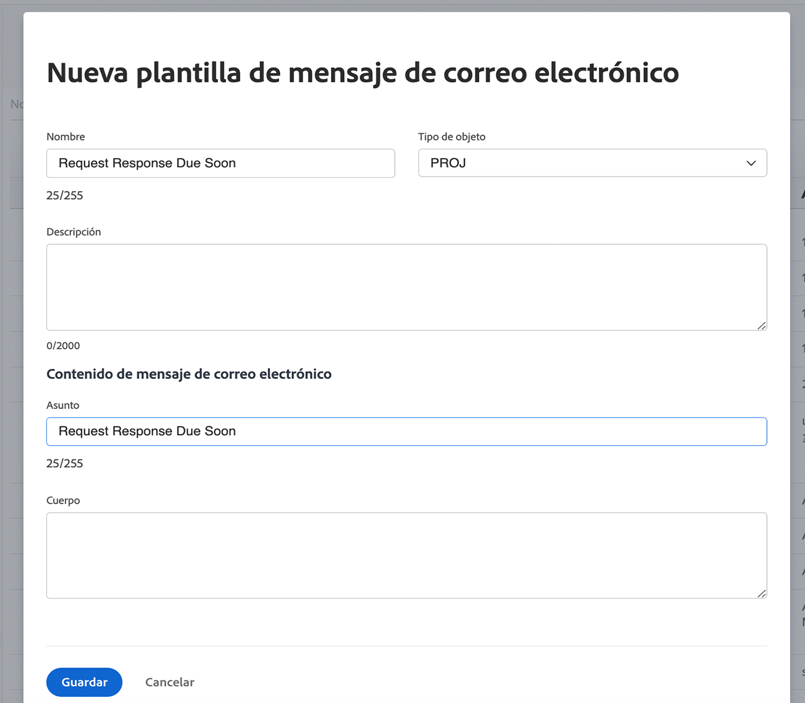

<!---
this has the same content as the system administrator notification setup and mangement section of the email and inapp notificiations learning path
--->

# Configuración de notificaciones de recordatorio

Los administradores del sistema crean las notificaciones de recordatorio en la variable [!UICONTROL Configuración] . Luego se pueden adjuntar y utilizar por los propietarios de proyectos, tareas y problemas como recordatorios para saber cuándo el trabajo debe realizarse pronto o antes.

Los recordatorios son específicos del objeto y deben adjuntarse manualmente al elemento de trabajo correspondiente para poder enviar la notificación.

**Creación de una notificación de recordatorio**

1. Haga clic en **[!UICONTROL Configuración]** en el **[!UICONTROL Menú principal]**.
1. Haga clic en el **[!UICONTROL Correo electrónico]** para obtener más información.
1. Haga clic en el **[!UICONTROL Notificaciones]** para obtener más información.
1. Haga clic en el **[!UICONTROL Nuevo recordatorio]** pestaña .
1. Haga clic en el **[!UICONTROL +Notificación de nuevo recordatorio]** botón.
1. Seleccione el objeto deseado para el menú desplegable.
1. Rellene la información requerida.
1. Haga clic en **[!UICONTROL Guardar]**.

![[!UICONTROL Nueva notificación de recordatorio] window](assets/admin-fund-reminder-notification-1.png)

Al configurar el recordatorio, hay que tener en cuenta algunos aspectos:

* **[!UICONTROL Nombre de notificación del recordatorio] —** Este es el nombre que verán los jefes de proyecto cuando adjunten un recordatorio a un objeto. Asegúrese de que el nombre sea sucinto pero descriptivo.
* **[!UICONTROL Período de calificación] —** Número de horas, días, semanas o meses antes o después de la fecha seleccionada en la sección Temporización.
* **[!UICONTROL Temporización] —** Seleccione si el recordatorio debe enviarse antes o después de las fechas de inicio/finalización previstas, previstas o reales del objeto. Las opciones para las hojas de horas están relacionadas con la fecha de inicio, la fecha de finalización o la fecha de la última actualización.
* **[!UICONTROL Criterios] —** Especifique los criterios para calificar el recordatorio que se va a enviar. Las opciones varían según el recordatorio específico del objeto.
* **[!UICONTROL Destinatarios] —** Seleccione a quién se debe enviar el recordatorio. Las opciones de los interesados varían según el tipo de objeto seleccionado para el recordatorio.

Una vez establecida y guardada la configuración del recordatorio, los propietarios de objetos pueden utilizar la notificación del recordatorio en [!DNL Workfront].

## Personalización del correo electrónico

Las notificaciones de recordatorio utilizan un formato de correo electrónico y un mensaje predeterminados. Si desea personalizar el correo electrónico, puede crear una plantilla.

<!---
paragraph above needs a hyperlink to an article
--->

<!---
learn more URLs
--->
