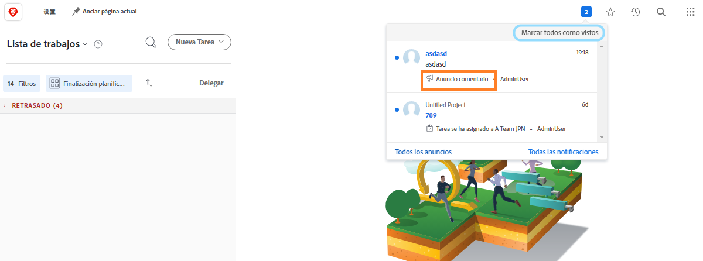
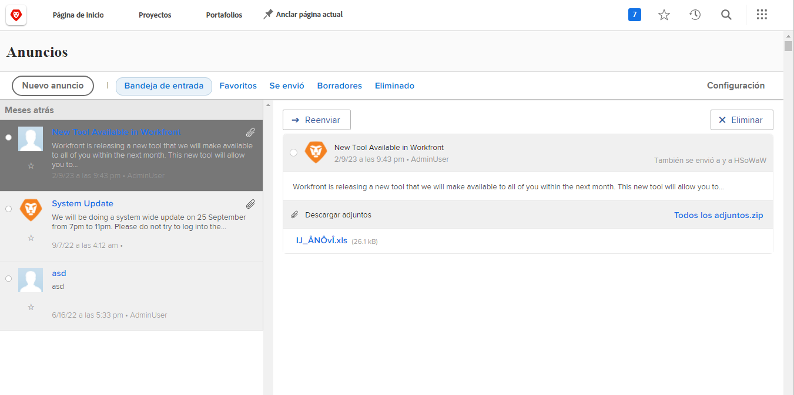

<!--
this has the same content as the system administrator notification setup and mangement section of the email and inapp notificiations learning path
-->

# Enviar mensajes del [!UICONTROL centro de anuncios]

El [!UICONTROL centro de anuncios] es una ubicación centralizada para que los administradores del sistema puedan recibir comunicaciones de [!DNL Workfront] o enviar anuncios a los usuarios de [!DNL Workfront] de su organización.

[!DNL Workfront] envía anuncios a los administradores del sistema sobre versiones de software, seminarios web próximos, mantenimiento del sistema y mucho más. El [!UICONTROL centro de anuncios] coloca toda esta información importante en un lugar, de modo que no la pierda entre los demás mensajes de la bandeja de entrada del correo electrónico.

El icono de notificación muestra las notificaciones y los anuncios sin leer enviados a través de [!DNL Workfront]. Los anuncios de la lista están etiquetados y se puede hacer clic en ellos si desea abrirlos.

Los administradores del sistema también pueden usar el [!UICONTROL centro de anuncios] para enviar mensajes a todos los usuarios de [!DNL Workfront]. Puede enviar recordatorios sobre con quién ponerse en contacto para obtener soporte técnico, ofrecer una “sugerencia del día” y más.

Vínculo ![[!UICONTROL Todos los anuncios]](assets/admin-fund-announcements-2.png)

**Para enviar un anuncio**

1. Haga clic en el **icono de notificación**.
1. Haga clic en **[!UICONTROL Todos los anuncios]**.
1. Haga clic en el botón **[!UICONTROL Nuevo anuncio]**. De forma predeterminada, la línea [!UICONTROL Enviar a] se rellena con [!UICONTROL Todos] para enviar un mensaje a todos los usuarios de [!DNL Workfront]. Puede eliminarla y escribir nombres de usuarios, funciones de trabajo, equipos, grupos o empresas.
1. Escriba una línea de asunto.
1. A continuación, escriba el texto del anuncio utilizando las herramientas de edición que desee.
1. Adjunte archivos para compartir haciendo clic en el botón **[!UICONTROL Agregar archivo adjunto]**, si procede.
1. Haga clic en **[!UICONTROL Enviar]**.

![Escribir un anuncio en la página [!UICONTROL Anuncios]](assets/admin-fund-announcements-3.png)

El área de anuncios parece una bandeja de entrada, los mensajes recibidos están en el panel izquierdo. Haga clic en un mensaje para leerlo.

