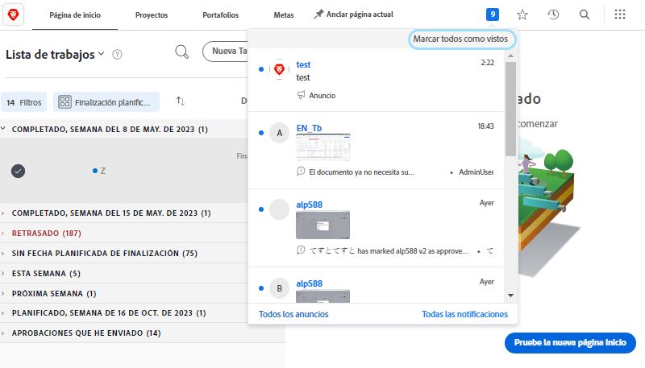
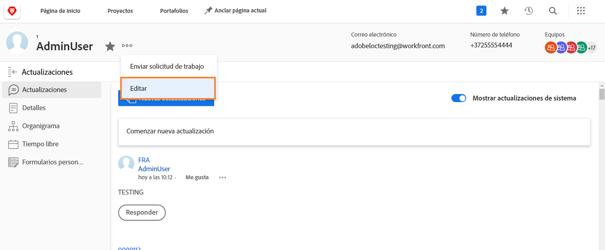

# Administrar notificaciones de eventos en la aplicación y por correo electrónico

El correo electrónico es parte de la vida laboral diaria y, algunos días, la cantidad de correo electrónico que recibe es abrumadora. Sin embargo, con [!DNL Workfront], los administradores del sistema pueden asegurarse de que todos reciben correos electrónicos relevantes y útiles con respecto al trabajo con el que están involucrados.

Workfront puede enviar a los usuarios varios tipos de notificaciones. Algunas de estas notificaciones están controladas a nivel del sistema y afectan a todos los usuarios. Algunas notificaciones se pueden configurar para que generen correos electrónicos instantáneamente, en un compendio diario. O bien, desactive los correos electrónicos para generar solo notificaciones dentro de Workfront.

## Notificaciones de eventos

Un evento es como un cambio de estado, un comentario publicado o una asignación realizada y puede generar un déclencheur de una notificación en la aplicación en [!DNL Workfront].

Sin embargo, puede determinar para qué eventos desea recibir notificaciones por correo electrónico seleccionando o anulando la selección de las opciones de sus preferencias.

Para realizar estos cambios, haga clic en su nombre desde la [!UICONTROL Menú principal].

![Nombre de usuario en [!UICONTROL Menú principal]](assets/admin-fund-user-notifications-02.png)

Haga clic en [!UICONTROL Editar] de la variable [!UICONTROL Más] para abrir el Navegador.

Haga clic en [!UICONTROL Notificaciones] en el [!UICONTROL Editar persona] cuadro emergente.

![[!UICONTROL Editar persona] window](assets/admin-fund-user-notifications-04.png)

Desde aquí puede decidir qué notificaciones desea recibir instantáneamente, diariamente o no. Los cambios que realice aquí son específicos de usted y no afectan a ningún otro usuario de Workfront.

**[!UICONTROL Diariamente]**

De forma predeterminada, los correos electrónicos están configurados para enviarse instantáneamente. Sin embargo, puede cambiar la frecuencia de notificación por correo electrónico desde [!UICONTROL Instantáneo] a [!UICONTROL Diario], asegurándose de que obtiene la información que necesita, cuando lo desea.

![[!UICONTROL Notificación] sección de [!UICONTROL Editar persona] window](assets/admin-fund-user-notifications-05.png)

La opción daily envía un resumen de los eventos del día en un mensaje de correo electrónico. Los usuarios reciben un correo electrónico por cada agrupación que ven en la variable [!UICONTROL Notificaciones] para obtener más información.

Por ejemplo, la variable [!UICONTROL Información sobre proyectos propios] generará un correo electrónico diario, la variable [!UICONTROL Acción necesaria] generará un correo electrónico diario, etc.

![[!UICONTROL Resumen diario] correo electrónico para [!UICONTROL Información sobre proyectos propios]](assets/admin-fund-user-notifications-06.png)

![[!UICONTROL Resumen diario] correo electrónico para [!UICONTROL Acción necesaria]](assets/admin-fund-user-notifications-07.png)

Además de seleccionar la opción diaria, establezca una hora para que se envíen esos correos electrónicos. Dependiendo de lo que funcione mejor, se pueden enviar correos electrónicos resumidos antes de entrar en el trabajo por la mañana o justo antes de salir para el día.

![[!UICONTROL Enviar un resumen diario por correo electrónico después de] menú desplegable en la [!UICONTROL Editar persona] window](assets/admin-fund-user-notifications-08.png)

**En absoluto**

La última opción es desactivar completamente las notificaciones por correo electrónico.

![La notificación seleccionada está desactivada [!UICONTROL Editar persona] window](assets/admin-fund-user-notifications-09.png)

Si decide hacerlo, sepa que, aunque no recibe correos electrónicos, el trabajo sigue asignándose, comentándose y actualizándose en [!DNL Workfront]. Al desactivar todas las notificaciones, es posible que falte información importante que debe tener en cuenta.

Hay algunos casos en los que [!DNL Workfront] ha visto a los usuarios desactivar las notificaciones por correo electrónico. Por ejemplo, si realiza la mayor parte del trabajo a través del [!DNL Workfront] aplicación móvil, puede desactivar las notificaciones por correo electrónico y recibir notificaciones solo a través de la aplicación.

Independientemente del [!UICONTROL Notificaciones de eventos] si decide recibir, las notificaciones son importantes para el éxito del trabajo que se está realizando para los objetivos de su organización.

## Recommendations

Hay un par de notificaciones de que [!DNL Workfront] recomienda dejar marcado, ya sea para un correo electrónico instantáneo o un compendio diario.

Para la mayoría de los usuarios:

* [!UICONTROL Al finalizar una tarea predecesora de una de mis tareas.]
* [!UICONTROL Alguien me incluye en una actualización dirigida]
* [!UICONTROL Alguien comenta sobre mi elemento de trabajo]
* [!UICONTROL Cambio de fecha límite de una tarea a la que estoy asignado]

Específicamente para los administradores de proyectos:

* [!UICONTROL Se activa un proyecto en el que participo]
* [!UICONTROL Se retrasa un proyecto de mi propiedad]
* [!UICONTROL Se agrega un problema a un proyecto de mi propiedad]
* [!UICONTROL La tarea Milestone se completa en un proyecto que yo mismo]

<!---
learn more URLs
Email notifications
guide: manage your notifications
--->
