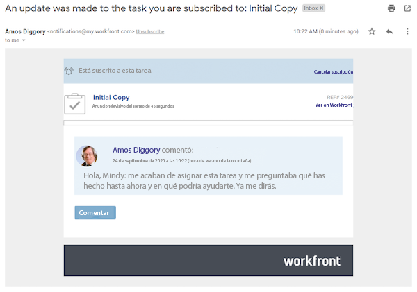
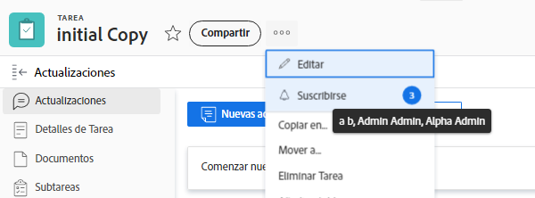

# Suscribirse a los elementos de trabajo

Las notificaciones de eventos le ponen al día sobre el trabajo que le ha sido asignado. Sin embargo, puede haber ocasiones en las que desee seguir elementos de trabajo que no tenga asignados, ya que esto puede afectar al trabajo que realice. Suscribirse a un elemento específico es la solución perfecta.

Por ejemplo, le interesa el progreso de la tarea Copia inicial. No le han asignado esta tarea, pero es responsable de editar esa copia inicial y desea saber lo que está sucediendo. Puede suscribirse a la tarea y, cuando se realicen actualizaciones, recibirá una notificación por correo electrónico que le ofrecerá una actualización en tiempo real de cómo progresa ese trabajo.

Es importante tener en cuenta que los correos electrónicos de suscripción y las notificaciones en la aplicación se envían solo cuando se realizan comentarios sobre el elemento. Los mensajes de correo electrónico y las notificaciones no se envían en otras acciones, como modificaciones de fechas de vencimiento o cambios de asignación.

Para suscribirse a un elemento de trabajo, debe tener al menos un permiso de uso compartido Ver para ese elemento.

Ventana ![[!UICONTROL Acceso a tareas]](assets/admin-fund-user-notifications-11.png)

Una vez que tenga acceso al elemento de trabajo, suscríbase a él mediante las acciones siguientes:

1. Vaya a la página de aterrizaje del proyecto, tarea o problema.
1. Haga clic en el menú **[!UICONTROL Acciones]**.
1. Hacer clic en **[!UICONTROL Suscribirse]**.

Opción ![[!UICONTROL Suscribirse] del menú de tareas](assets/admin-fund-user-notifications-12.png)

Puede ver quién más se ha suscrito al elemento de trabajo pasando el ratón por encima del número situado junto a [!UICONTROL Suscribirse/cancelar suscripción] en el menú.

Si tiene permisos para [!UICONTROL Administrar] o [!UICONTROL Compartir] para el elemento de trabajo, puede suscribir otros usuarios a un proyecto, tarea o problema mediante las acciones siguientes:

1. Haciendo clic en el número situado junto a la variable **[!UICONTROL Suscribirse]**.
1. Añadiendo el nombre de las personas que desea suscribir al elemento de trabajo.
1. Haciendo clic en **[!UICONTROL Guardar]**.

Ventana ![[!UICONTROL Suscribirse]](assets/admin-fund-user-notifications-15.png)

A las personas las que suscriba no se les notificará de la suscripción. Todos los suscriptores tienen permisos de visualización para el elemento. Sin embargo, si el suscriptor ya tenía los permisos [!UICONTROL Contribuir] o [!UICONTROL Administrar] para el elemento, esos permisos permanecerán inalterados.

Una entrada en la variable [!UICONTROL Actualizaciones] del elemento individual también indica quién se suscribió y cuándo. La variable [!UICONTROL Actualizaciones] también registra cuando otra persona ha suscrito a un usuario.

Página ![[!UICONTROL Actualizaciones] en una tarea que muestra la suscripción](assets/admin-fund-user-notifications-16.png)

Para cancelar la suscripción de un usuario, haga clic de nuevo en la ventana para abrir la ventana [!UICONTROL Suscriptores]. A continuación, haga clic en la X junto al nombre de la persona. No se notifica al usuario de que se ha dado de baja de la suscripción.

Opción de menú ![[!UICONTROL Cancelar suscripción] de un proyecto](assets/admin-fund-user-notifications-14.png)

<!--
learn more URL: Subscribe to items in Workfront
-->
