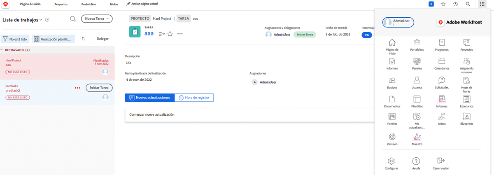
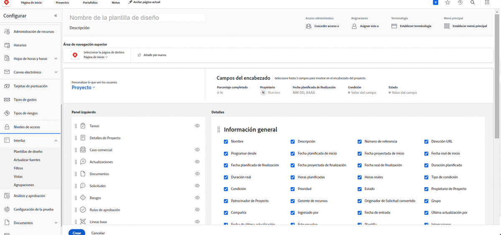
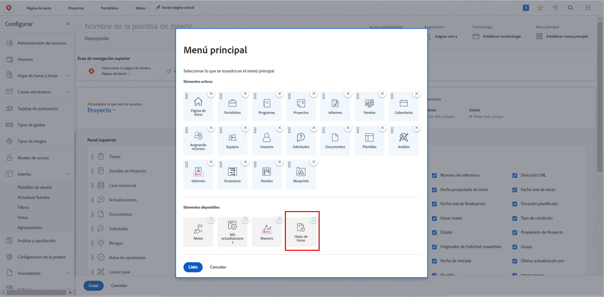
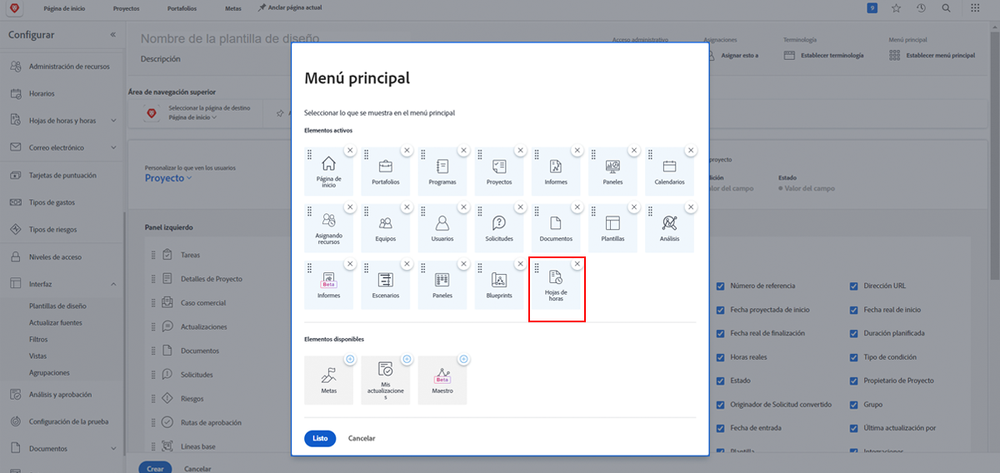

# ¿Qué son las plantillas de diseño?

Workfront tiene una gran cantidad de herramientas útiles para ayudarle a trabajar. Sin embargo, tener muchas opciones puede ser abrumador.

Las plantillas de diseño permiten a los administradores de sistemas y grupos personalizar la experiencia del usuario y centrarse en lo que es importante.

Por ejemplo, la mayoría de su organización no registra el tiempo. Sin embargo, el equipo consultor factura a los clientes, por lo que necesita contabilizarlo para garantizar una facturación precisa. Con una plantilla de diseño, las fichas horarias pueden ocultarse para quienes no las necesiten y mostrarse para quienes sí.

## Antes de la versión

Workfront recomienda hablar con los usuarios antes de crear una plantilla de diseño. Lo que facilita la tarea de disponer la información y las herramientas adecuadas es involucrar a quienes usen la plantilla de diseño, como los administradores de grupo.

No tenga miedo de introducir cambios después de crear una plantilla. Continúe recabando información sobre lo que necesitan, desean ver y a lo que quieren acceder. Recuerde que las plantillas de diseño están concebidas para ofrecer una experiencia sencilla a los usuarios.
