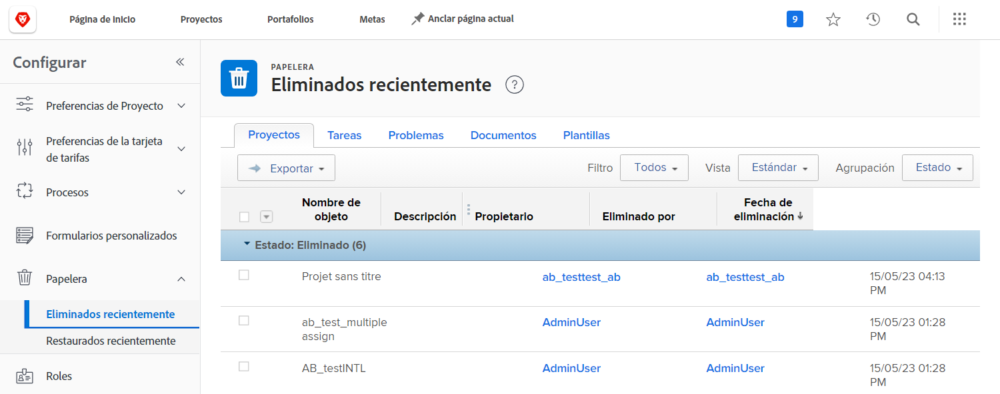
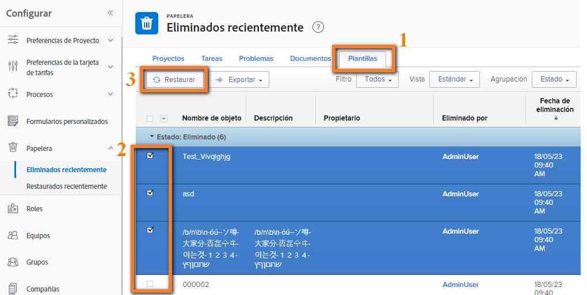
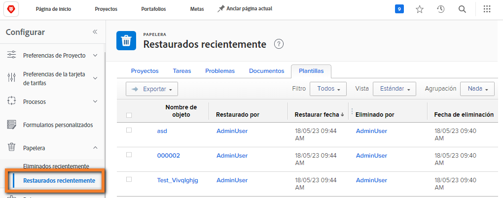

# Restaurar objetos desde la papelera de reciclaje

El trabajo del proyecto experimenta muchos cambios. Puede eliminar algo y 30 minutos más tarde se da cuenta de que la tarea era necesaria o que el documento era vital para el problema que está tratando de resolver.

Cuando se elimina algún objeto, Workfront lo coloca en la papelera de reciclaje durante un máximo de 30 días. El administrador del sistema puede restaurar el objeto a su posición original en Workfront, junto con toda su información (actualizaciones, horas registradas, documentos, etc.).

## Restauración de un objeto

1. Seleccione el área **Configuración** en el **Menú principal**.
1. Haga clic en **Papelera de reciclaje** en el panel de la izquierda.
1. Seleccione **Eliminado recientemente**.

Cada objeto restaurable tiene una pestaña para facilitar la búsqueda del elemento concreto que se va a restaurar.

1. Haga clic en la pestaña del objeto deseado.
1. Marque la casilla junto a los objetos para restaurarlos.
1. Haga clic en el botón **Restaurar**.

Los objetos que se restauran se mostrarán brevemente en la sección [!UICONTROL En curso]. Una vez que se actualiza la pantalla, los objetos ya no aparecen en la pantalla porque se han restaurado. Los elementos aparecen donde estaban anteriormente en [!DNL Workfront], lo cual se puede verificar en la pantalla [!UICONTROL Restaurado recientemente].

Los administradores del grupo pueden restaurar un proyecto asociado al grupo que administran, junto con cualquier tarea, problema o documento asociado al proyecto.

<!--
learn more URL
Restoring deleted items
Viewing items that have been recently restored
-->
