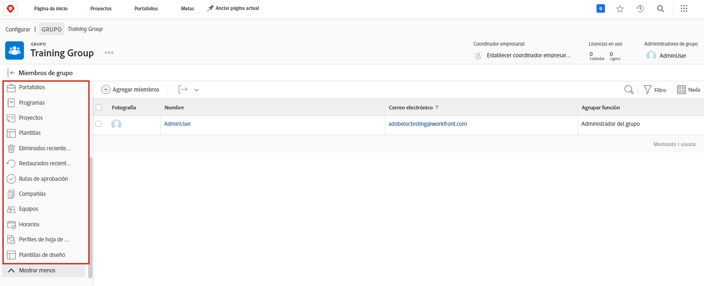

# Comprender la necesidad de administradores de grupos

<!---
21.4 updates have been made
--->

Cuando es el administrador del sistema de una empresa grande o de una que tiene muchos [!DNL Workfront] usuarios, mantener [!DNL Workfront] la configuración de cada grupo y subgrupo puede llevar mucho tiempo.

Nombrar administradores de grupo que puedan realizar algunas funciones administrativas para sus propios grupos en [!DNL Workfront] ayuda a equilibrar la carga a la hora de actualizar y mantener el sistema.

Los administradores del grupo tienden a estar más en sintonía con los desafíos diarios de su grupo, por lo que pueden administrar las necesidades del grupo. Esto le permite, como administrador del sistema, centrarse en la [!DNL Workfront] configuraciones que benefician a su organización en su conjunto.

Algunas de las cosas que los administradores de grupos pueden hacer en [!DNL Workfront] incluir:

* Cree subgrupos y añada usuarios a los subgrupos.
* Cree plantillas de diseño para su grupo.
* Cree procesos de aprobación para el grupo.
* Crear estados de flujo de trabajo de nivel de grupo.
* Acceda a proyectos, programas y portafolios asociados al grupo desde la página del grupo.
* Administrar las preferencias de proyecto, tarea y problema de nivel de grupo.
* Administrar las preferencias de hojas de horas de nivel de grupo.
* Administrar notificaciones de eventos de nivel de grupo.
* Inicie sesión como otros miembros del grupo.
* Asigne un líder empresarial al grupo.
* Gestionar una empresa.

Como administrador de sistemas o grupos, puede crear subgrupos dentro de los grupos y subgrupos que administra. A estos subgrupos se les pueden asignar sus propios administradores de grupo.

>[!NOTE]
>
>Hay un límite de 14 niveles de subgrupos en un grupo.

**Más información sobre los administradores de grupo**

<!---
bullet points below need hyperlinks
--->

Para obtener una lista de lo que administra el sistema, los administradores de grupos y los administradores de subgrupos pueden hacer en [!DNL Workfront], consulte el artículo Acciones permitidas para diferentes tipos de administradores.

## Administrar un grupo

Administre de forma rápida y eficaz miembros de grupo, subgrupos, estados de grupo, preferencias de proyecto de grupo y mucho más desde la página de grupo en [!DNL Workfront].

1. Seleccionar **[!UICONTROL Configurar]** desde el **[!UICONTROL Menú principal]**.
1. Ir a **[!UICONTROL Grupos]** en el panel izquierdo.
1. Seleccione el nombre de un grupo para abrirlo.
1. Abra la sección en la que desee realizar actualizaciones haciendo clic en ella en el panel izquierdo.

<!---
learn more URLs
Create and manage groups 
Create and manage subgroups 
Business leader overview 
--->
