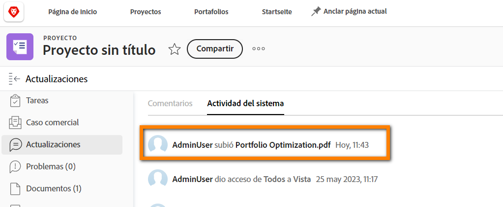

# Iniciar sesión como otro usuario

Una característica que los administradores de Workfront encuentran útil a la hora de configurar la experiencia del usuario es la función Iniciar sesión como. Esta función, en el [!UICONTROL Configurar] , le permite iniciar sesión como otro usuario sin tener que cerrar la sesión de su propia cuenta.

![[!UICONTROL Iniciar sesión como] página en [!UICONTROL Configurar] área](assets/admin-fund-log-in-as-1.png)

## Ventajas de iniciar sesión como

Esta función es útil por varios motivos:

* Los administradores pueden obtener una vista previa de las plantillas de diseño asignadas a los usuarios para asegurarse de que los elementos de menú o los paneles se muestran correctamente.
* Durante las pruebas del flujo de trabajo, resulta útil asegurarse de que los permisos de un usuario estén correctamente configurados.
* Los administradores incluso pueden utilizar esta función para marcar una tarea como completada o para aprobar a alguien que no pueda hacerlo.

## Acceder Iniciar sesión como

1. Seleccionar **[!UICONTROL Configurar]** desde el **[!DNL Main Menu]**.
1. Clic **[!UICONTROL Iniciar sesión como]** en el panel izquierdo.
1. Introduzca el nombre del usuario con el que debe iniciar sesión.

![[!UICONTROL Acceder al registro] pestaña activada [!UICONTROL Iniciar sesión como] página](assets/admin-fund-log-in-as-3.png)

Una vez que haya iniciado sesión, aparecerá una notificación en la parte superior de la pantalla que indica con quién ha iniciado sesión.

![[!UICONTROL Ha iniciado sesión como] Mensaje en la parte superior de [!DNL Workfront] ventana](assets/admin-fund-log-in-as-2.png)

## La pestaña Actualizaciones rastrea la actividad

Cuando un administrador de se conecta como otro usuario y realiza cambios/actualizaciones en nombre de ese usuario, los cambios se ven en el área de Actualizaciones de ese elemento específico. El ejemplo siguiente muestra que Joan Harris cambió una fecha límite en nombre de Roy Campbell.

