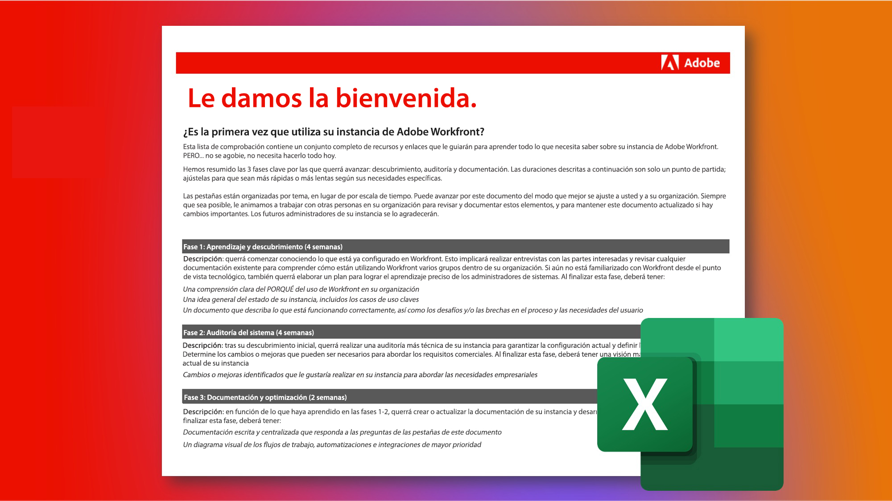

# Ocuparse de una instancia de Adobe Workfront existente

Lo maravilloso de Workfront es que es tan personalizable. El desafío de Workfront es que es muy personalizable. Y si es un administrador de sistema o de grupo nuevo que se hace cargo de una instancia de Workfront existente, puede resultar abrumador averiguar cómo se configuró y configuró originalmente.

Sin embargo, a través de nuestra Lista de comprobación de instancias heredadas, puede aprender todo lo que necesita saber sobre su instancia.\
 
 
<a href="assets/adobe-workfront-system-admin-playbook-inherited-instance.xlsx" class="spectrum-Button spectrum-Button--outline spectrum-Button--primary spectrum-Button--sizeM">
Descargar la lista de comprobación de instancias heredadas 
</a>

En esta lista de comprobación, revisará un conjunto completo de preguntas, recursos y vínculos para comprender claramente cómo se ha configurado.

Además, hemos descrito tres fases clave por las que pasará: descubrimiento, auditoría y documentación, con las duraciones sugeridas. Se pueden ajustar para adaptarlas a sus necesidades específicas y no tienen que hacerse de una sola vez.

Las fichas de la hoja de cálculo están organizadas por temas, en lugar de por escala de tiempo, para que pueda avanzar por el documento de la forma que le resulte más apropiada a usted y a su organización.

Siempre que sea posible, le animamos a que trabaje con otros miembros de su organización para revisar y documentar estos elementos, y a que mantenga este documento actualizado si se producen cambios importantes. Los futuros administradores de su instancia se lo agradecerán.

 
 

## Fase 1: Aprendizaje y descubrimiento

<b>Plazo sugerido: 4 semanas</b>

Lo primero que debe hacer es comprender cómo se configura hoy la instancia de Workfront.

Esto implica realizar entrevistas con las partes interesadas y revisar cualquier documentación existente para comprender cómo utilizan Workfront varios grupos de su organización.

Si no está familiarizado con Workfront desde un punto de vista tecnológico, realice la formación de administrador del sistema. Esto proporciona la perspectiva necesaria sobre cómo funcionan y afectan las distintas configuraciones a cada herramienta y, potencialmente, a cada usuario en Workfront.

Al final de esta fase, debería tener:

* Una comprensión clara de por qué el uso de Workfront por parte de su organización

* Una sensación general del estado de la instancia, incluidos los casos de uso clave

* Un documento que resume lo que funciona bien, así como los desafíos y/o lagunas en los procesos y las necesidades de los usuarios
 
 

## Fase 2: Auditoría del sistema

<b>Plazo sugerido: 4 semanas </b>

Después del descubrimiento inicial, se recomienda realizar una auditoría más técnica de la instancia. Esto significa que debe determinar los cambios o mejoras que pueden ser necesarios para garantizar que la configuración y la instalación actuales cumplan con los requisitos y necesidades de su empresa.

Al final de esta fase, debería tener:

* Una vista más detallada del estado actual de su instancia

* Se han identificado los cambios o mejoras que le gustaría realizar en su instancia para satisfacer las necesidades comerciales.
 
 

## Fase 3: Documentación y optimización

<b>Plazo sugerido: Inicial = 2 semanas; Actualización continua </b>

En función de lo que ha aprendido en las fases 1 y 2, querrá crear o actualizar y documentación de su instancia y desarrollar hojas de ruta para abordar desafíos estratégicos y de nivel de programa.

Mientras esta fase está en curso, debería tener:

* Documentación centralizada escrita que responde a las preguntas de las pestañas de este documento

* Diagrama visual de los flujos de trabajo, las automatizaciones y las integraciones de mayor prioridad

* Registro de pendientes o hoja de ruta que documenta futuras mejoras para mejorar los desafíos organizativos y estratégicos

 
Al pasar por cada fase, y con la ayuda de la lista de comprobación de instancias heredadas, usted, como administrador de un nuevo sistema o grupo, debe comprender mejor cómo se configura su instancia de Workfront, qué ajustes o mejoras se deben realizar y solidificar la documentación para optimizar la experiencia de Workfront de su organización.

 
 

Puede encontrar más información a continuación:
* [Definición de objetivos para la implementación de Workfront](https://experienceleague.adobe.com/docs/workfront/using/administration-and-setup/get-started-administration/define-wf-goals-objectives.html?lang=en)
* [Publicación de blog: Patrocinio ejecutivo y valor para el liderazgo](https://experienceleaguecommunities.adobe.com/t5/workfront-blogs/customer-success-tips-executive-sponsorship-and-value-to/ba-p/518353)
* [Publicación de blog: Introducción a los KPI de Adobe Workfront](https://experienceleaguecommunities.adobe.com/t5/workfront-blogs/kpi-dashboards-in-the-new-workfront-experience-introduction-to/ba-p/549001)
