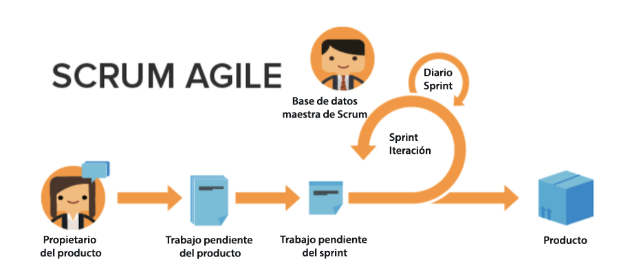

# Ventajas de utilizar Agile

## Capacidad para ajustar y girar rápidamente

Como su nombre indica, la metodología Agile permite que los equipos estén mejor equipados para cambiar rápidamente de dirección y enfoque. Las empresas de software y marketing son especialmente conscientes de la tendencia a que los cambios en la demanda se produzcan de una semana a otra. Agile permite a los equipos reevaluar el trabajo que están realizando y ajustarse en incrementos determinados para asegurarse de que, a medida que cambia el panorama del trabajo y del cliente, el enfoque también cambia para el equipo.

## Transparencia en el trabajo de un equipo

Los equipos de Agile utilizan reuniones diarias denominadas &quot;stand-ups&quot; para asegurarse de que el equipo se mantiene centrado en la lista priorizada de funciones o productos que se van a desarrollar. Ya no experimentan la confusión de no saber en qué están trabajando los demás miembros de su equipo. Mantienen un control regular de lo que el equipo ha logrado desde el día anterior, cualquier problema/obstáculo que puedan tener que ser abordados, y lo que planean trabajar en ese día.

Tener esta transparencia y dirección unificada permite a todos avanzar, más rápido.

## Comentarios frecuentes

La principal ventaja final de adoptar Agile sería el bucle de comentarios que se incorpora al final de cada iteración (recuerde: una iteración es una cantidad fija de tiempo en el que el equipo debe trabajar para completar resultados específicos). El bucle de comentarios permite a un equipo mirar atrás en las últimas semanas para determinar qué problemas surgieron, cómo puede estar cambiando el plan a partir de ahora, qué necesita el cliente si las necesidades anteriores han cambiado y las lecciones aprendidas como equipo.
