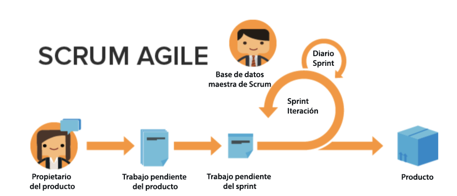

# Ventajas del uso de Agile

## Capacidad de ajustar y girar rápidamente

Como sugiere el nombre, la Metodología ágil permite a los equipos estar mejor equipados para cambiar rápidamente la dirección y el enfoque. Las empresas de software y marketing son especialmente conscientes de la tendencia a que los cambios en la demanda se produzcan de una semana a otra. Agile permite a los equipos reevaluar el trabajo que están realizando y ajustar en incrementos determinados para asegurarse de que, a medida que cambian el trabajo y el panorama del cliente, el enfoque también cambie para el equipo.

## Transparencia en el trabajo de un equipo

Los equipos ágiles utilizan reuniones diarias “breves” para asegurarse de que el equipo se concentre en la lista priorizada de características o productos que se van a desarrollar. Tienen la tranquilidad de saber en qué están trabajando los demás integrantes de su equipo. Llevan un control regular de lo que el equipo ha conseguido el día anterior, de los problemas u obstáculos que puedan tener que abordar y de lo que tienen previsto trabajar ese día.

Tener esta transparencia y una dirección unificada permite a todos avanzar más rápido.

## Comentarios frecuentes

El principal beneficio final de adoptar Agile sería el ciclo de comentarios que se incorpora al final de cada iteración. Recuerde: la iteración es la cantidad de tiempo definida en la que el equipo tiene que trabajar para completar envíos específicos. El ciclo de comentarios le permite al equipo consultar las últimas dos semanas para determinar qué problemas surgieron, cómo puede cambiar el plan futuro, qué necesita el cliente ahora si las necesidades anteriores han cambiado y las lecciones aprendidas en equipo.
