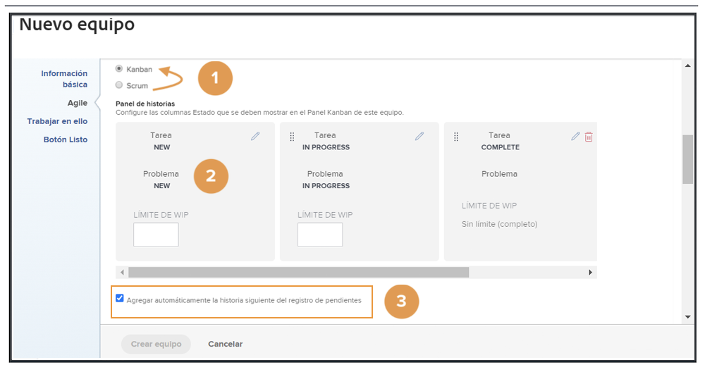
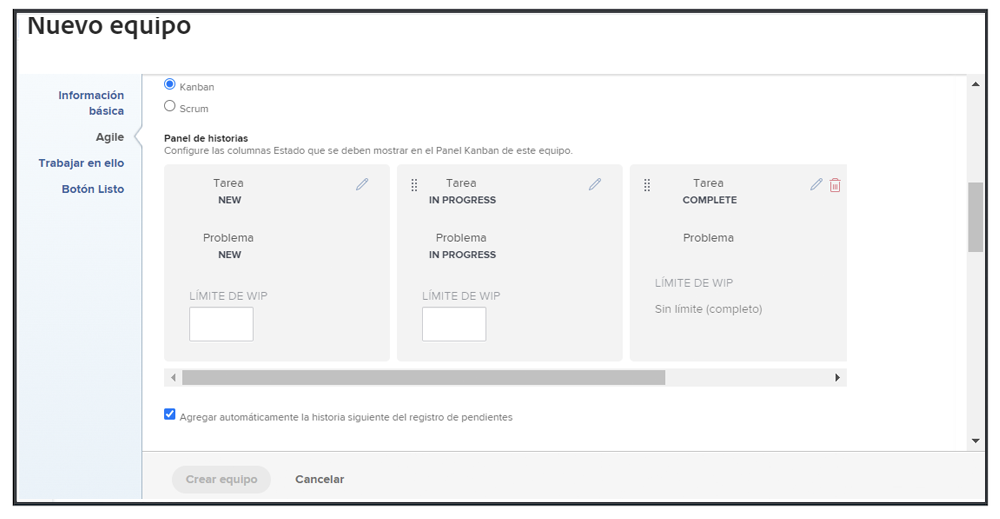
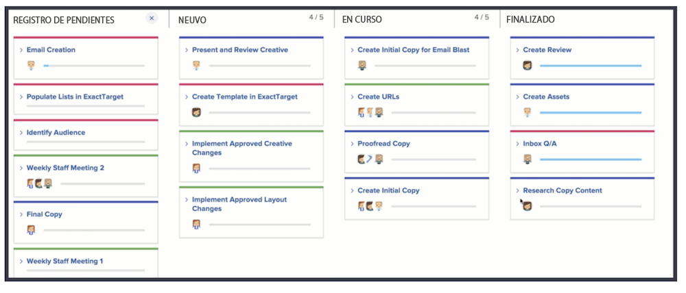
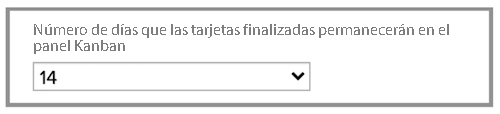

# Crear un equipo Kanban

El equipo de marketing creativo usa Scrum desde hace tiempo. Aunque aprecian el entorno flexible de un equipo ágil, les resulta difícil concretar las operaciones en un plazo determinado debido a la frecuencia con la que cambian las prioridades de su equipo.

Tienen una alternativa a Scrum. Se llama Kanban.

Kanban funciona para equipos que no desean definir en qué están trabajando dentro del período de tiempo que requiere una iteración basada en Scrum. En su lugar, Kanban permite a los equipos trabajar continuamente a través de su registro de asuntos pendientes.

Cambiemos el equipo de marketing creativo de un equipo de Scrum a un equipo de Kanban [1]. Realice este cambio en la sección Agile de la configuración del equipo.

Después de cambiar la metodología, debe especificar cuántas historias puede tener un equipo Kanban a la vez en cada columna ajustando el &quot;límite de WIP&quot;. [2]. WIP significa trabajo en curso (Work in Progress). El número que elija poner aquí depende de la cantidad de elementos activos que pueda gestionar el equipo. Se mostrará en el guion gráfico del equipo para recordarles si están asignados en exceso o no. Usted (y cualquier miembro del equipo con derechos de edición) también puede cambiar el límite del WIP directamente desde el guion gráfico.

Observe que puede arrastrar y soltar columnas de estado para colocarlas en el orden en que desee que estén.

Los equipos de Kanban también pueden elegir que la siguiente historia del registro de asuntos pendientes aparezca automáticamente en el guion gráfico cuando se complete una historia [ver el número 3 en la imagen superior]. Esto ayudará a los equipos que prefieran un ciclo de trabajo continuo.

La imagen siguiente muestra cómo se ve cuando una historia nueva aparece automáticamente en el guion gráfico cuando se completa una historia.

Para ayudar a administrar su trabajo completado de forma más eficiente, las historias permanecen en el tablero durante 14 días de forma predeterminada.

Si es necesario, esa configuración se puede ajustar a entre 1 y 30 días en la ventana de configuración del equipo.

Tenga en cuenta que, aunque esta es una metodología diferente, sigue siendo importante cuando se trabaja en un entorno Agile para preparar continuamente el registro de asuntos pendientes, discutiendo los requisitos de las historias y ajustando la prioridad de las historias. Siempre que desee volver a priorizar el registro de asuntos pendientes, debe mover una pestaña a la pestaña de Registro de asuntos pendientes para reorganizarla.
