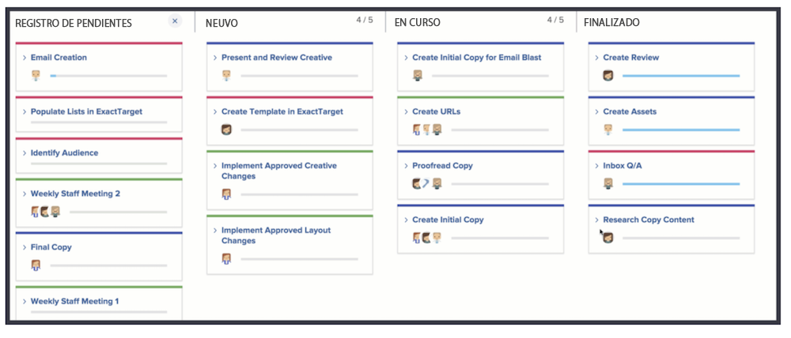

# Creación de un equipo Kanban

El equipo de marketing creativo lleva utilizando Scrum un tiempo. Agradecen el entorno flexible de un equipo Agile, pero les resulta difícil enviar historias a un periodo de tiempo específico debido a la frecuencia con la que cambian las prioridades de su equipo.

Tienen una alternativa a Scrum. Se llama Kanban.

Kanban funciona para equipos que no desean definir en qué están trabajando dentro del periodo de tiempo que requiere una iteración basada en Scrum. En su lugar, Kanban permite a los equipos trabajar continuamente en su registro de pendientes.

Cambiemos el equipo de marketing creativo de un equipo de Scrum a un equipo de Kanban [1]. Realice este cambio en la sección Agile de Configuración del equipo.

Después de cambiar la metodología, debe especificar cuántas historias puede tener un equipo Kanban a la vez en cada columna ajustando el &quot;límite de WIP&quot;. [2]. WIP significa Trabajo en curso. El número que elija poner aquí depende de cuántos elementos activos pueda gestionar el equipo. Se mostrará en el guion gráfico del equipo para recordarles si están sobreasignados o no. Usted (y cualquier miembro del equipo con derechos de edición) también pueden cambiar el límite de WIP directamente desde el guión gráfico.

Tenga en cuenta que puede arrastrar y soltar columnas de estado para colocarlas en el orden en que desee que estén.

Los equipos de Kanban también pueden elegir que la siguiente historia del registro de pendientes aparezca automáticamente en el guion gráfico cuando se complete una historia [ver el número 3 en la imagen superior]. Esto ayudará a los equipos que prefieran un ciclo de trabajo continuo.

La siguiente imagen muestra el aspecto que tendrá cuando una nueva historia aparezca automáticamente en el guion gráfico cuando se complete una historia.

Para ayudar a administrar el trabajo completado de manera más eficiente, las historias permanecen en el tablero durante 14 días de forma predeterminada.

Si es necesario, esa configuración se puede ajustar a entre 1 y 30 días en la ventana de configuración del equipo.

Tenga en cuenta que, aunque esta es una metodología diferente, sigue siendo importante cuando trabaje en un entorno ágil reducir continuamente el retraso al analizar los requisitos de la historia y ajustar la prioridad de la misma. Siempre que desee volver a priorizar el registro de pendientes, debe mover una pestaña a la pestaña Registro de pendientes para reorganizarlo.
