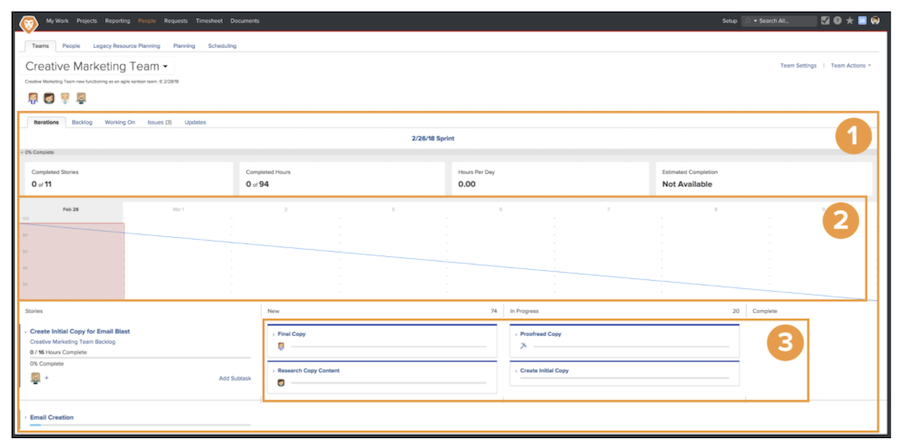

# Crear un equipo ágil de Scrum

## Configuración de un equipo de Scrum

Un equipo ágil en Workfront completa su trabajo desde la página de iteración [1]. El gráfico de evolución [2] en la parte superior de la página es una descripción general del progreso realizado hasta ahora durante esta iteración. Debajo del gráfico de evolución se encuentran las historias [3] a las que ha comprometido el equipo para esta iteración.

En este vídeo, aprenderá a crear un equipo ágil, seleccionar la metodología de Scrum y determinar la configuración del equipo de Scrum.

### Configuración de un equipo de Scrum desde cero

Ahora que sabe qué aspecto tendrá una vez configurado, puede empezar directamente a configurarlo en Workfront. Veamos las configuraciones usando un caso práctico para una compañía denominada Swains. Usted está a cargo de las operaciones del equipo creativo y se le ha otorgado el permiso para que el equipo creativo de marketing se mueva a Agile.

Este equipo en particular ha decidido adoptar la metodología de Scrum porque les encanta que el guion gráfico les dé mucha más visibilidad sobre quién está haciendo qué y en qué estado o elementos de trabajo del escenario están. Funciona bien el poder planear breves iteraciones con sus actuales demandas de trabajo. Normalmente, el equipo recibe campañas de marketing de dos a tres semanas. Debe ser capaz de priorizar aquello que su equipo puede hacer o gestionar en un plazo reducido.

## Crear un equipo ágil de Scrum en Workfront

Este vídeo contiene información sobre:

- Crear un equipo ágil
- Seleccionar la metodología de Scrum
- Determinar la configuración del equipo de Scrum

>[!VIDEO](https://video.tv.adobe.com/v/3412163/?quality=12&learn=on&enablevpops&captions=spa)

¿Ya tiene un equipo en Workfront que desea convertir en un equipo ágil? No se preocupe. Vaya a Configuración del equipo y marque el recuadro “Este es un equipo ágil”.

## Cambio de configuración del equipo ágil

La opción “En la pestaña Problemas, mostrar” ya no se incluye en la página de configuración del equipo porque los equipos ágiles ya no necesitan la pestaña Problemas. Los problemas asignados a un equipo se encuentran en la pestaña Registro de asuntos pendientes, lo que facilita la planificación de iteraciones que incluyen tareas y problemas.
