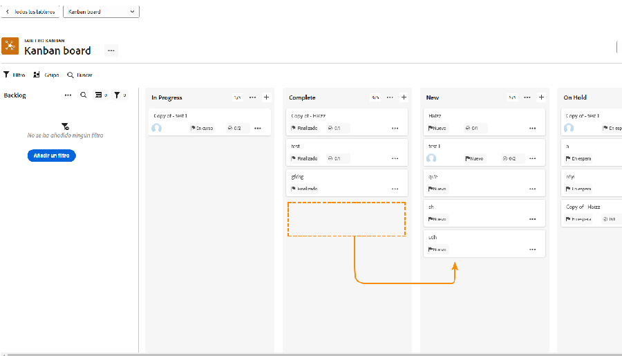
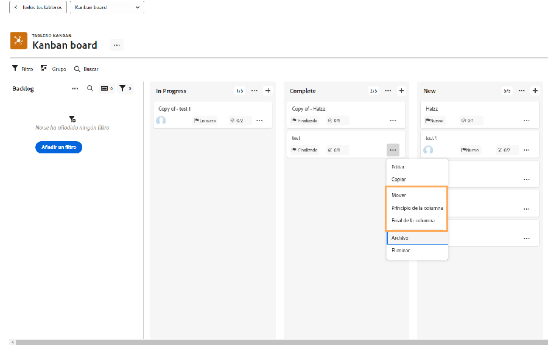
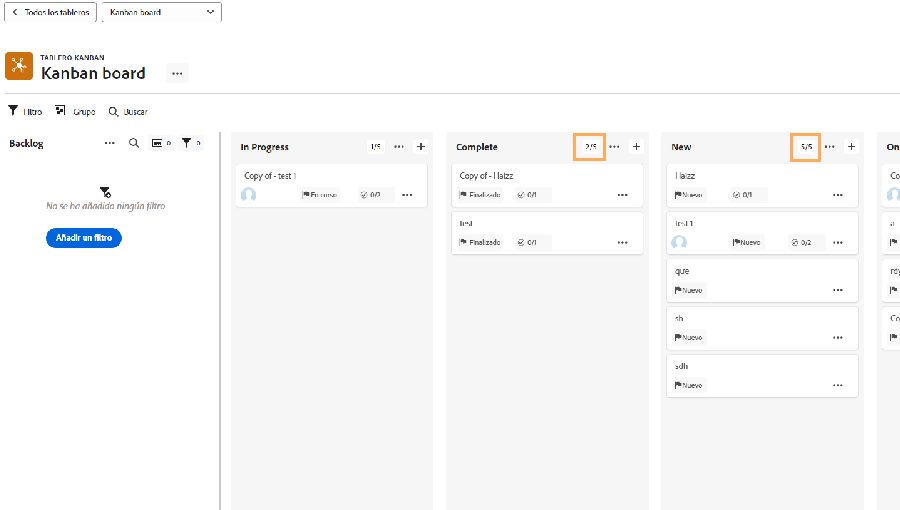
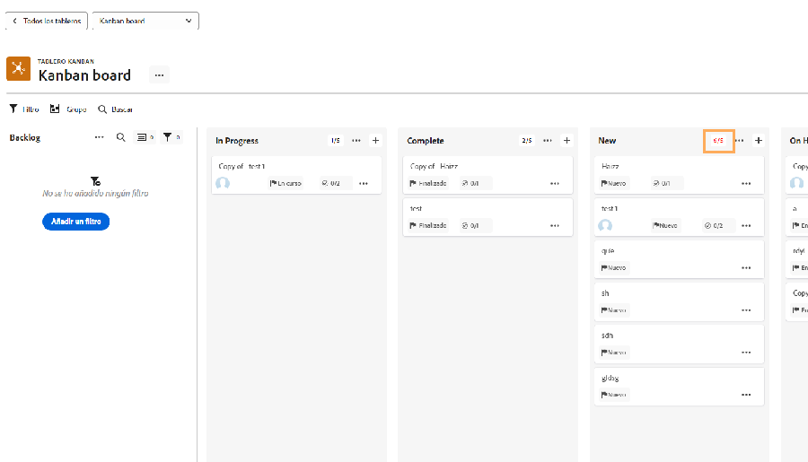

# Administrar el trabajo como equipo kanban

Administrar trabajo como equipo de Kanban Agregar historias al trabajo atrasado de Kanban Existen varias formas de agregar historias al trabajo atrasado del equipo de Creative Marketing.

El equipo puede añadir artículos directamente desde el atraso.
También se les pueden asignar tareas en un proyecto. Si el equipo de Creative Marketing tiene solicitudes dirigidas a ellas, estas solicitudes aparecerán en la ficha Solicitudes del equipo. Aparecerán en el trabajo pendiente del equipo si el equipo selecciona la solicitud y la convierte en un artículo.

## Uso del panel Kanban

Después de priorizar las historias pendientes, es hora de pasar a la junta de Kanban. Puede hacer asignaciones arrastrando y soltando los avatares de los integrantes del equipo que estarán trabajando en ese artículo en la tarjeta de artículo.

A medida que se avance en las historias, el equipo las moverá al estado apropiado en el guión gráfico. Los integrantes del equipo pueden utilizar los indicadores Kanban para indicar si un artículo está en curso, bloqueado o listo para realizar. Esto comunica a otros integrantes del equipo los elementos de trabajo que están en buen estado y si están listos para trabajar en ellos o no.

Los integrantes del equipo también pueden realizar actualizaciones en las tarjetas directamente en el guión gráfico para reflejar los cambios en aspectos como la descripción, el estado o la prioridad. Para ello, haga clic en el menú desplegable de una tarjeta de artículo y realice las modificaciones necesarias en el campo correspondiente [1].

## Ejecución de historias kanban

Tenga en cuenta que está utilizando un límite de cinco artículos en curso de trabajo. Al mirar el tablero, verá que a medida que mueve las tareas a columnas de estado, el número de tareas en cada carril se muestra en la parte superior derecha de cada columna de estado.

Si supera el límite de una columna de estado que coincide con Nuevo o En curso, recibirá un mensaje de error indicando que ha superado el límite de trabajo en curso.

Si su equipo decide que pueden gestionar más o menos artículos a la vez, usted (y otros integrantes del equipo con derechos de edición) pueden cambiar el número de trabajo en curso directamente desde el guión gráfico haciendo clic en el número de trabajo en curso y editándolo para reflejar su nueva decisión.
