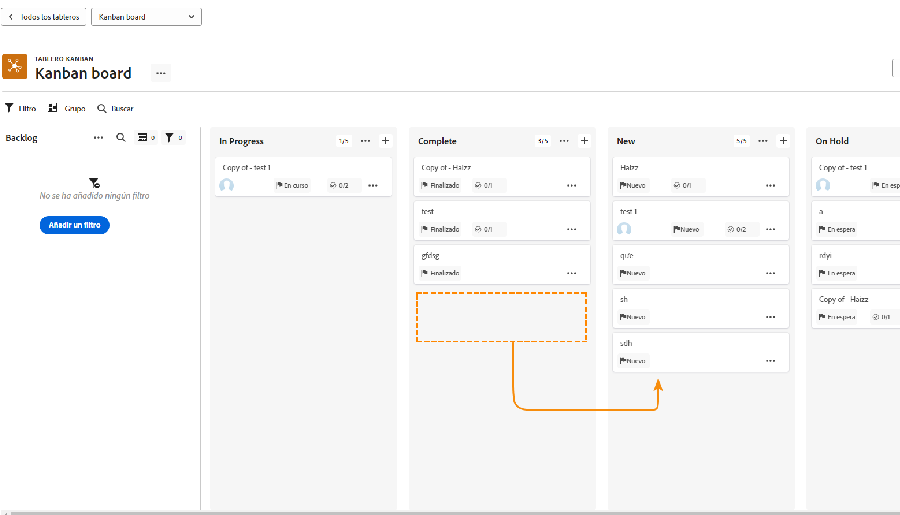
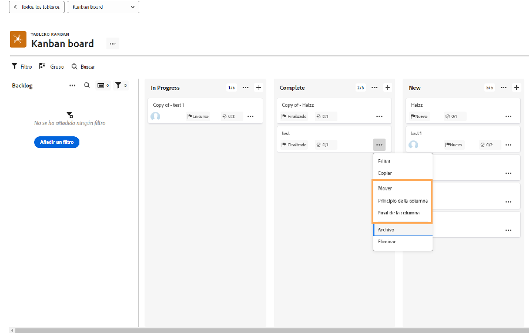
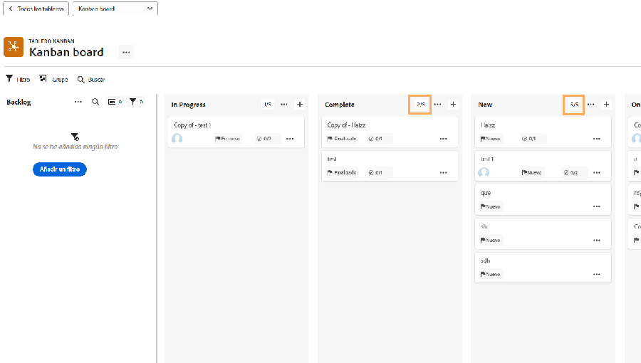
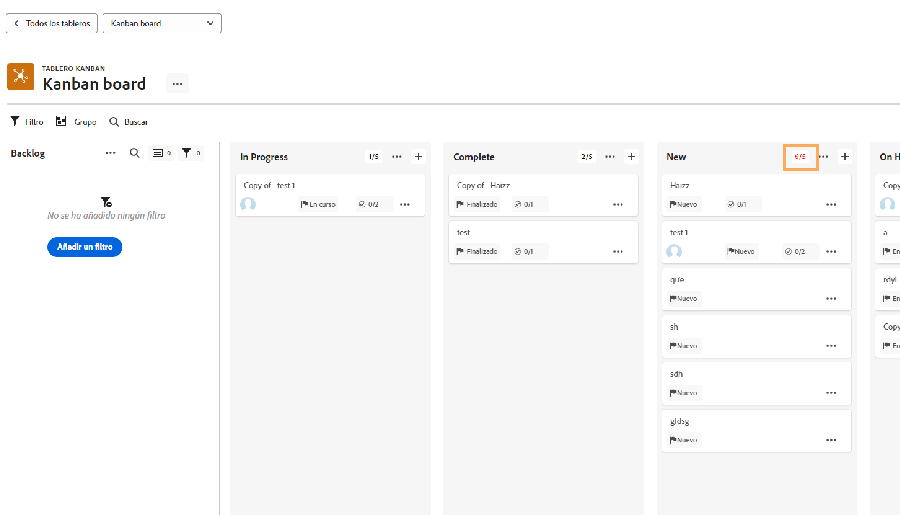

# Administrar el trabajo como un equipo Kanban

Administrar el trabajo como un equipo Kanban
Agregar historias al registro de asuntos pendientes de Kanban
Existen varias formas de agregar historias al registro de pendientes del equipo de marketing de Creative.

El equipo puede añadir historias directamente desde el registro de asuntos pendientes.
También se les pueden asignar tareas en un proyecto. Si el equipo de Creative Marketing tiene solicitudes dirigidas sus integrantes, estas solicitudes aparecerán en la pestaña Solicitudes del equipo. Aparecerán en el registro de asuntos pendientes del equipo si el equipo selecciona la solicitud y la convierte en un artículo.

## Uso del tablero Kanban

Después de priorizar el registro de asuntos pendientes, es hora de pasar al tablero de Kanban. Puede hacer asignaciones arrastrando y soltando los avatares de los integrantes del equipo que estarán trabajando en esa historia en la tarjeta de la historia.

A medida que se avance en las historias, el equipo las moverá al estado correspondiente en el guion gráfico. Los integrantes del equipo pueden utilizar los indicadores Kanban para indicar si una historia está en curso, bloqueada o lista para extraer. Esto comunica a otros integrantes del equipo los elementos de trabajo que están en buen estado y si están listos para trabajar en ellos o no.

Los integrantes del equipo también pueden realizar actualizaciones en las tarjetas directamente en el guion gráfico para reflejar los cambios en aspectos como la descripción, el estado o la prioridad. Para ello, haga clic en el menú desplegable de una tarjeta de historia y realice las modificaciones necesarias en el campo correspondiente [1].

## Ejecución de historias Kanban

Tenga en cuenta que está utilizando un límite de cinco historias en curso de trabajo. Al mirar el tablero, verá que a medida que mueve las tareas a columnas de estado, el número de tareas en cada carril se muestra en la parte superior derecha de cada columna de estado.

Si supera el límite de una columna de estado que coincide con Nuevo o En curso, recibirá un mensaje de error indicando que ha superado el límite de trabajo en curso.

Si su equipo decide que pueden gestionar un número mayor o menor de artículos a la vez, usted (y otros integrantes del equipo con derechos de edición) pueden cambiar el número de trabajos en curso directamente desde el guion gráfico al hacer clic en el número de trabajos en curso y editándolo para reflejar su nueva decisión.
