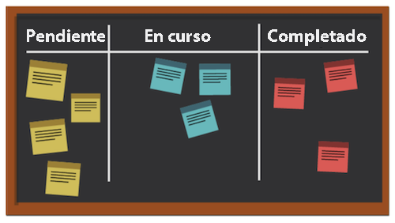
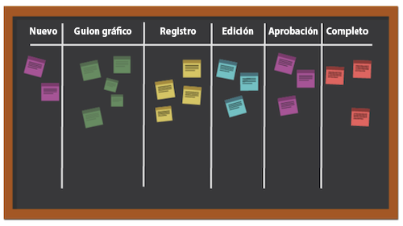

# ¿Cuál es la metodología Kanban y cómo funciona?

A diferencia de otras metodologías de Agile que se centran en un proceso cíclico, la metodología Kanban se centra en un flujo de trabajo optimizado. Kanban busca mejorar el flujo de trabajo, visualizando el trabajo utilizando un tablero Kanban, estableciendo un límite en la cantidad de trabajo que puede estar en curso, y analizando el flujo para hacer mejoras continuas.

Veamos algunos de los elementos clave de Kanban.

## Actores clave

Los actores clave de un equipo Kanban son similares a los de un equipo de Scrum, pero no hay ningún maestro de Scrum. Puede que todavía tenga sentido que alguien actúe como director de proyecto o supervisor, pero teóricamente esta función debería ocurrir de manera natural a medida que surja la necesidad.

## Visualización: Tablero Kanban

Hay muchas maneras de dar formato a un tablero Kanban. Los equipos funcionan a partir de un tablero que puede tener cualquier número de columnas. Cada columna representa el estado del trabajo que se está realizando.

En el tablero más simplista, la primera columna podría ser “pendientes”, la segunda “en curso” y la tercera “completado”.

Muchas empresas tienen su propia terminología para los nombres de columna, o incluso pueden enumerar cada paso de un proceso, pero la intención es la misma. Los integrantes del equipo mueven sus artículos de una columna a otra en función del estado en que se encuentre el trabajo.

## Prioridad

Los integrantes del equipo trabajan con un gestor de productos o un director de proyectos para asegurarse de que las columnas de registro de asuntos pendientes y otros estados estén priorizadas y de que el trabajo continúe avanzando hacia la finalización. El gestor de producto sigue siendo responsable de garantizar que se escuche la voz del cliente y que el producto se mueva en la dirección correcta.

## Limitar el trabajo en proceso

Un aspecto único de Kanban es que los equipos tienen un límite en su capacidad para la cantidad de artículos que pueden manejar en cualquier momento. Los equipos eligen una cierta cantidad de artículos que están dispuestos a tener en sus columnas “pendientes” y “en proceso”, y no superan ese número para evitar el agotamiento. Una vez que un artículo se traslada a “completado”, un artículo del registro de asuntos pendientes ocupa su lugar en la columna “pendientes”.

## Mejora continua

Kanban permite una mejora continua al proporcionar un sistema para que los equipos midan su eficacia. Pueden ver claramente cómo funcionan sus flujos de trabajo, cuánto tiempo tarda cada parte de dicho flujo de trabajo y con qué frecuencia sacan sus entregas a tiempo. Esto facilita la experimentación con diferentes formas de hacer las cosas para optimizar el rendimiento.
