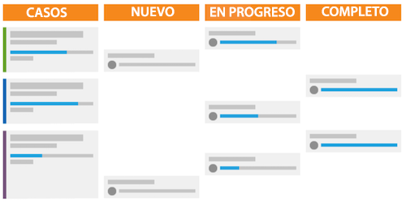

# ¿Cuál es la metodología Scrum y cómo funciona?

La metodología Scrum engloba el modelo de flexibilidad, pero difiere de otras en que tiene funciones definidas para quienes forman parte del equipo, como el propietario del producto, el líder de equipo de Scrum, etc. Además, cuenta con prácticas concretas para definir y completar el trabajo.

## Información general del equipo de Scrum

Cuando decida si desea cambiar o no a Scrum, deberá observar la estructura de sus equipos para ver si pueden transferirse fácilmente a la nueva metodología. Un equipo de Scrum tiene tres tipos de miembros: un propietario de producto, un líder de equipo de Scrum y los integrantes del equipo.

### Propietarios de producto

Los propietarios de producto son los dueños del producto y tienen la visión de lo que es o será. Son una voz para el cliente y el principal impulsor de las decisiones empresariales y la priorización de las características del producto.

### Líderes de equipo de Scrum

Los líderes de equipo de Scrum ayudan al equipo a hacer su trabajo, encuentran los recursos necesarios y crean consenso para funcionar de la manera más eficiente posible. También facilitan la comunicación y el acuerdo a lo largo del proceso.

### Integrantes del equipo

Un equipo suele ser multifuncional y tiene miembros con diferentes funciones y habilidades. Se encargan de planificar, ejecutar y entregar incrementos de productos. Les beneficiará estar físicamente ubicados en el mismo lugar o tener acceso a herramientas que permitan una colaboración rápida y sencilla, tanto entre ellos a lo largo del día como en sus reuniones breves diarias de equipo.

## Trabajo como equipo de Scrum

Una vez que haya reunido a estos actores clave, seguirán un nuevo estilo de flujo de trabajo para realizar su trabajo y entregar un producto al cliente. Una vez más, en comparación con la metodología tradicional o de cascada, ya no seguirán un proceso lineal de elaboración de un plan para un producto final y, a continuación, pasarán por los pasos o fases necesarios para entregarlo. En su lugar, los equipos de Scrum generan primero un registro de asuntos pendientes.

### Creación de un registro de asuntos pendientes

El equipo de Scrum busca una lista de características prioritarias y la funcionalidad deseada, denominadas “historias”. Necesitan preguntar al cliente y discutir como equipo lo que quieren o necesitan del sistema o producto que van a construir.

Una vez que han creado sus historias principales, deben preparar el registro de asuntos pendientes. Como equipo, deben dar cuatro pasos importantes.

* Desglose las historias grandes en incrementos más pequeños analizando lo que hay que hacer para cada una.

* Priorice sus historias y decida qué características deben desarrollarse primero.

* Aclara los requisitos y criterios de aceptación para que una historia se considere lista.

* Calcule la cantidad de esfuerzo que el equipo necesita invertir para completar cada historia y el registro de asuntos pendientes. Esto se puede hacer en horas o en puntos. Los puntos le permiten contar lo difícil o compleja que es la historia, en lugar de planificar el tiempo necesario para cada componente.

### Planificación de iteraciones

Una vez que el registro de asuntos pendientes se haya configurado y priorizado, es hora de planificar la iteración. (Muchas organizaciones utilizan las palabras “sprint” e “iteración” de forma intercambiable). El equipo decide qué historias completar basándose en las que se consideran listas para seguir. El equipo asigna las tareas y decide la duración de la iteración.

### Ejecución de la iteración

Ahora, es el momento de ejecutar la iteración. Los integrantes del equipo comienzan a hacer su trabajo como lo haría un equipo tradicional, pero ahora incorporan una reunión breve diaria.

Literalmente, se levantarán y responderán tres preguntas:

* ¿Qué hice ayer?
* ¿Qué haré hoy?
* ¿Cuáles son los obstáculos con los que nos encontramos para avanzar en las tareas?

Estas reuniones permiten que todo el mundo esté en sintonía y avance con rapidez.

## Uso de un gráfico de evolución y un guion gráfico para registrar el progreso

Es importante que el equipo, a medida que responde a las tres preguntas principales en sus reuniones breves, monitorice y lleve el seguimiento de su progreso hacia la finalización de la iteración. Al hacerlo, puede determinar si se está moviendo lo suficientemente rápido a través de sus historias para ofrecer todas las funciones a tiempo al final de la iteración. Hay dos componentes para hacerlo en el proceso de Scrum.

### Guion gráfico 

Mediante un guion gráfico, los equipos mueven sus historias a través de columnas de estado para mostrar cuándo los elementos de trabajo son nuevos, están en curso o se han completado.

### Gráfico de evolución

Se puede utilizar un gráfico de evolución para supervisar si el equipo está completando las historias a una velocidad suficiente. Los gráficos de evolución se pueden utilizar en iteraciones individuales o en toda la versión del producto.

