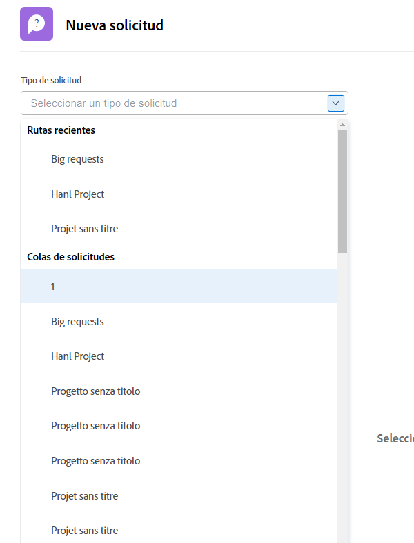
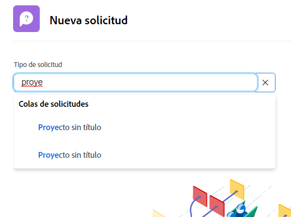

# Realizar una solicitud

En este vídeo, aprenderá a:

* Navegar al área de solicitud
* Realizar una solicitud
* Ver solicitudes enviadas
* Buscar un borrador de una solicitud

>[!VIDEO](https://video.tv.adobe.com/v/336092/?quality=12)

## Acceso rápido y fácil a las rutas de cola de solicitudes

Al hacer clic en el [!UICONTROL Tipo de solicitud] , las tres últimas rutas de solicitud que ha enviado recientemente para que se muestren automáticamente en la parte superior de la lista. Seleccione una opción para enviar otra solicitud a la misma cola.

Al final de la lista se encuentran todas las colas de solicitud a las que tiene acceso. Si no está seguro de qué cola utilizar para la solicitud, utilice la búsqueda de palabras clave para encontrar rápida y fácilmente la que necesita.

Mientras escribe palabras clave, [!DNL Workfront] muestra coincidencias para que pueda encontrar la ruta de la cola de solicitud que se adapte a sus necesidades. Por ejemplo, para realizar una solicitud de una publicación en medios sociales, empiece a escribir &quot;medios sociales&quot; en la sección [!UICONTROL Tipo de solicitud] y la lista se actualiza dinámicamente para mostrar cualquier coincidencia.

Seleccione la opción que desee, rellene el formulario de solicitud y envíe la solicitud.

<!---
Learn more
Requests area overview
Create and submit Workfront requests
Guides
Make a work request
--->
