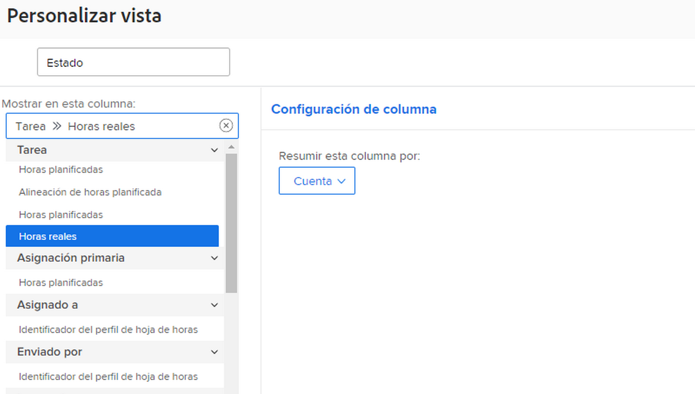
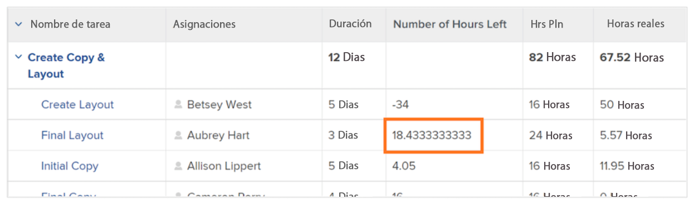
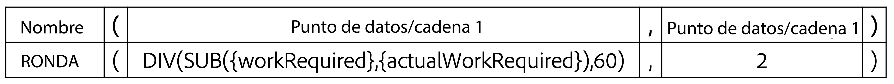

# Crear una expresión de datos SUB, SUM, DIV o PROD

En este vídeo, aprenderá lo siguiente:

* Qué hacen las expresiones SUB, SUM, DIV y PROD
* Cómo crear una expresión de datos SUB en un campo calculado

>[!VIDEO](https://video.tv.adobe.com/v/335177/?quality=12&learn=on)

## Información adicional: Expresión ROUND

### Crear una expresión ROUND

La expresión ROUND toma cualquier número y lo redondea a un determinado número de decimales.

La mayoría de las veces, la expresión de datos ROUND se utiliza junto con otra expresión de datos y cuando el campo de formato se deja como Texto o Número.

Vamos a crear un campo calculado para determinar la diferencia entre el número de horas planificadas y las horas realmente registradas en una tarea, que requiere la expresión SUB y tiene este aspecto:

**SUB(){workRequired},{actualWorkRequired})**

Y dado que el tiempo se rastrea en minutos y el formato preferido es mostrar la información en horas, la expresión también debe dividirse por 60 y tener este aspecto:

**DIV(SUB(){workRequired},{actualWorkRequired}),60)**

Si el formato se cambia a Número al crear el campo calculado en el formulario personalizado, puede cambiar el formato numérico al agregar el campo en una vista.

Sin embargo, si el formato del campo al crear un campo personalizado se deja como Texto, el formato no se puede cambiar fácilmente dentro de la vista. La expresión ROUND debe utilizarse para evitar ver números como este en el proyecto:

<b>Utilice la expresión de datos ROUND en un campo calculado</b>

La expresión ROUND incluye el nombre de la expresión (ROUND) y, normalmente, dos puntos de datos. Estos puntos de datos pueden ser una expresión o un campo en Workfront, seguidos de un número para indicar cuántos lugares decimales desea incluir.

Una expresión tendría esta estructura: ROUND(punto de datos, #)

En la expresión que calcula la diferencia entre las horas planificadas y las reales, utilice esta expresión —DIV(SUB(){workRequired},{actualWorkRequired}),60): como primer punto de datos. A continuación, asegúrese de que el número que proviene de esa expresión no vaya más de 2 lugares a la derecha del decimal.

La expresión podría escribirse de esta manera: ROUND(DIV(SUB({workRequired},{actualWorkRequired}),60),2).
