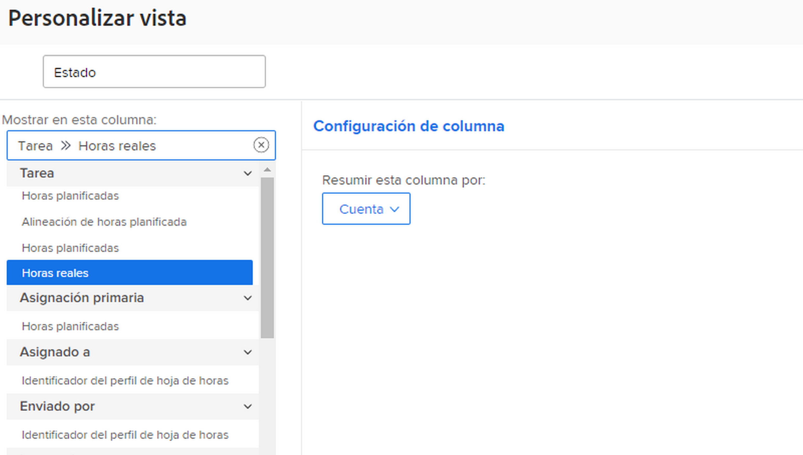
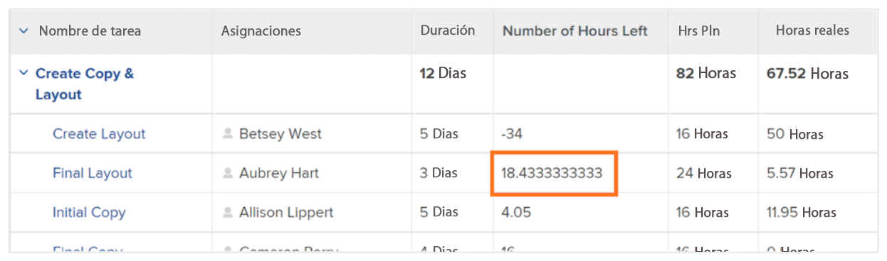
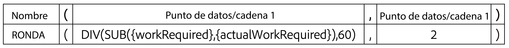

# Cree una expresión de datos SUB, SUM, DIV o PROD

Este vídeo contiene información sobre:

* Qué hacen las expresiones SUB, SUM, DIV y PROD
* Creación de una expresión de datos SUB en un campo calculado

>[!VIDEO](https://video.tv.adobe.com/v/335177/?quality=12&learn=on&enablevpops=1)

## Información adicional: expresión ROUND

### Creación de una expresión ROUND

La expresión ROUND toma cualquier número y lo redondea a un determinado número de decimales.

La mayoría de las veces, la expresión de datos ROUND se utiliza junto con otra expresión de datos y cuando el campo de formato se deja como Texto o Número.

Vamos a crear un campo calculado para determinar la diferencia entre el número de horas planificadas y registradas realmente en una tarea, que requerirá la expresión SUB y tendrá este aspecto:

**SUB({workRequired},{actualWorkRequired})**

Dado que el tiempo se rastrea en minutos y el formato preferido es mostrar la información en horas, la expresión también necesita dividirse en 60 y tener este aspecto:

**DIV(SUB({workRequired},{actualWorkRequired}),60)**

Si el formato se cambia a Número al crear el campo calculado en el formulario personalizado, puede cambiar el formato de número al agregar el campo en una vista.

Sin embargo, si el formato de campo al crear un campo personalizado se deja como Texto, el formato no se puede cambiar fácilmente en la vista. La expresión ROUND debe utilizarse para evitar ver números como este en el proyecto:

<b>Utilizar la expresión de datos ROUND en un campo calculado</b>

La expresión ROUND incluye el nombre de la expresión (ROUND) y, normalmente, dos puntos de datos. Estos puntos de datos pueden ser una expresión o un campo en Workfront, seguido de un número para indicar cuántos lugares decimales desea utilizar.

Una expresión está estructurada de esta manera: ROUND(punto de datos, #)

En la expresión que calcula la diferencia entre las horas planificadas y las reales, utilice esta expresión —DIV(SUB({workRequired},{actualWorkRequired}),60)— como primer punto de datos. A continuación, asegúrese de que el número que proviene de esa expresión no supere las dos posiciones a la derecha del decimal.

La expresión podría escribirse así: ROUND(DIV(SUB({workRequired},{actualWorkRequired}),60),2).
