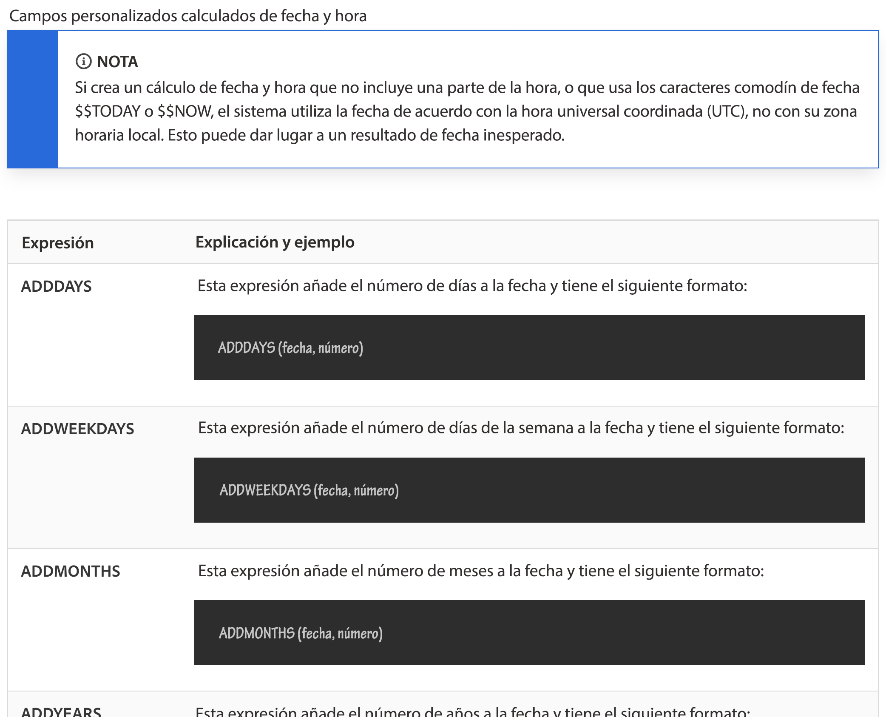
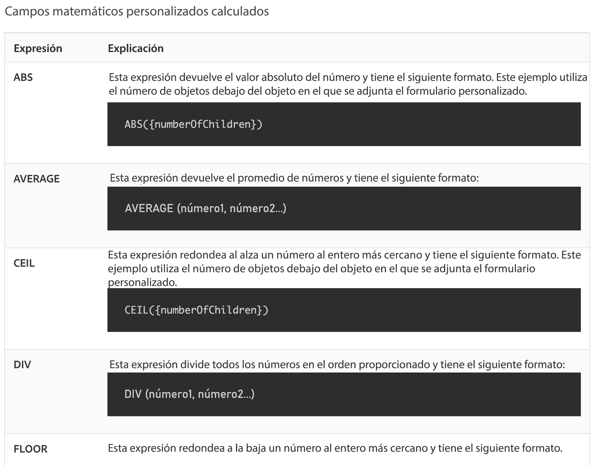

# Comprender la fecha y la hora y las expresiones matemáticas

## Expresiones de fecha y hora

Las expresiones de fecha y hora permiten extraer fechas importantes al frente de los informes, calcular automáticamente el número de días laborables que se tardó en completar una tarea o quitar las marcas de hora de la vista cuando no se necesitan.

Al consultar las expresiones de fecha y hora disponibles, encontrará varias opciones disponibles.

Existen dos conjuntos de expresiones de fecha y hora que se utilizan con mayor frecuencia por los clientes de [!DNL Workfront]:

* ADDDAYS/ADDWEEKDAY/ADDMONTHS/ADDYEARS y
* DATEDIFF / WEEKDAYDIFF

## Expresiones matemáticas

Las expresiones matemáticas permiten a [!DNL Workfront] realizar cálculos automáticamente, ya sean simples o complicados.

Al consultar las expresiones de fecha y hora disponibles, verá que tiene varias opciones disponibles.

Los clientes de Workfront suelen utilizar estos dos conjuntos de expresiones matemáticas:

* SUB, SUM, DIV, PROD
* ROUND

>[!NOTE]
>
>Para obtener una lista completa de expresiones y más información sobre cada una, vaya a la página de documentación [Expresiones de datos calculadas](https://experienceleague.adobe.com/es/docs/workfront/using/reporting/reports/calculated-custom-data/calculated-data-expressions).

