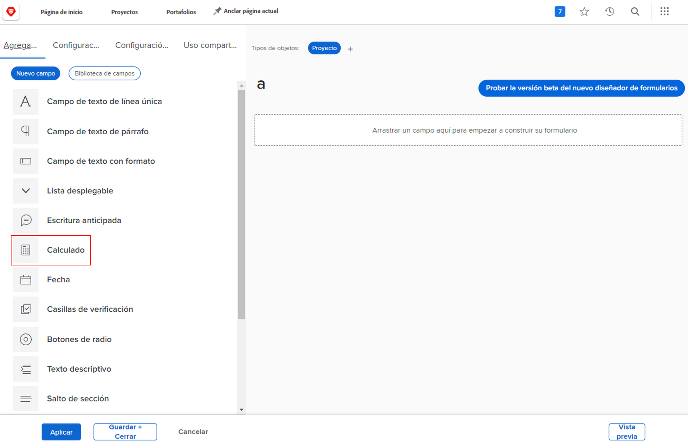
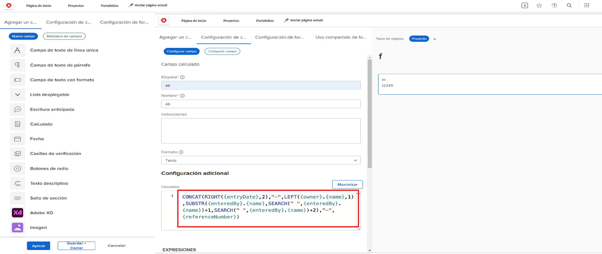
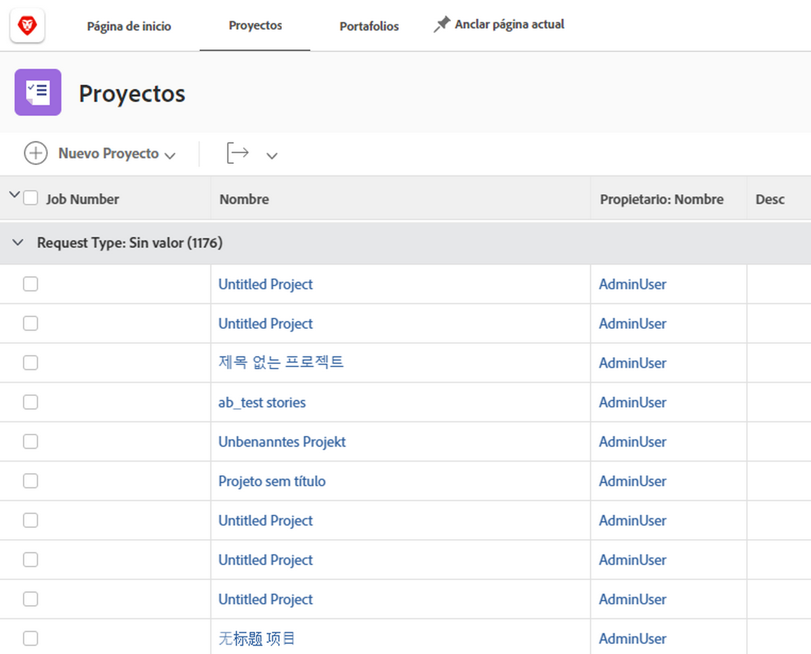
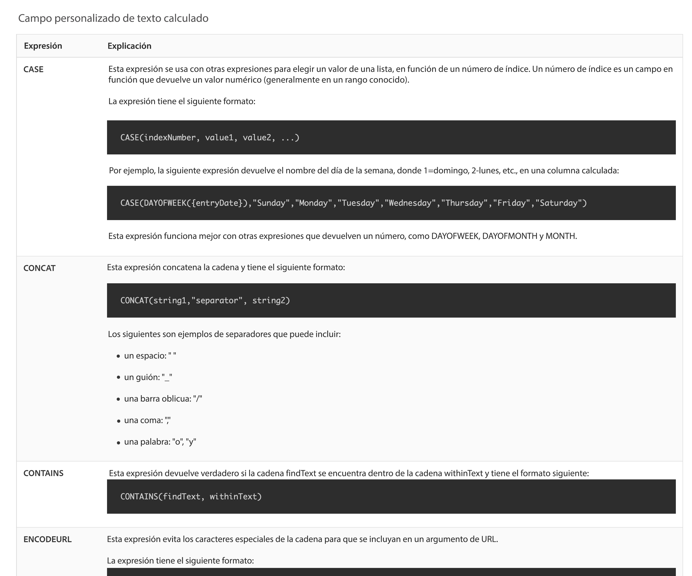

# Introducción a los campos calculados y las expresiones

<!-- **Note**: The expression examples shown are simple and some may be mitigated by fields already supplied by  . However, the examples are used to illustrate the foundational knowledge needed in order to build expressions in Workfront.-->

Workfront proporciona una variedad de campos que son comunes en múltiples áreas de negocio y que se utilizan habitualmente para la administración del trabajo. Campos como fecha planificada de finalización, presupuesto del proyecto, nombre del usuario asignado de la tarea, etc.

Sin embargo, cada organización tiene datos específicos de su sector y compañía que deben recopilarse para comprender si se cumplen los objetivos de la empresa. Por ejemplo, su organización desea realizar un seguimiento de lo siguiente:

* La línea de negocio a la que contribuirá un proyecto.
* Si la financiación proviene de proveedores, internos o ambos.
* La resolución que se necesita para las imágenes utilizadas.

Aunque estos campos no están integrados de forma inherente en [!DNL Workfront], puede crear campos de entrada de datos personalizados y campos de respuesta rellenados previamente y de selección múltiple mediante un formulario personalizado.

Esta ruta de aprendizaje se centra en el campo calculado. Aprenderá qué es un campo calculado, los diferentes tipos de información que puede extraer del campo calculado a través de expresiones de datos y cómo crear esos campos calculados para mejorar la recopilación de datos y la creación de informes.

## ¿Qué es un campo calculado?

Un campo calculado contiene datos personalizados creados mediante expresiones de datos y campos de Workfront existentes.

Por ejemplo, su organización tiene un sistema específico de numeración de proyecto o número de trabajo que incluye lo siguiente:

* El año en el que se creó el proyecto.
* Las iniciales del propietario del proyecto.
* El número de referencia del proyecto de [!DNL Workfront].

Con las expresiones en un campo calculado, puede tomar cada parte de la información ya almacenada en [!DNL Workfront] y crear ese ID de proyecto único, o número de trabajos, que luego puede agregar a un informe de esta manera:

Según los datos específicos necesarios, los campos calculados pueden ser simples, utilizar una o dos expresiones o, lo que es más complicado, utilizar varias expresiones incrustadas. Tenga en cuenta que Workfront solo puede utilizar datos ya almacenados o extraídos del sistema para campos calculados.

## Expresiones de texto

Las expresiones de texto buscan, diseccionan y combinan información encontrada en [!DNL Workfront] para crear datos más significativos u obtener una buena perspectiva sobre el trabajo que realiza su organización.

Por ejemplo, las expresiones de texto se pueden utilizar para lo siguiente:

* Mostrar “Más de 5000 dólares” cuando los gastos del proyecto superen los 5000 dólares o &quot;Menos de 5000 dólares&quot; cuando los gastos estén por debajo de eso, en una columna de la vista del proyecto.

* Asigne a cada proyecto un número único que incluya el año en que se creó el proyecto, el número de referencia de [!DNL Workfront] del proyecto, el nombre y las iniciales del propietario del proyecto.

* Cree un informe que enumere todos los proyectos que no estén asignados a un portafolio o a un programa para que pueda utilizarlos en las reuniones del administrador.

Las expresiones de texto se pueden utilizar en un campo personalizado para realizar estos tipos de búsquedas y combinaciones en Workfront.

Al consultar las posibles expresiones de texto, encontrará varias opciones.

Hay seis expresiones de texto que se utilizan con más frecuencia:

* CONCAT
* IZQUIERDA/DERECHA
* CONTAINS
* IF
* ISBLANK