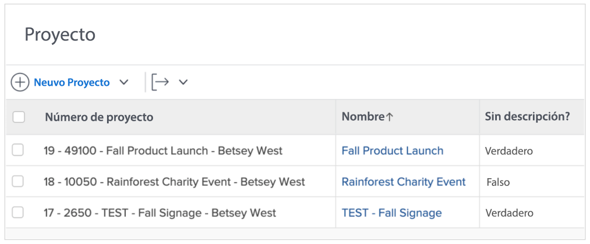
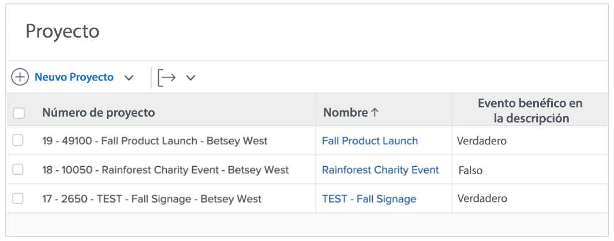
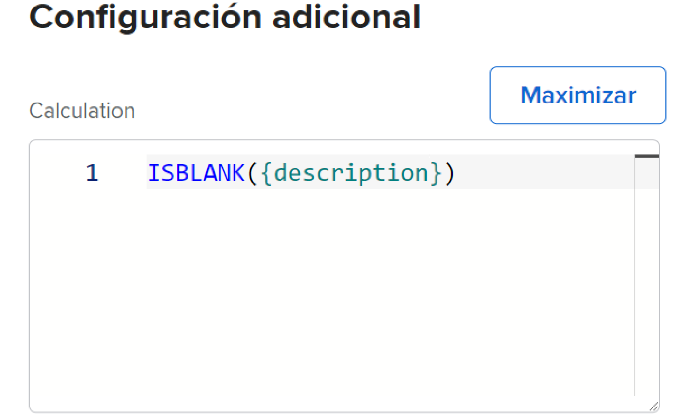
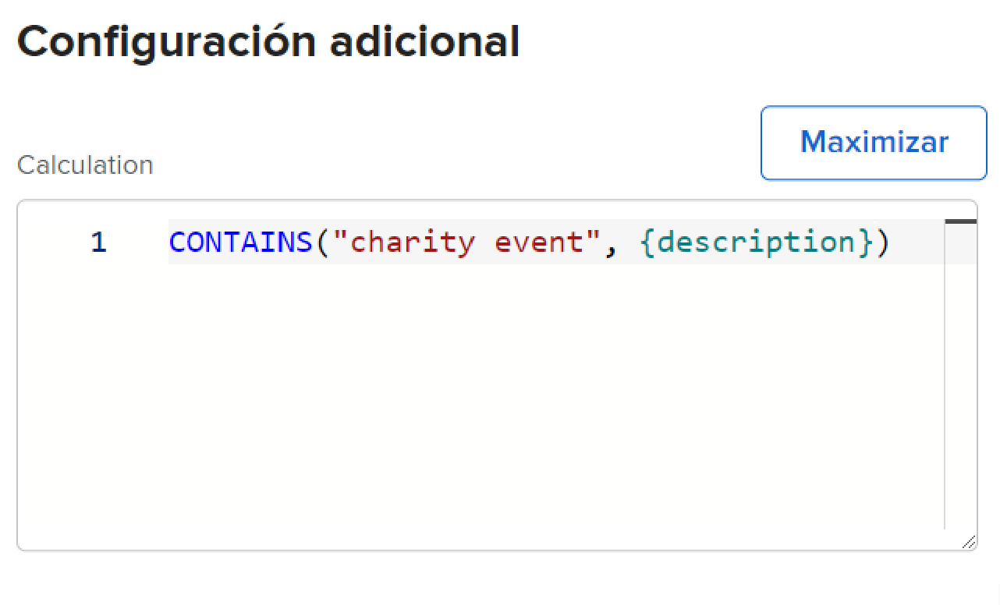

# Uso de las expresiones ISBLANK y CONTAINS

Las expresiones CONTAINS e ISBLANK se utilizan para proporcionar valores verdaderos o falsos simples. La diferencia es que la expresión ISBLANK comprueba si el campo contiene un valor mientras la expresión de texto CONTAINS busca una cadena específica dentro de un campo.

Por ejemplo, para ver si un proyecto tiene una descripción, use la expresión ISBLANK. Si el campo de descripción está en blanco, la expresión devuelve un valor de verdadero. Si el campo de descripción no está en blanco, devuelve el valor de falso.

Para buscar un valor específico en la descripción, como &quot;evento de caridad&quot;, utilice la expresión de texto CONTAIN. Si encuentra &quot;evento de caridad&quot; en la descripción, el campo calculado dice &quot;verdadero&quot;. Muestra “falso” si no encuentra &quot;evento de caridad&quot;.

## ISBLANK

La expresión de texto ISBLANK incluye el nombre de la expresión y un punto de datos.

**ISBLANK({data point})**

En el ejemplo anterior (donde desea saber si el proyecto tiene una descripción), la expresión sería la siguiente:

ISBLANK({description})

## CONTAINS

La expresión de texto CONTAINS incluye el nombre de la expresión, la palabra o frase que está buscando y el campo en el que buscarlo.

**CONTAINS(&quot;frase&quot;,{fields})**

Asegúrese de colocar comillas alrededor de la palabra o frase que está buscando; de lo contrario, la expresión no será válida.

En el ejemplo anterior (al buscar &quot;evento de caridad&quot; en la descripción del proyecto), la expresión sería la siguiente:

**CONTAINS(&quot;evento de caridad&quot;,{description})**

**Nota**: La expresión CONTAINS distingue entre mayúsculas y minúsculas. Por ejemplo, si &quot;Evento de caridad&quot; aparece en mayúsculas en el campo de descripción, ponga en mayúsculas esta frase en la expresión.

**CONTAINS(&quot;Evento de caridad&quot;,{description})**

Tanto las expresiones ISBLANK como CONTAINS son útiles si desea ver si hay un valor presente. Sin embargo, puede ser más útil saber cuál es el valor, para verlo realmente o tener algún tipo de descriptor para proporcionar una mejor perspectiva.

Por ejemplo, en lugar de saber simplemente que un proyecto se ha convertido a partir de una solicitud, quiere averiguar el nombre de la solicitud original.

En ese caso, utilice la expresión CONTAINS junto con la expresión IF.

La mayoría de las veces, las expresiones de texto ISBLANK y CONTAINS se utilizan con IF.
