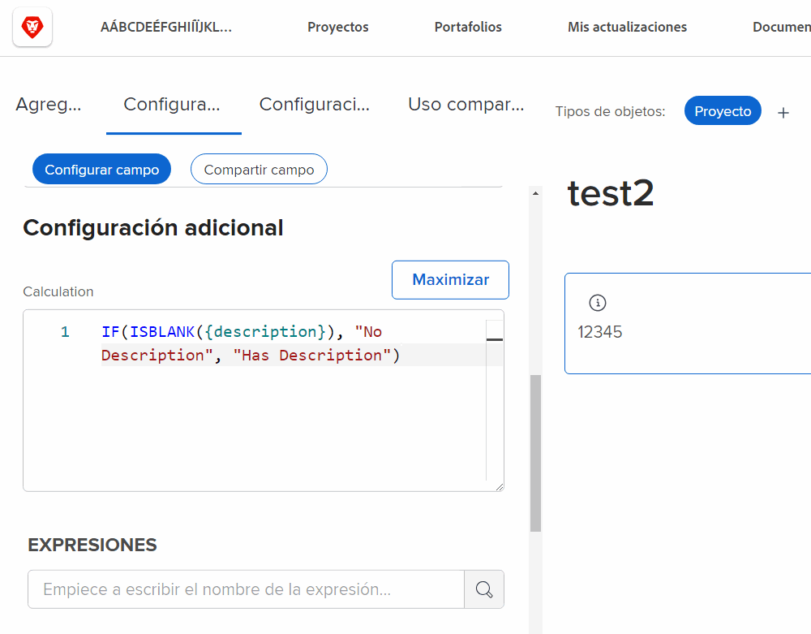
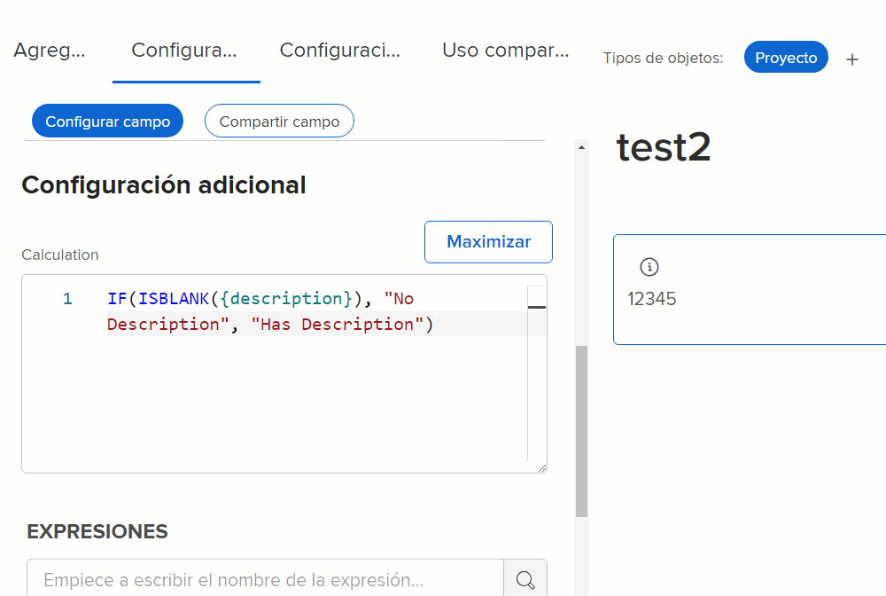
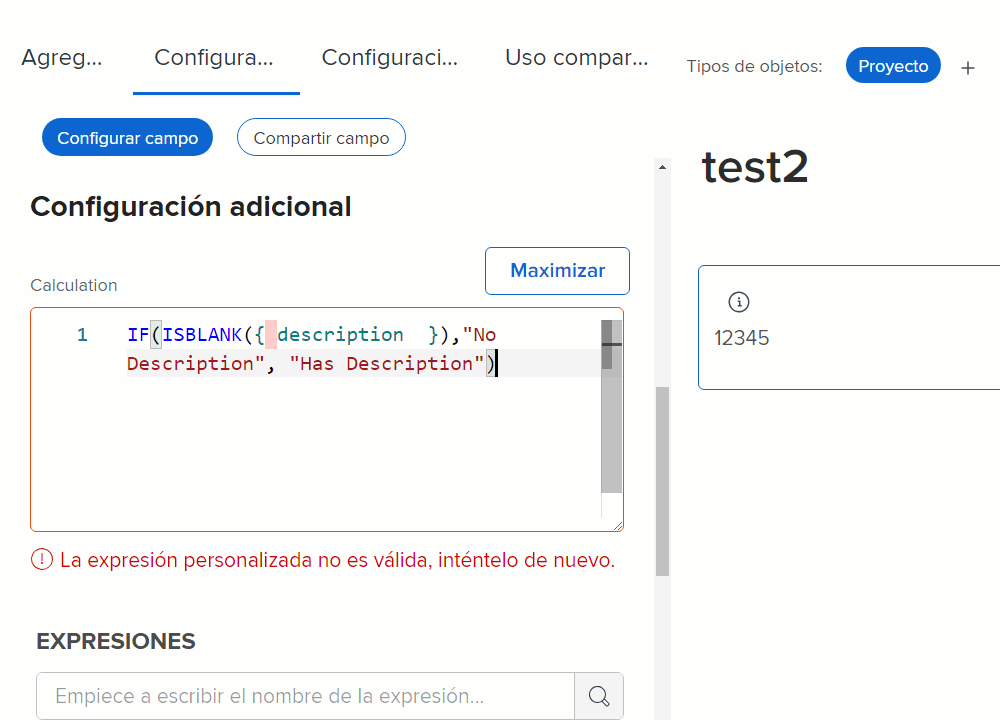
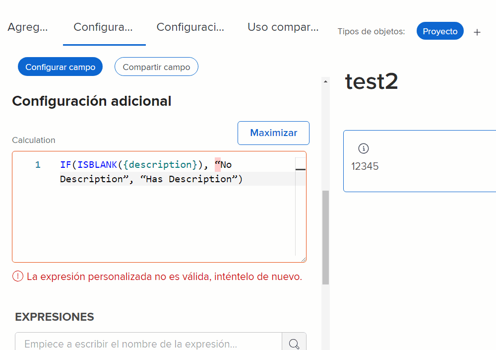
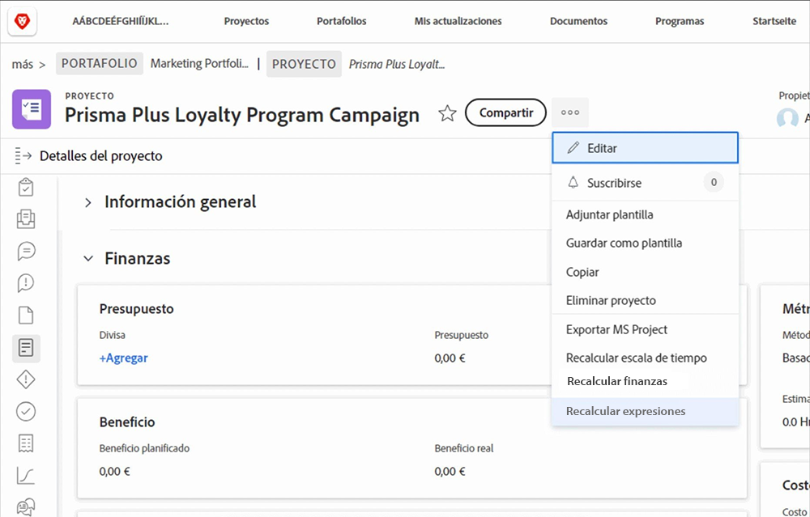
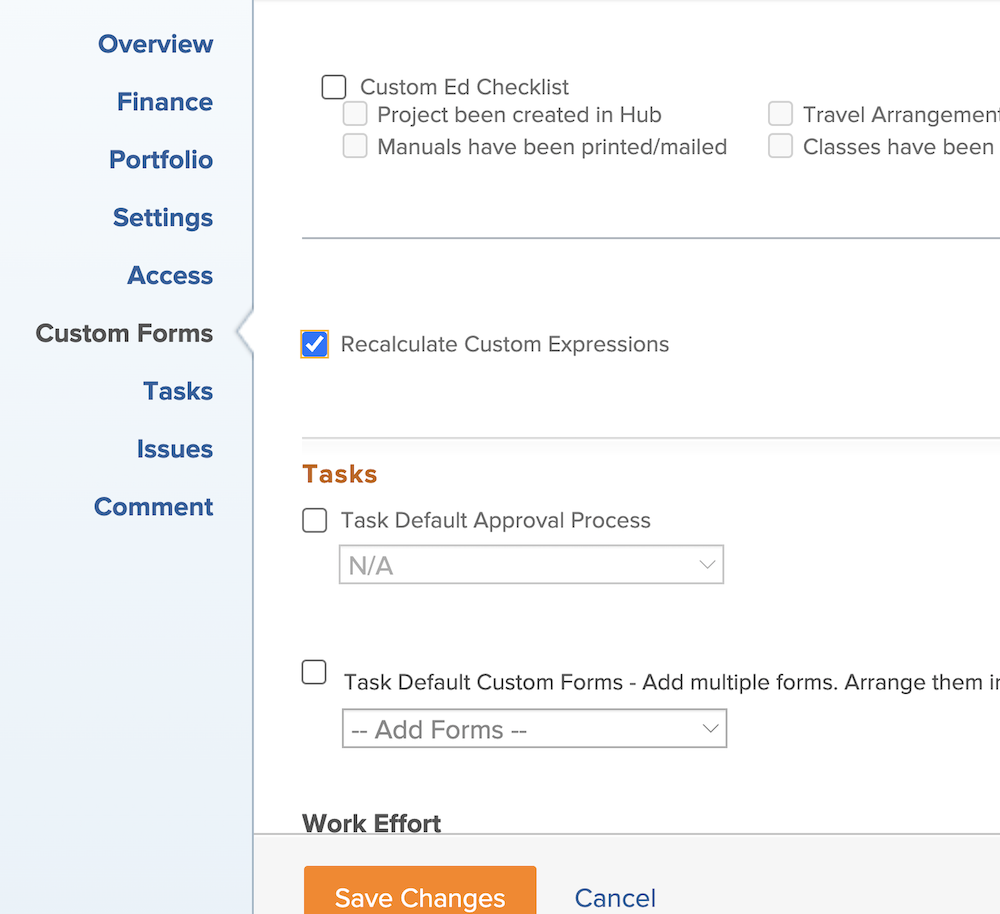

# Aspectos importantes sobre las expresiones de campos calculados

A continuación se muestra una lista de conceptos que es útil conocer al trabajar con campos calculados personalizados en Workfront.

## Las mayúsculas y minúsculas importan en los nombres de expresiones

Cuando se trata de nombres de expresiones, las mayúsculas y minúsculas son importantes. Al escribir inicialmente un nombre de expresión, puede usar mayúsculas, minúsculas o una combinación de ambas.

Sin embargo, la expresión debe escribirse como mayúsculas para que el sistema reconozca la expresión y guarde el campo.

## Las horas se almacenan en minutos

Las horas de la base de datos de Workfront se almacenan en minutos. Si hace referencia a campos como Horas planificadas u Horas reales, divida entre 60 para mostrar el tiempo en horas y no en minutos.

## El espaciado no afecta a las expresiones

La forma recomendada de escribir expresiones es con poco o ningún espaciado entre cada expresión.

* IF(ISBLANK({description}),&quot;Sin descripción&quot;,&quot;Tiene descripción&quot;)

Sin embargo, si el espaciado le ayuda a ver lo que está sucediendo, se puede añadir algo de espaciado a las expresiones. Los espacios adicionales no deben impedir que la expresión recopile o calcule un valor en [!DNL Workfront].

* IF (ISBLANK ({description}), &quot;Sin descripción&quot;, &quot;Tiene descripción&quot; )

Los únicos elementos que no pueden tener espacios entre ellos son los campos y los corchetes. De lo contrario, recibirá un mensaje de error y no podrá guardar el campo o el formulario personalizado.

## Las comillas deben ser rectas

Cuando utilice comillas en una expresión, asegúrese de que sean rectas (&quot;). Si las comillas son curvas (“), el sistema de [!DNL Workfront] muestra el mensaje “Expresión personalizada no válida”.

## Actualización de los cálculos al guardar formularios y editar objetos

Este es un aspecto importante de los campos calculados que se debe comprender.

La información que se muestra en un campo calculado seguirá siendo la misma y estará obsoleta a menos que se vuelva a calcular el formulario personalizado.

Las expresiones se pueden actualizar mediante la opción Recalcular expresiones del menú Más de un objeto.

Si desea ver la cantidad de días que ha estado abierto un problema. Cree un campo calculado llamado “Días abiertos” con la expresión DATEDIFF.

* Nombre del campo = Días abiertos
* Expresión = DATEDIFF({entryDate},$$TODAY)

Una vez guardado, el número de días entre la primera vez que se creó el problema o se introdujo en Workfront y la fecha de hoy se muestra en la página de detalles de un objeto o en una vista de informe.

Al ver la misma página de detalles o la misma vista de informe al día siguiente, se espera que ese número aumente en uno. Si el número es 5 hoy, mañana debería ser 6. El día siguiente debe ser 7, luego 8, etc.

Sin embargo, el campo seguirá mostrando el 5 cada día. El campo debe “volver a ejecutarse” o recalcularse para actualizar la información.

Para actualizar un campo con la opción Volver a calcular expresiones:

* Haga clic en el nombre del objeto para abrirlo.
* Haga clic en el icono Más.
* Seleccione Recalcular expresiones en la lista.

También puede volver a calcular varias expresiones al mismo tiempo utilizando la función “edición masiva” en una lista o informe. Supongamos que ha creado un informe que muestra una lista de problemas con el cálculo Días abiertos que aparece en una columna. Si desea volver a calcular todos los problemas a la vez, haga lo siguiente:

* Seleccione todos los problemas del informe.
* Seleccione la opción de edición para editar de forma masiva todos los problemas seleccionados.
* Haga clic en la etiqueta Formularios personalizados de la izquierda para desplazarse hacia abajo hasta la sección formularios personalizados.
* Marque la casilla Volver a calcular expresiones personalizadas en la parte inferior de la sección Formularios personalizados.
* Haga clic en Guardar cambios.

La pantalla se actualiza para mostrar información actualizada en el campo calculado.

**Nota**: Aunque hay otras formas de actualizar o volver a calcular expresiones en un campo calculado, esta es la forma más rápida y sencilla.

## Los cálculos pueden variar de un formulario a otro dentro del mismo campo

Tan pronto como se guarda un campo calculado en un formulario personalizado y se guarda el formulario personalizado, el campo calculado se agrega a la Biblioteca de campos para que se pueda utilizar en otros formularios personalizados.

Sin embargo, si tiene un campo calculado en el formulario A y el mismo campo calculado en el formulario B, la idea inicial es que los cálculos son exactamente iguales. No siempre es así. El campo calculado del formulario A podría estar calculando de forma completamente diferente en el formulario B.

Cuando se selecciona un campo personalizado calculado de la biblioteca de campos y se agrega a un formulario personalizado, el campo se agrega, pero el cálculo queda en blanco. Una razón por la que esto sucede es que el cálculo puede estar haciendo referencia a campos que no existen para otro tipo de objeto.

Por ejemplo, ha creado un campo calculado, “Días hasta finalizar”, para determinar cuánto tiempo tardó en completarse una tarea en un proyecto.

* WEEKDAYDIFF({actualStartDate},{actualCompletionDate})

Desea hacer lo mismo para una iteración. Puede utilizar la misma expresión; sin embargo, los campos disponibles para un objeto de tarea no siempre están disponibles para un objeto de iteración. De este modo, [!DNL Workfront] ofrece la posibilidad de crear el cálculo con los campos de objeto correctos.

**Consejo**: Copie la expresión calculada de la casilla Cálculo en el campo Instrucciones al crear campos personalizados. Este campo no se borra cuando se agrega un campo personalizado calculado al formulario personalizado desde la Biblioteca de campos.

Según la necesidad, los campos calculados en los formularios personalizados pueden ser bastante sencillos o muy complejos. Las expresiones pueden incrustar o anidar otras expresiones y valores para proporcionar el nivel de detalle necesario para obtener una mejor imagen de lo que está sucediendo con el trabajo realizado en su organización.

<!--Depending on the need, calculated fields in custom forms can be quite simple or very complex. Expressions can embed, or nest, other expressions and values to provide the level of detail needed to get a better picture of what is going on with the work being done at your organization. 

Most of the examples and exercises in this course have been relatively simple to provide a base understanding of the expressions most commonly used and how to build those expressions in a custom calculated field. 

Now you're ready to start building your own calculated custom fields.-->
