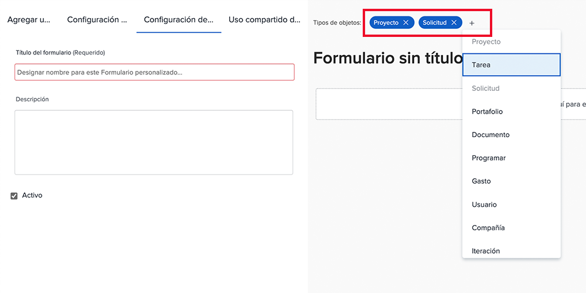

# Crear y compartir un formulario personalizado

En este vídeo, aprenderá a:

* Determinar qué objetos utilizar para el formulario
* Añadir campos únicos en una gran variedad de formatos
* Organización de campos mediante secciones y lógica
* Compartir formularios con otros usuarios

>[!VIDEO](https://video.tv.adobe.com/v/335172/?quality=12&learn=on)

## Los formularios personalizados funcionan con varios tipos de objetos

Al hacer clic en el botón [!UICONTROL Nuevo formulario personalizado] , puede seleccionar tantos objetos como desee utilizar con un único formulario personalizado. Todos los campos que agregue a este formulario estarán disponibles para cualquiera de los objetos seleccionados cuando el formulario personalizado esté adjunto a ellos.

![La ventana de formulario personalizado muestra la variable [!UICONTROL Nuevo formulario personalizado] opciones de objeto](assets/create-custom-form.png)

Al editar un formulario personalizado, puede ver todos los tipos de objeto seleccionados. Puede agregar o eliminar tipos de objetos de esta lista.

Es posible que desee crear una forma personalizada de tipo proyecto y problema. Cuando se adjunta a un problema, puede rellenar cualquiera de los campos relacionados con el problema. Posteriormente, si decide convertir el problema en un proyecto, el formulario personalizado se cargará automáticamente en el proyecto y los datos que introduzca en los campos del problema, el formulario personalizado estará disponible para su visualización o edición en el formulario personalizado del proyecto.

## Opciones de campo personalizadas

**[!UICONTROL Etiqueta] y [!UICONTROL Nombre] campos**

La variable [!UICONTROL Etiqueta] y [!UICONTROL Nombre] Los campos de un campo personalizado tienen diferentes propósitos. [!UICONTROL Etiqueta] es el nombre del campo que verán los usuarios en [!DNL Workfront]. [!UICONTROL Nombre] es lo que se puede usar con integraciones como API.

![Se muestra la ventana de formulario personalizado [!UICONTROL Etiqueta] y [!UICONTROL Nombre] campos](assets/custom-forms-field-label-and-name.png)

Esto proporciona la flexibilidad para cambiar la etiqueta de cara al usuario para que coincida con los cambios en su organización, sin afectar a las integraciones u otras conexiones que dependen de un nombre de campo específico.

**[!UICONTROL Campo de texto con formato]**

La variable [!UICONTROL Campo de texto con formato ]contiene herramientas básicas de marcado de texto que permiten a los usuarios agregar negrita, cursiva o subrayado al texto mientras rellenan el campo en un formulario personalizado.

![Se muestra la ventana de formulario personalizado [!UICONTROL Campo de texto con formato] option](assets/custom-forms-text-field-with-formatting.png)

El campo también tiene un límite de 15.000 caracteres, lo que permite disponer de mucho espacio para proporcionar información vital y utilizar formato para facilitar la lectura por parte de los demás.

**[!UICONTROL Typeforward] field**

La variable [!UICONTROL Typeforward] permite que el sistema rellene automáticamente una lista de opciones en función del objeto seleccionado para el campo.

![Se muestra la ventana de formulario personalizado [!UICONTROL Typeforward] opción de campo](assets/custom-forms-typeahead-1.png)

Por ejemplo, si crea un [!UICONTROL Typeforward] campo denominado &quot;Nombre de aprobación del administrador de marketing&quot; y seleccione [!UICONTROL Usuario] como tipo de objeto al que se hace referencia, aparece una lista de nombres de usuario cuando un usuario rellena ese campo en un formulario personalizado. La variable [!UICONTROL Typeforward] está diseñado para conectar los datos personalizados con información capturada en el sistema y eliminar la necesidad de mantener manualmente muchas opciones en los campos desplegables.

![Se muestra la ventana de formulario personalizado [!UICONTROL Typeforward] menú desplegable](assets/custom-forms-typeahead-2.png)
