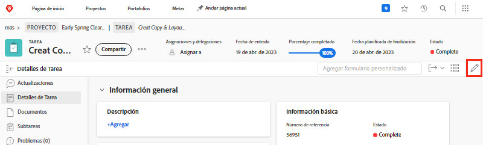

# Edición de un formulario personalizado

<!--
21.4 updates have been made here
-->

Puede editar información sobre un formulario personalizado después de adjuntarlo a un objeto.

1. Desplácese al objeto para el que desea editar información sobre el formulario personalizado.
1. Haga clic en [Tipo de objeto] **[!UICONTROL Detalles]** en el panel izquierdo.
1. Expanda el formulario personalizado haciendo clic en la flecha situada junto a su nombre.
1. Haga clic en un solo campo del formulario personalizado para acceder al modo de edición en ese campo. También puede hacer clic en el botón [!UICONTROL Editar] en la esquina superior derecha para editar todos los formularios personalizados o las secciones de los formularios personalizados.
1. La información de tipo en un único campo personalizado, incluso si los campos obligatorios en otros formularios personalizados del objeto todavía no se han rellenado.
1. Haga clic en **[!UICONTROL Guardar cambios]**.

