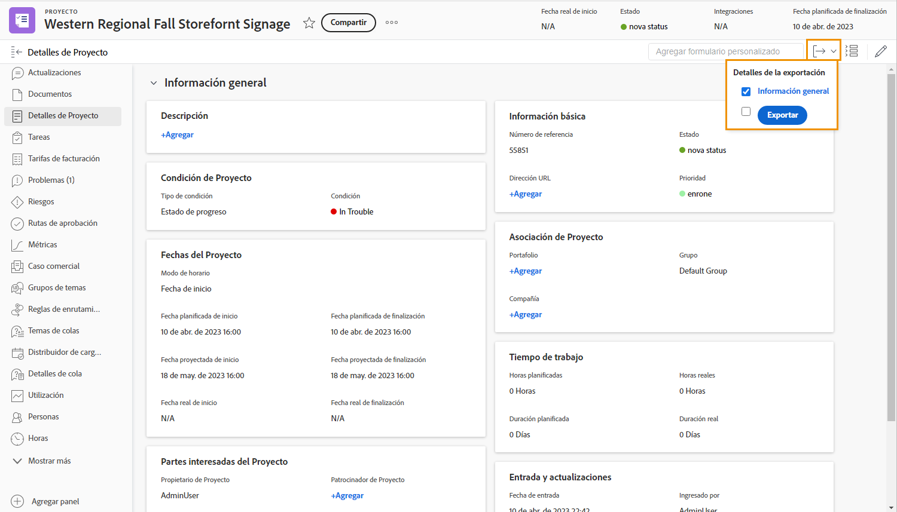
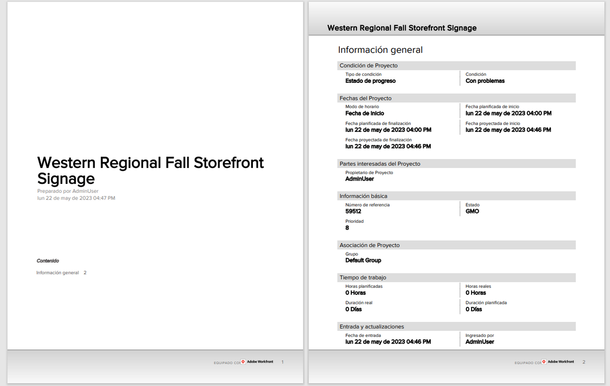

# Exportar un formulario personalizado como PDF

La captura de los datos únicos de una organización es una parte esencial de la administración del trabajo. Los formularios personalizados se utilizan normalmente para este fin. Poder exportar formularios personalizados permite que se distribuyan y compartan fácilmente. Puede exportar formularios personalizados desde proyectos, tareas o problemas al acceder al formulario en la sección [!UICONTROL Detalles] de los objetos.

También puede incluir el área [!UICONTROL Información general] del PDF exportado.

Por ejemplo, para exportar un formulario personalizado denominado Información de marketing de vídeo que está adjunto a un proyecto:

1. Haga clic en el icono **[!UICONTROL Exportar]**. Todos los formularios personalizados adjuntos al proyecto aparecen en el menú desplegable, incluida la sección [!UICONTROL Información general].
1. Seleccione Información de marketing de vídeo en la lista.
1. Haga clic en **[!UICONTROL Exportar]** en la parte inferior de la lista.

Se descarga un archivo PDF con formato.

