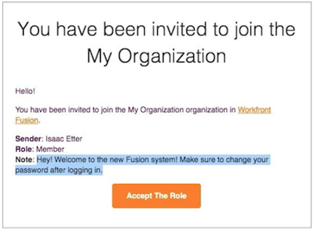

# Iniciar sesión como nuevo usuario

Cuando se le invita como nuevo usuario a una instancia de Workfront Fusion, recibe dos correos electrónicos.

Un correo electrónico tiene una nota que el administrador del sistema de Workfront Fusion añadió cuando creó el perfil y le invitó a la organización. En la parte inferior del correo electrónico se encuentra [!UICONTROL Aceptar La Función] botón. **¡No haga clic aún en este botón!**

El otro correo electrónico contiene sus credenciales de inicio de sesión.

Para empezar a utilizar Workfront Fusion, haga clic en el [!UICONTROL Iniciar sesión] en el segundo correo electrónico e inicie sesión con la contraseña proporcionada.

Después de iniciar sesión por primera vez, se le pedirá que cambie su contraseña.

Cuando haya iniciado sesión, vuelva al otro correo electrónico y haga clic en [!UICONTROL Aceptar La Función] botón.

Una vez hecho esto, vuelva a Workfront Fusion y actualice la página. Ahora puede ver las secciones de su equipo y de información general en el panel izquierdo.
