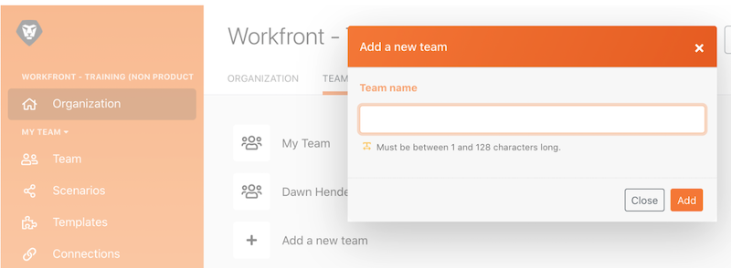

# Tutorial de administración

Aprenda a cambiar entre diferentes organizaciones o equipos y a agregar usuarios al sistema.

## Tutorial de administración

En este vídeo aprenderá:

* Navegación entre organizaciones y equipos
* Cómo crear equipos
* Cómo invitar a usuarios a una organización y a un equipo

>[!VIDEO](https://video.tv.adobe.com/v/335310/?quality=12&learn=on)

## ¿Desea obtener más información? Recomendamos lo siguiente:

[Documentación de Workfront Fusion](https://experienceleague.adobe.com/docs/workfront/using/adobe-workfront-fusion/workfront-fusion-2.html?lang=es)
