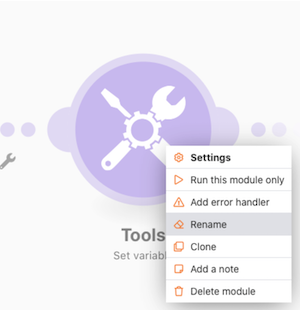
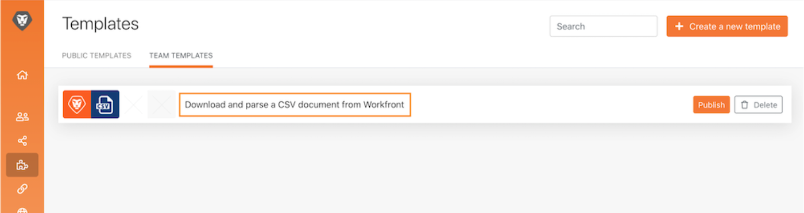

# Accesibilidad y claridad

Al principio de la formación sobre Workfront Fusion, ha aprendido algunas prácticas recomendadas básicas para facilitar la lectura, el uso compartido y la comprensión de los escenarios. Estas prácticas ayudan a facilitarles las cosas a los futuros usuarios de Workfront Fusion o a cualquier persona que solucione problemas o admita su instancia de Workfront Fusion. Aporte su granito de arena siguiendo las directrices que figuran a continuación a la hora de diseñar los escenarios.

## Etiquetas y notas

Como regla general, la meta principal de Workfront Fusion es tener siempre diseños de escenario simples. He aquí algunas formas de conseguir diseños sencillos de interpretar.

* Asegúrese de nombrar todos los módulos. Haga clic con el botón derecho en un módulo y seleccione Cambiar nombre. Las etiquetas de módulo deben ser cortas pero comprensibles para su rendimiento. Por ejemplo, “Crear proy. de mkting con plantilla ch”.
  
* Etiquete también las rutas de enrutamiento. Incluso si una ruta no utiliza un filtro directamente después de un enrutador, puede aplicar una etiqueta sin rellenar la lógica del filtro. Esto permite a otros comprender qué paquetes pasan, por cuáles rutas y por qué. Para crear una etiqueta para una ruta de enrutador sin filtro, haga clic con el botón derecho en ella, añada una etiqueta y guárdela.
  
* Añada notas donde corresponda en un escenario si una etiqueta de módulo o de ruta de enrutamiento van a ser demasiado cortas para aclarar lo que realmente está ocurriendo. Puede agregar notas siempre que lo desee a lo largo del proceso de diseño e iteración.

Sin embargo, puede que sea más fácil leer y comprender si las incorpora al final del diseño del escenario, cuando esté listo para su lanzamiento. Trabaje desde el final del diseño de su escenario (la esquina inferior derecha) hacia atrás. De este modo, las notas que se aplican al principio del escenario aparecen en la parte superior de la lista al abrir el panel de notas.

Después de guardar o cerrar el panel de notas, estas se ordenan con las creadas más recientemente en la parte superior. En la imagen siguiente, la primera nota creada aparece en la parte inferior de la lista. Las notas se crearon intencionalmente desde la parte inferior derecha hasta la ruta anterior y finalmente hasta el activador, básicamente el orden inverso en el que un paquete de datos pasaría por el escenario. Esto hace que las notas aparezcan en el orden en que se ejecuta el escenario en el paquete de datos.

## Plantillas de Workfront Fusion

Una buena manera de simplificar el etiquetado de módulos y rutas de enrutamiento es mediante plantillas. Las plantillas de prácticas recomendadas pueden acelerar la creación de escenarios para casos de uso comunes.

### Ejemplo de plantilla

Al iniciar un escenario, compruebe primero si hay una plantilla disponible que ayude. Por ejemplo, desea crear un escenario que comience descargando un documento CSV de Workfront y luego lo analice.

Haga clic en la sección Plantillas para ver si alguna de las públicas se ajusta a sus necesidades.

Haga clic en la pestaña Plantillas de equipo para ver si alguien de su equipo ha creado una que podría ser útil.

Si encuentra la plantilla que desea utilizar, haga clic en su nombre para abrirla.

A continuación, vaya a la esquina superior derecha, haga clic en Opciones y seleccione Crear escenario.

### Creación de una plantilla

Puede crear una plantilla en la sección Plantillas de equipo. La plantilla que cree está disponible para usted y para su equipo, pero al hacer clic en el botón Publicar puede compartirla con personas ajenas.

Al crear la plantilla, puede incluir un asistente para guiar a las personas que la utilizan para generar sus escenarios, cambiar las conexiones, los datos asignados y otros campos de panel según corresponda.

Marque la casilla “Usar en el asistente” para añadir instrucciones que estarán disponibles cuando alguien cree un escenario con su plantilla. Esta información aparecerá en el campo Ayuda. Para permitir que los usuarios vean este texto al usar la plantilla, active Utilizar como valor predeterminado.

## ¿Desea obtener más información? Recomendamos lo siguiente:

[Documentación de Workfront Fusion](https://experienceleague.adobe.com/es/docs/workfront-fusion/using/get-started-with-fusion/understand-workfront-fusion/workfront-fusion-overview)
