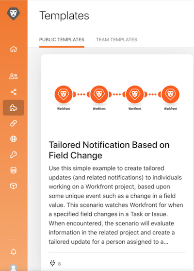

# Accesibilidad y claridad

Al principio de la formación de Workfront Fusion, ha aprendido algunas prácticas recomendadas básicas para facilitar la lectura, el uso compartido y la comprensión de los escenarios. Estas prácticas ayudan a facilitar las cosas a los futuros usuarios de Workfront Fusion o a cualquiera que solucione problemas o admita su instancia de Workfront Fusion. Páguelo a cuenta nueva siguiendo las directrices que se indican a continuación al diseñar escenarios.

## Etiquetas y notas

Como regla general, un objetivo principal en Workfront Fusion es siempre tener diseños de escenarios simples. A continuación se indican algunas formas de crear diseños fáciles de interpretar.

* Asegúrese de asignar un nombre a todos los módulos. Haga clic con el botón derecho en un módulo y seleccione Cambiar nombre. Las etiquetas de módulo deben ser cortas, pero comprensibles para lo que el módulo está realizando. Por ejemplo, &quot;Crear proyecto Mktg con plantilla Ch&quot;.
  
* Etiquetar también las rutas de enrutamiento. Incluso si una ruta no utiliza un filtro directamente después de un enrutador, puede aplicar una etiqueta sin rellenar la lógica del filtro. Hacer esto permite a otros comprender qué paquetes pasan por qué rutas y por qué. Para crear una etiqueta para una ruta de enrutador sin filtro, haga clic con el botón secundario en la ruta, agregue una etiqueta y guarde los cambios.
  
* Agregue notas, cuando corresponda, en un escenario en el que una etiqueta de módulo o de ruta de enrutamiento sea demasiado corta para aclarar lo que está ocurriendo realmente. Puede agregar notas siempre que lo desee a lo largo del proceso de diseño e iteración.

Sin embargo, puede ser más fácil de leer y comprender si agrega notas al final del diseño de escenario cuando esté listo para el lanzamiento. Trabaje desde el final del diseño del escenario (la esquina inferior derecha más alejada) hacia atrás. De este modo, las notas que se aplican al principio del escenario se encuentran en la parte superior de la lista al abrir el panel de notas.

Después de guardar o cerrar el panel de notas, las notas se ordenan con el último creado en la parte superior. En la imagen siguiente, la primera nota creada aparece en la parte inferior de la lista. Las notas se crearon intencionadamente desde la parte inferior derecha a la ruta superior y, finalmente, al déclencheur; básicamente, el orden inverso en el que un conjunto de datos pasaría por el escenario. Esto hace que las notas aparezcan en el orden en que el escenario se ejecuta realmente en el paquete de datos.

## Plantillas de Workfront Fusion

Una buena manera de optimizar el etiquetado de módulos y rutas de enrutamiento es mediante plantillas. Las plantillas de prácticas recomendadas pueden acelerar la creación de escenarios para casos de uso comunes.

### Ejemplo de plantilla

Al iniciar un escenario, primero compruebe si hay una plantilla disponible que le ayude. Por ejemplo, desea crear un escenario que comience descargando un documento CSV desde Workfront y luego lo analice.

Haga clic en la sección Plantillas para ver si alguna plantilla pública satisface sus necesidades.

Haga clic en la ficha Plantillas de equipo para ver si alguien de su equipo ha creado una plantilla que pueda ser útil.

Si encuentra una plantilla que desee utilizar, haga clic en el nombre para abrirla.

A continuación, vaya a la esquina superior derecha, haga clic en Opciones y seleccione Crear escenario.

### Creación de una plantilla

Puede crear una plantilla en la sección Plantillas de equipo. La plantilla que cree estará disponible para usted y para su equipo, pero cuando haga clic en el botón Publicar podrá compartirla con personas ajenas a su equipo.

Al crear la plantilla, puede incluir un asistente para guiar a las personas que la utilizan para crear sus escenarios, cambiando las conexiones, los datos asignados y otros campos del panel según corresponda.

Marque la casilla &quot;Usar en asistente&quot; para agregar instrucciones que estarán disponibles cuando alguien cree un escenario con su plantilla. Esta información aparece en el campo Ayuda. Para permitir que los usuarios vean este texto al utilizar la plantilla, habilite Usar como valor predeterminado.

## ¿Desea obtener más información? Recomendamos lo siguiente:

[Documentación de Workfront Fusion](https://experienceleague.adobe.com/docs/workfront/using/adobe-workfront-fusion/workfront-fusion-2.html?lang=en)
