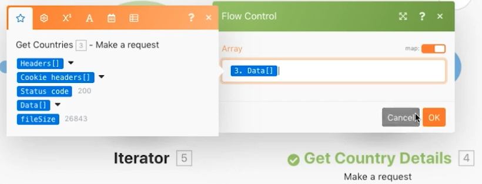

# Agregación avanzada

Obtenga información sobre cómo utilizar las agrupaciones al agregarlas.

## Información general del ejercicio

Llame a un servicio web para devolver detalles sobre varios países e identificar la población total de todos los países, agrupados por subregión.

## Pasos a seguir

**Obtenga detalles del país.**

1. Cree un nuevo escenario y asígnele el nombre “Agregación avanzada”.
1. Establezca el módulo del activador en un HTTP: realice un módulo de solicitud.
1. Utilice esta URL, `https://restcountries.com/v2/lang/es`, que proporciona una lista de todos los países donde se habla español.
1. Deje el Método como Get.
1. Haga clic en la casilla de verificación Analizar respuesta.
1. Cambie el nombre del módulo “Obtener países”.
1. Haga clic en Guardar y Ejecutar una vez.

   **El resultado es un paquete único, pero viene en una matriz con 24 colecciones, una para cada país hispanohablante.**

   

   **Debe recopilar información de la subregión para cada uno de los países, por lo que deberá realizar una petición HTTP adicional.**

1. Agregue otra solicitud para obtener información de la subregión. Solo devolverá el primer país, pero está bien por ahora. Añadir otro HTTP Realice un módulo de solicitud y utilice la URL `https://restcountries.com/v2/name/{country name}`.
1. Para obtener el nombre del primer país, vaya al panel de asignación y haga clic en Datos y, a continuación, en Nombre en la matriz. El [1] en el campo de datos significa que devolverá el primer elemento de la matriz.

   + Haga clic en el número y cambie el índice si es necesario, pero en este caso solo desea el primer elemento.

1. Compruebe Analizar respuesta en el panel de asignación y haga clic en OK.
1. Cambie el nombre de “Obtener detalles del país”.
1. Haga clic en Guardar y, a continuación, en Ejecutar una vez.

   + El resultado es información para un solo país.

1. Para obtener los demás países, debe iterar a través de la matriz. Añada un iterador, que toma una lista de cosas y genera un paquete para cada elemento de la lista.

   **Añada el iterador y el agregador.**

1. Haga clic con el botón derecho entre los módulos HTTP y añada el módulo iterador control de flujo.
1. En el campo Matriz, seleccione Datos en el módulo Obtener países.

   

1. En el módulo Obtener detalles del país, actualice el campo URL para que tome el campo de nombre del iterador en lugar del módulo Obtener países.

   

1. Ahora agregue un agregador numérico después de Obtener detalles del país para agrupar y sumar las poblaciones.
1. El módulo de origen es el módulo del iterador.
1. La función de agregado es SUM.
1. El valor es [datos:población] desde el módulo Obtener detalles del país.
1. Haga clic en la opción Mostrar configuración avanzada en la parte inferior y agrupe por [datos:subregión] desde el módulo Obtener detalles del país.

   

   **Termine con un agregador de texto para agregar lo que ha agrupado dentro del agregador numérico.**

1. Añada un agregador de texto al final.
1. El módulo de origen es el agregador numérico.
1. En el área Texto, insértese “La población total de [CLAVE] es [resultado]”.

   

1. Guarde y ejecute una vez.

   + Revise la salida del módulo final.
