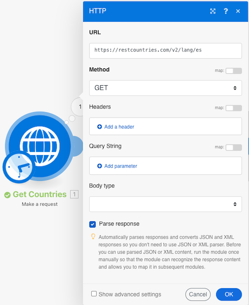

# Agregación avanzada

Obtenga información sobre cómo utilizar las agrupaciones al agregar.

## Resumen del ejercicio

Llame a un servicio web para devolver detalles sobre varios países e identificar la población total de todos los países, agrupada por subregión.

## Pasos a seguir

**Obtener información del país.**

1. Cree un nuevo escenario y asígnele el nombre &quot;Agregación avanzada&quot;.
1. Establezca el módulo de déclencheur en un módulo HTTP - Crear una solicitud.
1. Utilice esta dirección URL, `https://restcountries.com/v2/lang/es`, que te da una lista de todos los países donde se habla español.
1. Deje el método como Get.
1. Haga clic en la casilla de verificación Analizar respuesta.
1. Cambie el nombre de este módulo a &quot;Obtener países&quot;.
1. Haga clic en Guardar y ejecutar una vez.

   **El resultado es un solo paquete, pero viene en una matriz con 24 colecciones, una para cada país de habla hispana.**

   

   **Debe recopilar información de la subregión para cada uno de los países, por lo que deberá realizar una solicitud HTTP adicional.**

1. Agregar otra solicitud para obtener información de la subregión. Solo devolverá el primer país, pero está bien por ahora. Añadir otro módulo HTTP Make a request y utilizar la URL `https://restcountries.com/v2/name/{country name}`.
1. Para obtener el nombre del primer país, vaya al panel Asignación y haga clic en Datos y, a continuación, en Nombre en la matriz. El [1] en el campo de datos significa que devolverá el primer elemento de la matriz.

   + Haga clic en el número y cambie el índice si es necesario, pero en este caso solo desea el primer elemento.

1. Compruebe la respuesta Analizar en el panel de asignación y, a continuación, haga clic en Aceptar.
1. Cambie el nombre de este campo a &quot;Obtener detalles del país&quot;.
1. Haga clic en Guardar y luego en Ejecutar una vez.

   + El resultado es información para un solo país.

1. Para llegar a los otros países, debe iterar a través de la matriz. Añada un iterador, que toma una lista de cosas y genera un paquete para cada elemento de la lista.

   **Añada el iterador y el agregador.**

1. Haga clic con el botón derecho entre los módulos HTTP y añada el módulo Iterator Flow Control.
1. En el campo Matriz, seleccione Datos del módulo Obtener países.

   

1. En el módulo Obtener detalles de país, actualice el campo URL para tomar el campo de nombre del iterador en lugar de usar el módulo Obtener países.

   

1. Ahora, agregue un agregador numérico después de Obtener detalles de país para agrupar y sumar las poblaciones.
1. El módulo de origen es el módulo del iterador.
1. La función de acumulado es SUMA.
1. El valor es [datos:población] en el módulo Obtener detalles de país.
1. Haga clic en la opción Mostrar configuración avanzada en la parte inferior y agrupe por [datos:subregión] en el módulo Obtener detalles de país.

   

   **Termine con un agregador de texto para agregar lo que ha agrupado dentro del agregador numérico.**

1. Agregue un agregador de texto al final.
1. El módulo de origen es el agregador numérico.
1. En el área Texto, inserte &quot;La población total de [CLAVE] es [resultado].&quot;

   

1. Guardar y ejecutar una vez.

   + Revise el resultado del módulo final.
