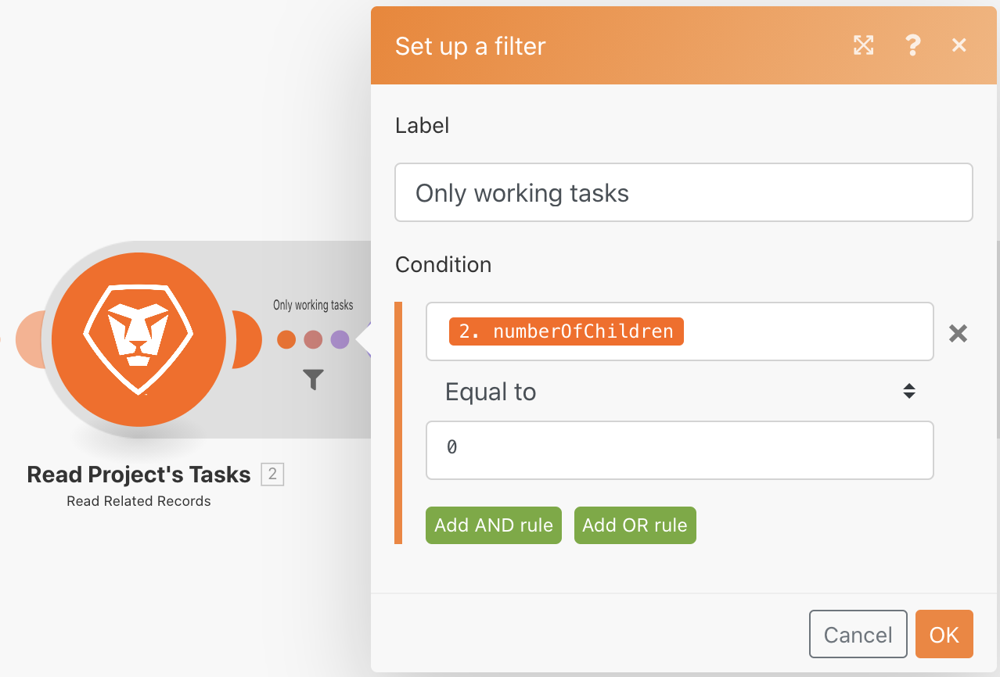
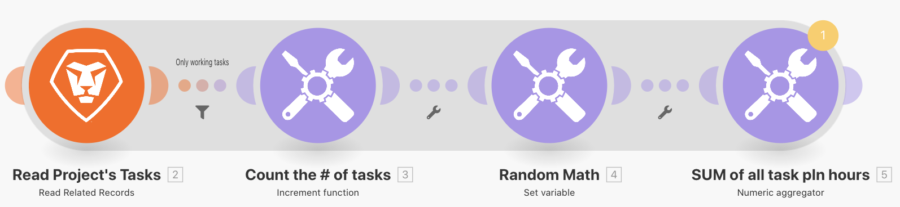

# Agregación

Aprenda a acumular varios paquetes de información en un solo valor.

## Información general del ejercicio

Con el escenario &quot;Introducción a la iteración&quot; que creó en el último ejercicio, agregue las horas programadas en cada tarea de trabajo del proyecto y envíe un correo electrónico con esa información.

## Pasos a seguir

**Agregue un filtro y SUME las horas programadas.**

1. Clona el escenario &quot;Introducción a la iteración&quot; que creó en el ejercicio anterior y asígnele el nombre &quot;Introducción a la agregación&quot;.
1. Agregue un filtro entre el módulo Leer proyecto y el módulo Contar el número de tareas . Asigne al filtro el nombre &quot;Solo tareas de trabajo&quot;.
1. Establezca la condición en Número de hijos [Operador numérico: Igual a] 0.

   

1. Después del módulo Random Math, agregue un módulo de herramienta de agregador numérico.
1. Establezca el módulo de origen en Leer tareas del proyecto.
1. Establezca la función Aggregate en SUM.
1. Establezca el valor en el campo Trabajo desde el módulo Leer tareas del proyecto.
1. Cambie el nombre de este módulo &quot;SUM de todas las horas del plan de tareas&quot;.

   

   **Observe la sombra que muestra que la agregación termina la iteración.**

   

   **Envíe un correo electrónico con horas agregadas.**

1. Añada un módulo Send an email desde la aplicación Email, después del agregador numérico.
1. Envíe el correo electrónico a usted mismo.
1. La línea de asunto es &quot;Detalles del proyecto&quot;.
1. En el campo Contenido , ponga &quot;Hay un proyecto llamado [nombre del proyecto] que tiene un número total de [result] horas planificadas&quot;. La variable[nombre del proyecto]&quot; se toma del módulo Leer un registro y &quot;[result]&quot; se toma del módulo del agregador.

   

1. Guarde y ejecute una vez. Busque el correo electrónico en la bandeja de entrada.

En la iteración, se puede acceder a los paquetes individuales. Pero fuera de la iteración, en el módulo Send an email , solo se puede acceder a los campos agregados.
