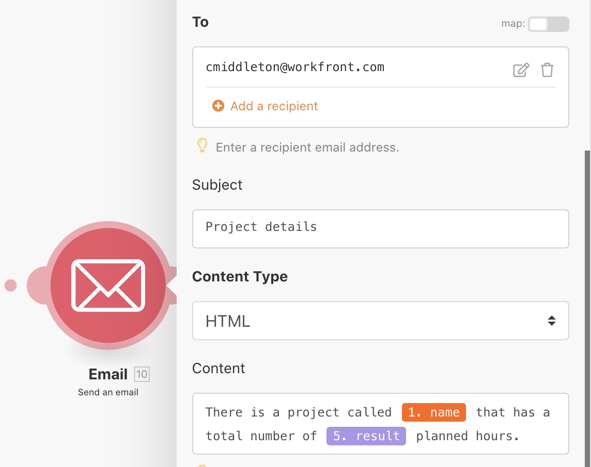

# Ejercicio de agregación

Aprenda a acumular varios paquetes de información en un solo valor.

## Información general del ejercicio

Con el escenario “Introducción a la iteración” que usted creó en el último ejercicio, agregue las horas planificadas en cada tarea de trabajo del proyecto y envíese a sí mismo un correo electrónico con esa información.

## Pasos a seguir

**Agregue un filtro y SUME las horas planificadas.**

1. Clona el escenario “Introducción a la iteración” que usted creó en el ejercicio anterior y asígnele el nombre “Introducción a la agregación”.
1. Agregue un filtro entre el módulo Leer proyecto y el módulo Contar el número de tareas. Asigne al filtro el nombre “Solo tareas de trabajo”.
1. Establezca la condición en Número de tareas secundarias [Operador numérico: Igual a] 0.

   

1. Después del módulo Matemáticas aleatorias, agregue un módulo de herramienta de agregador numérico.
1. Establezca el módulo de origen en Leer tareas del proyecto.
1. Establezca la función Agregar en SUM.
1. Establezca el Valor en el campo Trabajo desde el módulo Leer tareas del proyecto.
1. Cambie el nombre de este módulo “SUM de todas las horas del plan de tareas”.

   

   **Observe la sombra que muestra que la agregación termina con la iteración.**

   

   **Envíe un correo electrónico con horas agregadas.**

1. Añada un módulo Enviar un correo electrónico desde la aplicación Correo electrónico, después del agregador numérico.
1. Envíese el correo electrónico a usted mismo.
1. La línea de asunto es “Detalles del proyecto”.
1. En el campo Contenido, ponga “Hay un proyecto llamado [nombre del proyecto] que tiene un número total de [resultado] horas planificadas”. El “[nombre del proyecto]” se toma del módulo Leer un registro y se toma el “[resultado]” del módulo del agregador.

   

1. Guarde y ejecute una vez. Busque el correo electrónico en la bandeja de entrada.

En la iteración, se puede acceder a los paquetes individuales. Pero fuera de la iteración, en el módulo Enviar un correo electrónico, solo se puede acceder a los campos agregados.
