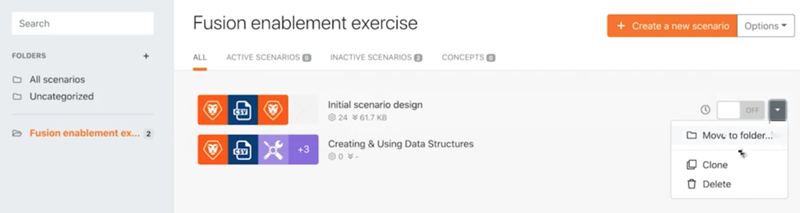

# Más allá de la asignación básica

Aprenda a utilizar las fórmulas del panel de asignación para manipular o convertir los campos enviados a un módulo.

## Resumen del ejercicio

Cambie el nombre del proyecto, la fecha de inicio planificada y la prioridad desde los ejercicios del tutorial Asignación básica más allá utilizando las fórmulas del panel de asignación.

## Pasos a seguir

**Cree un clon del escenario de diseño inicial.**

1. Seleccione la opción Clonar a la derecha del diseño del escenario inicial en la sección de escenario, como se muestra a continuación. Asígnele el nombre &quot;Más allá de la asignación básica&quot;.

   

   **Ahora vamos a usar el panel de asignación en el módulo Crear proyectos de Workfront para configurar el nombre del proyecto, la fecha de inicio planificada y los campos de prioridad.**

1. Haga clic en el módulo Crear proyectos de Workfront para editar la configuración. En el panel de asignación, cambie el campo Nombre a &quot;[Nombre de mi proyecto] por [Patrocinador].&quot;

   + El [Nombre de mi proyecto] es la columna 1 del módulo Analizar CSV y [Patrocinador] es la columna 6. La palabra &quot;por&quot; se escribe entre los dos.

1. A continuación, vaya a la Fecha planificada de inicio y utilice la fórmula addDays para agregar 15 días al campo, tal como se describe en el vídeo de tutorial de asignación básica Más allá.
1. Busque el campo Priority y coloque el botón Map en la parte superior derecha del campo. El menú de la lista desplegable cambia a un número. Cree una instrucción if para etiquetar un proyecto como de prioridad alta (4) si la clasificación de confianza del archivo CSV es menor que 100; de lo contrario, puede ser normal (2).

   + La calificación de confianza se encuentra en la columna 4.

   **En este punto, el panel de asignación debería tener este aspecto:**

   

1. Haga clic en Aceptar y luego en Ejecutar una vez.
1. Busque el proyecto en la instancia de Workfront para asegurarse de que todo esté asignado correctamente.
1. Guarde el escenario.
