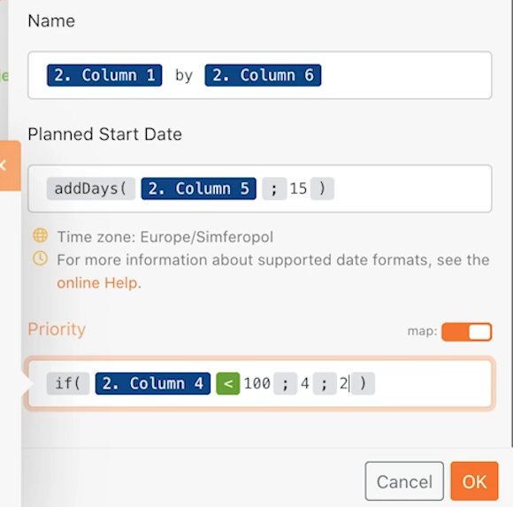

# Más allá de la asignación básica

Aprenda a utilizar las fórmulas del panel de asignación para manipular o convertir los campos enviados a un módulo.

## Información general del ejercicio

Cambie el nombre del proyecto, la fecha de inicio planificada y la prioridad en los ejercicios de tutorial de asignación más allá de la asignación básica mediante las fórmulas del panel de asignación.

## Pasos a seguir

**Haga un clon del escenario de diseño de escenario inicial .**

1. Seleccione la opción Clonar a la derecha del diseño de escenario inicial en la sección de escenario, como se muestra a continuación. Denomínela &quot;Más allá de la asignación básica&quot;.

   

   **Ahora vamos a usar el panel de asignación en el módulo Crear proyectos de Workfront para configurar los campos nombre del proyecto, fecha de inicio planificada y prioridad.**

1. Haga clic en el módulo Crear proyectos de Workfront para editar la configuración. Con el panel de asignación, cambie el campo Nombre a &quot;[Mi nombre de proyecto] por [Patrocinador].&quot;

   + La variable [Mi nombre de proyecto] es la columna 1 del módulo CSV Parse y [Patrocinador] es la columna 6. La palabra &quot;por&quot; se escribe entre los dos.

1. A continuación, vaya a la Fecha de inicio planeada y utilice la fórmula addDays para añadir 15 días al campo, tal como se describe en el vídeo de tutorial de asignación Más allá de la base .
1. Busque el campo Priority y active el botón Map en la parte superior derecha del campo. El menú de la lista de selección cambia a un número. Cree una instrucción if para etiquetar un proyecto como de prioridad alta (4) si la clasificación de confianza de archivos CSV es inferior a 100; de lo contrario, puede ser Normal(2).

   + La clasificación de confianza se encuentra en la columna 4.

   **En este punto, el panel de asignación debería tener este aspecto:**

   

1. Haga clic en Aceptar y, a continuación, en Ejecutar una vez.
1. Busque el proyecto en la instancia de Workfront para asegurarse de que todo estaba asignado correctamente.
1. Guarde el escenario.
