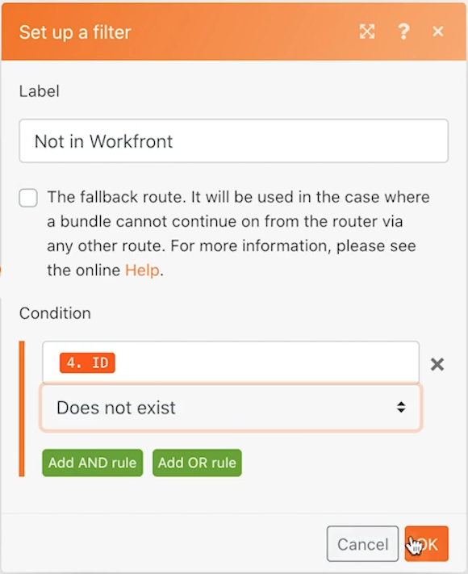

# Ejercicio de almacenes de datos

Obtenga información sobre cómo sincronizar nombres de empresas entre dos sistemas.

## Información general del ejercicio

Esta es la primera parte de una sincronización unidireccional de empresas en Workfront y otro sistema. Por ahora, solo se sincroniza entre un almacén de datos de Fusion y Workfront. Una tabla de un almacén de datos realiza un seguimiento del Workfront ID (WFID) y el ID de la empresa en el archivo CSV (CID) de cada empresa. Esto nos permitirá hacer de esto una sincronización bidireccional en algún momento en el futuro.

## Pasos a seguir

**Descargue el archivo desde Workfront.**

1. En la carpeta “Archivos de ejercicio de Fusion” de Workfront, seleccione “_Companies.csv” y haga clic en Detalles del documento.
1. Copie el primer número de ID de la dirección URL.
1. En Fusion, cree un nuevo escenario denominado “Uso de almacenes de datos para sincronizar datos”.
1. Para el módulo de activación, seleccione el módulo Descargar documento de Workfront.
1. Configure la conexión de Workfront e incluya el ID de documento copiado desde la URL de Workfront.
1. Asigne a este módulo el nombre “Obtener archivo de compañías”.
1. Ahora agregue un módulo CSV de análisis.
1. Para el campo Número de columnas, escriba 2.
1. Asigne datos desde el módulo Descargar documento en el campo CSV.
1. Asigne a este módulo el nombre “Analizar archivo de compañías”.
1. Guarde su escenario y haga clic en Ejecutar una vez.

   **Cree un almacén de datos y una estructura de datos.**

1. Agregue un módulo de registros de búsqueda del almacén de datos.
1. Cree un nuevo almacén de datos con el nombre “Sincronización de compañías”.
1. Dentro del almacén de datos, cree una estructura de datos denominada “Sincronización de compañías (struc)”.
1. Cree cuatro campos.

   + CID: el ID de compañía en el archivo CSV
   + Nombre de la compañía
   + WFID: el ID de la compañía de Workfront
   + Fecha de creación: asegúrese de que el tipo de datos sea una fecha

   

1. Haga clic en Guardar en la estructura de datos y, a continuación, establezca el tamaño de almacenamiento de datos en 1 y guarde el almacén de datos.
1. Continuando en el módulo Almacén de datos, configure un filtro donde el CID sea igual al ID de la compañía desde el módulo CSV de análisis (columna 1).
1. Haga clic en Mostrar configuración avanzada y seleccione la opción “continuar con la ejecución del escenario o la ruta, incluso si este módulo se devuelve sin resultados”.

   

1. Cambie el nombre de este módulo “Compañías coincidentes”.
1. Agregue un módulo de registros de búsqueda de Workfront.
1. Elija Compañía como tipo de registro.
1. Los criterios de búsqueda son el nombre de compañía dentro de Workfront que es igual al nombre de la compañía en el archivo CSV.
1. Para los resultados, seleccione el nombre de la compañía y el ID.

   

1. Haga clic en Aceptar y cambie el nombre de este módulo por “Compañías coincidentes”.

   **Cree diferentes rutas en función de si la compañía existe en Workfront o en el almacén de datos.**

   **Ruta de enrutamiento 1: crear una compañía.**

1. Agregue un módulo de enrutador a la derecha del módulo de registros de búsqueda de Workfront.
1. Agregue un módulo Crear registro de Workfront a la ruta superior.
1. Establezca el tipo de registro a Compañía.
1. Seleccione Nombre en Campos a asignar. Asigne el campo de nombre al resultado del módulo CSV de análisis (columna 2).
1. Cambie el nombre de este módulo a “Crear compañía”.

   

1. Añada un filtro después del enrutador para crear solo una empresa si no está ya en Workfront. Denomínela “No está en Workfront”.
1. Establezca la Condición en el ID desde el módulo de búsqueda de Workfront si no existe.

   

   **Prepárese para actualizar el almacén de datos en la siguiente ruta.**

1. Agregue el módulo de la variable Set al final de la ruta superior.
1. Establezca el nombre de la variable en “ID de Workfront”.
1. Establezca el valor de la variable en el ID desde el módulo Crear compañía.
1. Cambie el nombre de este módulo a “Establecer ID de Workfront”.

   **Ruta de enrutamiento 2: Actualice el almacén de datos.**

1. Cree un filtro en la ruta de enrutamiento 2. Asígnele el nombre “No está en el almacén de datos”.

1. Establezca la Condición en la Clave desde el módulo del almacén de datos y no existe.

   

1. El primer módulo de esta ruta es el módulo de la variable Get.
1. Establezca el nombre de la variable en “ID de Workfront”.
1. Cambie el nombre de este módulo a “Obtener ID de Workfront”.
1. Agregue otro módulo desde la aplicación Almacén de datos y añada/sustituya el registro.
1. En el campo Almacén de datos, seleccione Sincronización de la compañía. Este es el almacén de datos que creó anteriormente.
1. Deje el campo Clave en blanco.
1. Asigne el campo CID de la Columna 1 en el módulo Analizar CSV.
1. Asigne el campo de nombre de compañía de la Columna 2 en el módulo Analizar CSV.
1. Asigne el campo WFID del módulo Obtener ID de Workfront.
1. Para el campo Fecha de creación, utilice la función formatDate de la pestaña Fecha y hora para dar formato a la fecha actual como MM/DD/AAAA.

   

1. Haga clic en Aceptar y cambie el nombre de este módulo por “Crear entrada de la compañía”.

   **Ruta de enrutamiento 3: sincronice el almacén de datos entre sistemas.**

1. Comience creando un filtro en la ruta de enrutamiento 3. Denomínelo “La compañía existe, no está en el almacén de datos”.
1. Establezca la Condición en la clave desde el módulo de registros de búsqueda del almacén de datos no existe.
1. Haga clic en el botón Agregar regla AND y designe que el nombre de la compañía del archivo CSV (Columna 2) es igual al nombre de la compañía que se encuentra en el módulo de búsqueda de Workfront.

   

1. Ahora agregue otro módulo de registro Añadir/reemplazar clonando el que se encuentra al final de la ruta de enrutamiento 2.
1. Arrastre el módulo clonado a su sitio al final de la ruta de enrutamiento 3. Elimine el módulo vacío que estaba allí.
1. Haga clic en el módulo clonado. Todos los campos deben permanecer iguales excepto el campo WFID. Asígnelo desde el módulo Búsqueda de empresas coincidentes.

   

1. Haga clic en Aceptar y cambie el nombre de este módulo por “Crear entrada de la compañía”.
