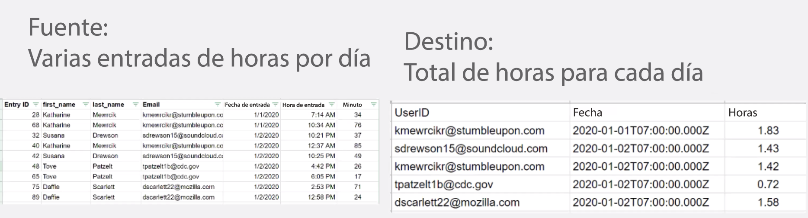
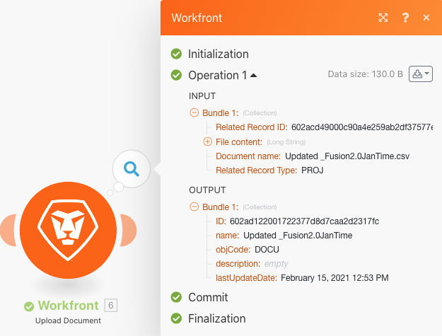

# Estructuras de datos

Transformar datos de un archivo de origen en un archivo de destino.

## Información general del ejercicio

Abra un archivo CSV que contenga una lista de entradas de tiempo. Estas entradas de hora son para minutos que varios usuarios registran a lo largo de ciertos días. El objetivo es tomar esta información y producir un nuevo CSV que muestre el tiempo total, en horas, registrado por cada usuario cada día.

En esta situación, se abrirá un archivo que contiene una lista de entradas de hora para minutos de trabajo, incluida la fecha y la hora, cuántos minutos se escribieron y la dirección de correo electrónico de quién realizó la entrada. Hay 100 entradas, algunas hechas por las mismas personas y algunas fueron hechas el mismo día que otras.

Para producir un archivo que muestre el tiempo total, en horas, trabajado cada día por cada individuo, siga estos pasos:

1. En el módulo déclencheur, obtenga un archivo de la carpeta Workfront. Descargue el archivo .
1. En el primer módulo CSV, analice los datos de entrada horaria para generar un paquete para cada entrada horaria. Este es un iterador.
1. El primer módulo Herramientas es un agregador numérico. Esto SUMA todos los minutos y agrupa las filas por dirección de correo electrónico y, a continuación, por fecha. El resultado es el total de minutos trabajados cada día por dirección de correo electrónico.
1. El segundo módulo Herramientas es un módulo Set Variable . Utilice esto para dar formato a los minutos que se dividirán entre 60 y 2 decimales.
1. En el segundo módulo CSV, configure el archivo de salida.
1. En el módulo final, cargue el archivo CSV en Workfront.

## Pasos a seguir

**Descargue el archivo desde Workfront.**

1. En la carpeta &quot;Archivos de ejercicio de fusión&quot; de Workfront, seleccione &quot;_Fusion1.0JanTime.csv&quot; y haga clic en Detalles del documento.
1. Copie el primer número de ID de la dirección URL.
1. Cree un nuevo escenario. Asígnele el nombre &quot;Creación y uso de estructuras de datos&quot;.
1. Comience con el módulo Descargar documento de la aplicación Workfront.
1. Configure la conexión de Workfront e incluya el ID de documento que ha copiado de la URL de Workfront.

   

   **Analice los datos de entrada horaria.**

1. Añada otro módulo seleccionando Analizar CSV.
1. Configure el CSV de análisis para 7 columnas. Marque la casilla CSV contiene encabezados . Elija Comma delimiterType y coloque Data en el campo CSV.

   

1. Haga clic en Ejecutar una vez para ver el resultado.
1. Abra el inspector de ejecución para ver las entradas y salidas del módulo CSV de análisis. Hay un paquete (un archivo CSV) como entrada y varios paquetes como salidas (un paquete para cada fila en el archivo CSV). Debería tener un aspecto similar al siguiente:

   

   **A continuación, transforme los datos en el formulario de salida deseado, con totales de tiempo agregados expresados en horas en lugar de minutos.**

1. Añada un módulo de herramienta Acumulador numérico.
1. Seleccione el módulo de origen, que es el módulo CSV de análisis.
1. Seleccione SUM para la función de agregado.
1. El campo Value es la columna 7 del archivo CSV. Son los minutos que registra cada usuario.
1. Para sumar los campos por grupo, haga clic en Configuración avanzada y establezca Agrupar por en correo electrónico (columna 4), fecha (columna 5).

   + Esto sumará para cada combinación del correo electrónico y la fecha. Asegúrese de colocar una coma entre la columna 4 y la columna 5. Esto se utilizará como delimitador más adelante.

   **El panel de asignación debe tener este aspecto:**

   

1. Haga clic en Ejecutar una vez para comprobar el resultado de la agregación.

   **Los paquetes de salida deberían tener este aspecto:**

   

   **Ahora, convierta los minutos agregados en horas.**

1. Añada otro módulo de herramientas, seleccionando Establecer variable.
1. Asigne a la variable el nombre &quot;Horas&quot;.
1. Establezca el valor de la variable en formatNumber(result/60;2;.;,)

   **El panel de asignación debe tener este aspecto:**

   

   **A continuación, obtenga los valores configurados para el archivo de salida. Desea utilizar el userID y el valor de fecha utilizado para las agrupaciones. También desea las horas calculadas.**

1. Añada otro módulo CSV mediante el agregador Crear CSV (avanzado).
1. El módulo de origen es el agregador Herramientas - Numérico .
1. Haga clic en Add by the Data structure y asigne un nombre a la estructura de datos &quot;Time Logged Daily Sum&quot; (Suma diaria con registro de tiempo).
1. Haga clic en Agregar elemento para crear el primer elemento.
1. Asigne un nombre al elemento &quot;UserID&quot; y establezca el tipo en Texto. Haga clic en Agregar.
1. Vuelva a hacer clic en Agregar elemento para crear el segundo elemento.
1. Asigne un nombre al elemento &quot;Fecha&quot;, establezca el tipo en Fecha y haga clic en Agregar.
1. Haga clic en Agregar elemento una vez más.
1. Asigne un nombre al elemento &quot;Horas&quot;, establezca el tipo en Número y haga clic en Agregar.

   **La estructura de datos debería tener este aspecto:**

   

1. Haga clic en Guardar para finalizar la estructura de datos Suma diaria con registro de tiempo.

   **Ahora se proporcionan los valores para los tres campos que se acaban de crear. Debería ver esos tres campos en el panel de asignación CSV.**

1. Haga clic en el campo UserID y seleccione GET en la pestaña funciones generales . En el primer parámetro, coloque SPLIT desde la pestaña text and binary functions . El primer parámetro para la función SPLIT es el campo Clave. Agregue una coma como delimitador y 1 como índice. Esto indica que desea que la GET recupere el primer campo de la matriz Clave.
1. Copie esta expresión en el campo Date . Cambie el índice de 1 a 2 para GET del segundo valor de la matriz.
1. Para el campo Horas , añada el campo Horas de la herramienta Establecer variable .

   **El panel de asignación CSV debería tener este aspecto:**

   

   **Si ejecuta el escenario ahora, debería ver este resultado:**

   

   **Ahora, agregue un módulo para tomar este resultado y cargarlo como documento en un proyecto existente en Workfront.**

1. Abra el proyecto en Workfront y copie el ID del proyecto de la dirección URL.
1. Vuelva al escenario en Fusion y añada otro módulo: el módulo Cargar documento de la aplicación de Workfront.
1. Pegue el ID del proyecto en el campo ID de registro relacionado .
1. Elija Proyecto para el Tipo de registro relacionado.
1. Elija la opción Mapa para el archivo de origen.
1. Para el nombre del documento, utilice el nombre de archivo que descargó y añada &quot;Actualizado&quot; delante de él.
1. Para el contenido de Archivo, utilice la salida Texto del módulo Crear CSV .

   **El panel de asignación debe tener este aspecto:**

   

1. Haga clic en Aceptar y en Guardar el escenario.
1. Haga clic en Ejecutar una vez para ejecutar el escenario.

   **Compruebe el inspector de ejecución en el módulo Cargar documento para confirmar que el documento se ha cargado.**

   