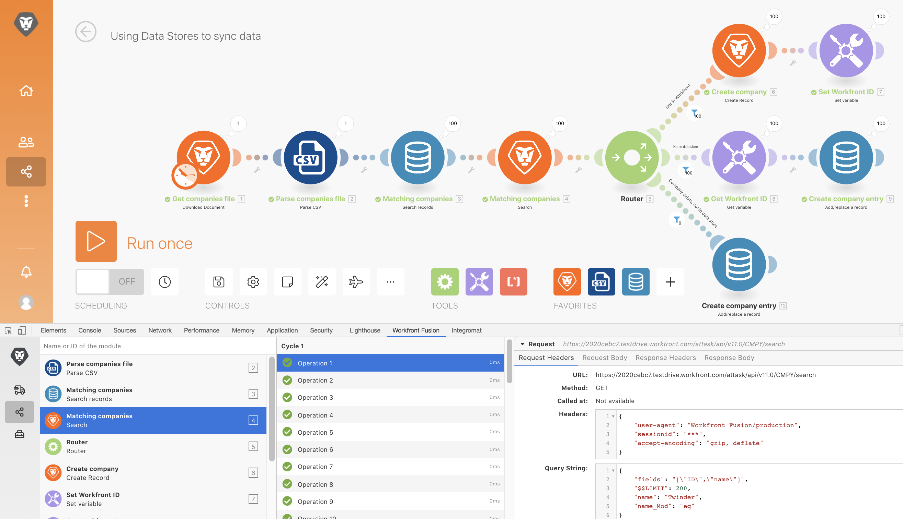

# Herramienta de desarrollo

Mejore sus capacidades para solucionar problemas de un escenario y facilitar las configuraciones complejas con la herramienta de desarrollo.

## Información general del ejercicio

Instale y utilice las diferentes áreas de la herramienta de desarrollo de Workfront para profundizar en las solicitudes/respuestas realizadas y en los trucos avanzados de diseño de escenarios.

>[!NOTE]
>
>La herramienta de desarrollo de Workfront Fusion solo está disponible en el explorador Chrome cuando se usa la [Herramienta para desarrolladores Chrome](https://developer.chrome.com/docs/devtools/).

## Pasos a seguir

**Instale la herramienta de desarrollo.**

1. Descargue el documento “workfront-fusión-devtool.zip” que se encuentra en la carpeta de archivos de ejercicios de Fusion de la unidad de prueba.
1. Extraiga los archivos .zip a una carpeta.
1. Abra una pestaña en Chrome e introduzca **chrome://extensions**.
1. Alterne en el modo Desarrollador con el conmutador en la parte superior derecha y, a continuación, haga clic en el botón “Cargar desempaquetado” que aparece en la parte superior izquierda. Seleccione la carpeta que contiene la herramienta de desarrollo (donde la descomprimió).

   

1. Una vez desempaquetada, la herramienta de desarrollo aparece entre las demás extensiones.

   

   **Utilice el flujo en directo.**

1. Comience abriendo el escenario “Uso de almacenes de datos para sincronizar datos”.
1. Abra la herramienta de desarrollo con F12 o la función F12. O puede hacer clic en el menú de tres puntos de la barra de direcciones de Chrome y navegar a las herramientas para desarrolladores.

   

1. Haga clic en la ficha Workfront Fusion y, a continuación, seleccione Transmisión en directo en la lista de la izquierda.
1. Haga clic en Ejecutar una vez para ver los eventos a medida que se producen.
1. Haga clic en un evento para ver las pestañas a la derecha de Encabezados de solicitud, Cuerpo de solicitud, Encabezados de respuesta y Cuerpo de respuesta.

   

   **Uso del Depurador de escenario**

1. Seleccione Depurador de escenario y haga clic en un módulo para ver información sobre las operaciones de dicho módulo.

   

1. Vaya a la pestaña Historial. Haga clic en Detalles en una ejecución para examinar los detalles de operación del módulo para una ejecución específica.

   

   **Uso de las herramientas**

1. Vuelva al diseñador de escenarios y seleccione Herramientas en la herramienta de desarrollo. Muestra las herramientas disponibles.

   

+ Enfoque en un módulo: busque y abra un módulo rápidamente mediante el uso del ID de módulo.
+ Buscar módulos por asignación: busque un escenario con una palabra clave para encontrar valores asignados o claves en módulos.
+ Obtener metadatos de la aplicación: consulte los metadatos del escenario de la aplicación seleccionada.
+ Copiar asignación: copia la asignación de un módulo a otro. También puede clonar el módulo en el diseñador.
+ Copiar filtro: copia un filtro. El filtro siempre se asigna al módulo en su derecha.
+ Conexión de intercambio: la herramienta toma la conexión del módulo seleccionado y establece la misma conexión con todos los módulos de la misma aplicación en el escenario. Esto resulta útil si tiene que cambiar la conexión en un escenario completado. Evite perder toda la asignación y ahorre tiempo con esta herramienta.
+ Intercambio de variable: busca todas las ocurrencias de la variable dada en todo el escenario, o en un módulo, y las reemplaza por la nueva. No se admiten caracteres comodín. Si ha asignado accidentalmente un valor a lo largo de todo el escenario, esto puede ayudarle a intercambiar fácilmente por el valor correcto.
+ Intercambiar aplicación: intercambia la aplicación dada por otra.
+ Base 64: codifique los datos introducidos en Base64 o descodifique Base64. Resulta útil cuando desea buscar datos concretos en la solicitud codificada.
+ Copiar nombre de módulo: copia el nombre del módulo seleccionado en el portapapeles.
+ Origen de reasignación: cambia el origen de la asignación de un módulo a otro. Primero debe añadir el módulo para utilizarlo como módulo de origen para la ruta en un escenario.
+ Migración del sistema operativo: se realiza específicamente para actualizar los módulos de Google Sheets (heredados) a la última versión de Google Sheets. Añade una nueva versión del módulo justo después de la versión heredada del módulo en la ruta del escenario.
