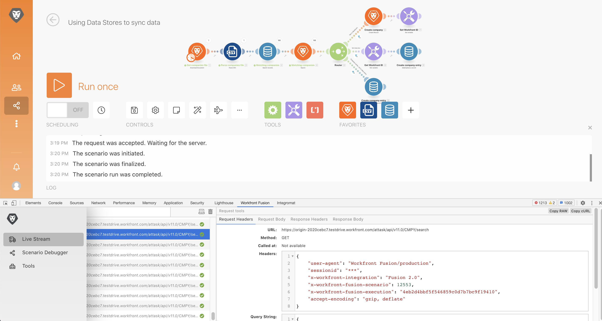

# Herramienta de desarrollo

Mejore sus capacidades para solucionar problemas de escenarios y facilitar configuraciones complejas mediante la herramienta de desarrollo.

## Resumen del ejercicio

Instale y utilice las diferentes áreas de la herramienta de desarrollo de Workfront para profundizar en las solicitudes/respuestas realizadas y los trucos avanzados de diseño de escenarios.

>[!NOTE]
>
>La herramienta de desarrollo de Workfront Fusion solo está disponible en el navegador Chrome al utilizar el [Herramienta para desarrolladores de Chrome](https://developer.chrome.com/docs/devtools/).

## Pasos a seguir

**Instale la herramienta de desarrollo.**

1. Descargue el documento &quot;workfront-fusion-devtool.zip&quot; que se encuentra en la carpeta Archivos de ejercicios de Fusion en la unidad de prueba.
1. Extraiga los archivos Zip en una carpeta.
1. Abra una pestaña en Chrome e introduzca. **chrome://extensions**.
1. Active el modo de desarrollador con el conmutador de la parte superior derecha y, a continuación, haga clic en el botón &quot;Cargar desempaquetado&quot; que aparece en la parte superior izquierda. Seleccione la carpeta que contiene la herramienta de desarrollo (aquí es donde la descomprimió).

   

1. Una vez desempaquetada, la herramienta de desarrollo aparece entre las demás extensiones.

   

   **Utilice la emisión en directo.**

1. Comience por abrir el escenario &quot;Usar almacenes de datos para sincronizar datos&quot;.
1. Abra la herramienta Desarrollo escribiendo F12 o la función F12. O puede hacer clic en el menú de tres puntos de la barra de direcciones de Chrome y navegar a Herramientas para desarrolladores.

   

1. Haga clic en la pestaña Workfront Fusion y, a continuación, seleccione Emisión en directo en la lista de la izquierda.
1. Haga clic en Ejecutar una vez para ver los eventos a medida que se producen.
1. Haga clic en un evento para ver las pestañas de la derecha para los encabezados de solicitud, el cuerpo de solicitud, los encabezados de respuesta y el cuerpo de respuesta.

   

   **Uso de Scenario Debugger**

1. Seleccione Depurador de escenarios y haga clic en un módulo para ver información sobre las operaciones de ese módulo.

   

1. Vaya a la pestaña Historial. Haga clic en Details on an execution para examinar los detalles de la operación del módulo para una ejecución específica.

   

   **Uso de las herramientas**

1. Vuelva al diseñador de escenarios y seleccione Herramientas en la herramienta Desarrollo. Esto muestra las herramientas disponibles.

   

+ Enfoque de un módulo: busque y abra un módulo rápidamente mediante el ID del módulo.
+ Buscar módulos por asignación: busque un escenario con una palabra clave para encontrar valores asignados o claves en los módulos.
+ Obtener metadatos de la aplicación: consulte los metadatos de la aplicación seleccionada en un escenario de.
+ Copiar asignación: copia la asignación de un módulo a otro. También puede clonar el módulo en el diseñador.
+ Copiar filtro: copia un filtro. El filtro siempre se asigna al módulo que se encuentra a su derecha.
+ Intercambiar conexión: la herramienta toma la conexión del módulo seleccionado y establece la misma conexión para todos los módulos de la misma aplicación en el escenario. Esto resulta útil si tiene que cambiar la conexión a lo largo de un escenario completado. Evite perder toda la asignación y ahorre tiempo mediante esta herramienta.
+ Intercambiar variable: busca todas las ocurrencias de la variable dada en todo el escenario o en un módulo y las reemplaza por la nueva. No se admiten caracteres comodín. Si ha asignado accidentalmente un valor a todo el escenario, esto puede ayudarle a intercambiar fácilmente por el valor correcto.
+ Intercambiar aplicación: intercambia la aplicación determinada por otra.
+ Base 64: codificar los datos introducidos en Base64 o descodificar Base64. Resulta útil cuando desea buscar datos concretos en la solicitud codificada.
+ Copiar nombre de módulo: copia el nombre del módulo seleccionado en el portapapeles.
+ Origen de reasignación: cambie el origen de asignación de un módulo a otro. Primero debe agregar el módulo que se va a usar como módulo de origen a la ruta en un escenario.
+ Migrar SO: creado específicamente para actualizar los módulos de Hojas de cálculo de Google (heredados) a la última versión de Hojas de cálculo de Google. Agrega una nueva versión del módulo justo después de la versión heredada del módulo en la ruta del escenario.
